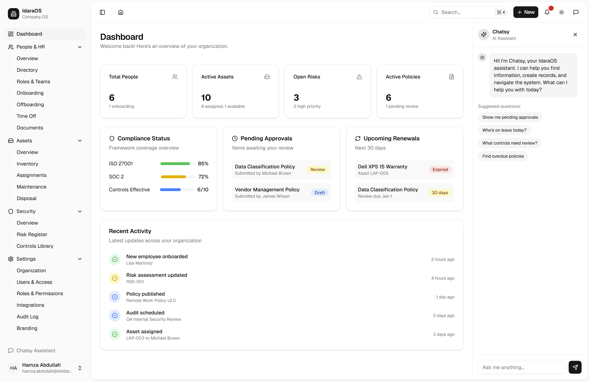

# IdaraOS - Organization Operating System

**A unified platform for managing your organization, from startup to enterprise.**



IdaraOS was born from a real need: managing an organization that requires proper security, compliance, and effective people management - without paying a fortune that most startups simply can't afford. When we looked at the open-source landscape for a comprehensive solution, we found nothing. The existing tools were either prohibitively expensive enterprise software or fragmented point solutions that required stitching together dozens of vendors.

So we built IdaraOS: an open-source, extensible platform that brings together HR & people management, asset tracking, finance operations, and a complete security engine (supporting ISO 27001, SOC I, SOC II, and more) with risk registers, controls, audits, and objectives - all in one place. It's designed for individuals and organizations of all scales who want enterprise-grade organization management without the enterprise price tag.

> **Note**: IdaraOS is currently under active development. Not all features described are fully implemented yet. We're building in public and welcome contributions.

Built with Next.js and modern web technologies using a design-first, API-first approach.

## Quick Start (Local Development)

### Prerequisites

- Docker Desktop installed and running
- Git

### Option 1: Development Mode (Hot Reload)

```bash
# Clone the repository
git clone https://github.com/stellarsoft-tech/IdaraOS.git
cd IdaraOS

# Start the development environment
cd deployment/docker
docker-compose -f docker-compose.dev.yml up
```

Access the application:
- **HTTPS**: https://localhost (recommended for Entra SSO)
- **Direct**: http://localhost:3000

Changes to source code are reflected immediately without rebuilding.

### Option 2: Local Production Build

```bash
cd deployment/docker
docker-compose -f docker-compose.local.yml up -d
```

This builds and runs the production version locally for testing.

### What's Included

The Docker environment provides:
- PostgreSQL 16 database
- Automatic database migrations and seeding
- Caddy reverse proxy with automatic HTTPS
- Next.js application (dev or production mode)

## Project Structure

```
IdaraOS/
├── apps/web/                 # Next.js application
│   ├── app/                  # App Router pages
│   │   └── (dashboard)/      # Dashboard routes
│   │       ├── settings/     # Settings module
│   │       └── people/       # People & HR module
│   ├── components/           # React components
│   │   ├── primitives/       # Reusable primitives (DataTable, FormBuilder, etc.)
│   │   └── ui/               # shadcn/ui components
│   └── lib/                  # Utilities, API hooks, RBAC
│       ├── api/              # React Query hooks and API clients
│       ├── db/               # Database schema (Drizzle ORM)
│       └── rbac/             # Role-based access control
├── docs/                     # Documentation
│   ├── modules/              # Module architecture documents
│   │   ├── settings/         # Settings module design
│   │   └── people/           # People & HR module design
│   ├── prompts/              # Cursor AI prompts
│   ├── CONTRIBUTING.md       # Development workflow
│   └── DECISIONS.md          # Technical decisions
├── deployment/               # Deployment configurations
│   └── docker/               # Docker compose files
├── migrations/               # Database migrations
└── scripts/                  # Build and utility scripts
```

## Development Philosophy

### Design-First, Iterative Development

IdaraOS follows a design-first approach where each module is planned and documented before implementation:

1. **Design**: Create architecture documents with Mermaid diagrams showing module structure, permissions, and user flows
2. **Build**: Implement the module following the design, using established patterns and primitives
3. **Evolve**: Iterate on the architecture as new functionalities and permissions are added

### Module Architecture Documents

Each module has an `architecture.md` file in `docs/modules/<module-name>/` containing:

- **Module Overview**: High-level diagram of sub-modules and their relationships
- **Permissions**: What roles can perform which actions
- **User Flows**: Sequence diagrams showing key user interactions
- **API Endpoints**: Backend routes and their purposes

### What Goes Into a Module

When building a new module, you'll typically create:

- **Database Schema**: Tables defined in `lib/db/schema.ts` using Drizzle ORM
- **API Routes**: Next.js API routes in `app/api/`
- **React Query Hooks**: Data fetching and mutations in `lib/api/`
- **Page Components**: Dashboard pages in `app/(dashboard)/`
- **RBAC Permissions**: Module and action definitions in `lib/rbac/`

## Core Modules

### Settings

Organizational configuration and administration:
- Organization profile and preferences
- Users & access management
- Roles & permissions
- Integrations (Microsoft Entra ID SSO/SCIM)
- Audit log

### People & HR

Workforce management:
- People directory
- Person profiles
- Onboarding workflows
- Time off management

## Tech Stack

- **Framework**: Next.js 15 (App Router)
- **Database**: PostgreSQL 16 with Drizzle ORM
- **UI**: Tailwind CSS 4, shadcn/ui (Radix UI primitives)
- **Forms**: react-hook-form + Zod validation
- **Tables**: TanStack Table v8 with virtualization
- **State**: TanStack Query for server state
- **Auth**: NextAuth.js with Microsoft Entra ID support
- **Package Manager**: pnpm (workspaces)

## Key Primitives

### DataTable

Full-featured data table with:
- Server-side pagination, sorting, filtering
- Column visibility, reordering, resizing
- Row selection with bulk actions
- Faceted filters with status chips
- CSV export
- Loading skeletons, empty states

### FormBuilder / FormDrawer

Schema-driven forms with:
- Zod validation integration
- All field types (text, select, date, boolean, etc.)
- Create/edit/readonly modes
- Drawer-based forms for CRUD operations

### PageShell

Consistent page layout with:
- Title and description
- Action buttons
- Breadcrumb navigation

### Protected

RBAC-aware component wrapper:
- Hide/show based on permissions
- Module and action-level control

## Documentation

- **[CONTRIBUTING.md](docs/CONTRIBUTING.md)**: Development workflow and coding standards
- **[DECISIONS.md](docs/DECISIONS.md)**: Technical decisions and rationale
- **[QUICK_START.md](QUICK_START.md)**: Detailed setup guide
- **[Module Docs](docs/modules/)**: Architecture documents for each module

## Development Commands

```bash
# Install dependencies (if running outside Docker)
pnpm install

# Run development server
pnpm dev

# Run linting
pnpm lint

# Run type checking
pnpm typecheck

# Run tests
pnpm test
```

## Contributing

See [CONTRIBUTING.md](docs/CONTRIBUTING.md) for the complete development workflow.

## License

This software is licensed under the [PolyForm Internal Use License 1.0.0](LICENSE).

**You may:**
- Use IdaraOS for your organization's internal business operations
- Modify and customize the software for your internal needs
- Create derivative works for internal use

**You may not:**
- Redistribute the source code commercially
- Sell or sublicense the software
- Offer the software as a service to third parties
- Fork for commercial purposes

See the [LICENSE](LICENSE) file for the complete terms.

---

**Built for developers who value clarity, consistency, and modern tooling.**
