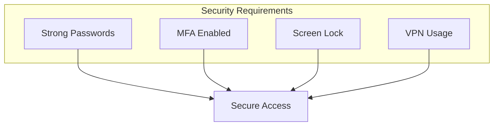

# Acceptable Use Policy

## Purpose

This Acceptable Use Policy (AUP) defines the acceptable use of company computing resources,
networks, and data. It is designed to protect employees, partners, and the company from
illegal or damaging actions by individuals, either knowingly or unknowingly.

## Scope

This policy applies to all employees, contractors, consultants, and other workers using
company computing equipment, networks, or data.

## Acceptable Use

### General Guidelines

- Use company resources primarily for business purposes
- Protect your credentials and don't share passwords
- Report security incidents immediately
- Keep software and systems updated
- Follow data classification guidelines

### Email and Communications

**DO:**
- Use professional language
- Encrypt sensitive information
- Be cautious of phishing attempts
- Archive important communications

**DON'T:**
- Open suspicious attachments
- Forward chain emails
- Use personal accounts for business data
- Share credentials via email

### Internet Usage

Acceptable uses include:
- Business research
- Professional development
- Industry news and updates
- Approved cloud services

Prohibited uses include:
- Illegal content
- Excessive personal use
- Unauthorized downloads
- Bypassing security controls

## Security Requirements

### Password Policy

- Minimum 12 characters
- Mix of uppercase, lowercase, numbers, symbols
- Change every 90 days
- No password reuse (last 10)

### Device Security

1. Enable full-disk encryption
2. Install approved antivirus software
3. Keep operating system updated
4. Use VPN for remote access
5. Lock device when unattended

## Prohibited Activities

The following activities are strictly prohibited:

- Unauthorized access to systems
- Installing unauthorized software
- Sharing confidential information
- Harassment or discrimination
- Copyright infringement
- Mining cryptocurrency
- Running unauthorized servers

## Consequences

Violations of this policy may result in:

| Severity | Action |
|----------|--------|
| Minor | Verbal warning, training |
| Moderate | Written warning, restricted access |
| Major | Suspension, termination |
| Criminal | Legal action |

## Reporting

Report policy violations or security concerns to:
- Your manager
- IT Help Desk
- Security Team
- Anonymous ethics hotline

## Acknowledgment

All users must acknowledge understanding of this policy annually and upon initial access
to company systems.

---

*Last updated: January 2024*
*Policy owner: IT Security Team*

