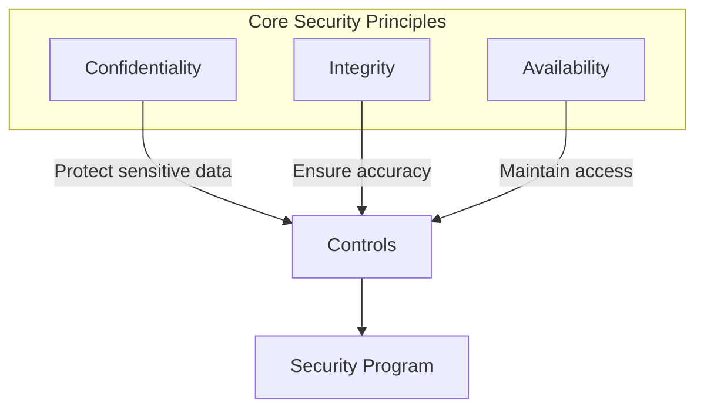

# Information Security Policy

## Purpose

This policy establishes the framework for managing information security within the organization.
It defines the principles, responsibilities, and requirements for protecting organizational
information assets against threats and vulnerabilities.

## Scope

This policy applies to:
- All employees, contractors, and third parties
- All information systems and data
- All physical and digital assets

## Security Principles

Our information security program is built on three core principles:

### Confidentiality
Information must be protected from unauthorized access and disclosure.

### Integrity
Information must be accurate, complete, and protected from unauthorized modification.

### Availability
Information must be accessible to authorized users when needed.

## Roles and Responsibilities

| Role | Responsibilities |
|------|-----------------|
| Executive Leadership | Approve security policies, provide resources |
| Security Team | Implement and monitor security controls |
| IT Department | Maintain technical security measures |
| Department Managers | Ensure team compliance |
| All Employees | Follow security policies and report incidents |

## Access Control

Access to information systems must follow the principle of **least privilege**:

1. Access is granted based on business need
2. Access rights are regularly reviewed
3. Access is revoked upon role change or termination
4. Multi-factor authentication is required for sensitive systems

## Data Classification

All organizational data must be classified according to sensitivity:

- **Public**: Can be shared externally
- **Internal**: For internal use only
- **Confidential**: Restricted access, business-sensitive
- **Restricted**: Highly sensitive, legal/compliance requirements

## Incident Response

Security incidents must be reported immediately to the Security Team:

## Compliance

This policy supports compliance with:
- ISO 27001 Information Security Management
- SOC 2 Trust Service Criteria
- GDPR Data Protection Requirements
- Industry-specific regulations

## Policy Review

This policy is reviewed annually or when significant changes occur. All employees must
acknowledge receipt and understanding of this policy.

---

*For questions about this policy, contact the Security Team.*

