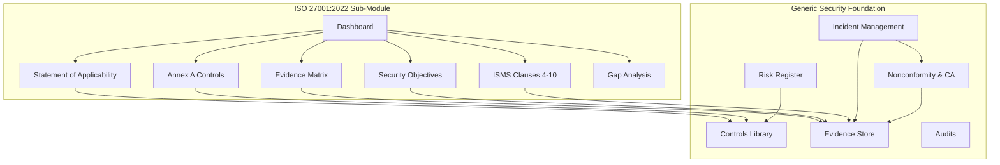

# ISO 27001:2022 ISMS Module

## Overview

The ISO 27001:2022 module in IdaraOS helps organizations establish, implement, maintain, and continually improve an **Information Security Management System (ISMS)**. It maps directly to the standard's mandatory clauses (4–10) and Annex A controls (93 controls across four themes).

This module is part of the Security (GRC) area and integrates with the generic foundation layer: risks, controls, evidence, audits, objectives, incident management, and nonconformity/corrective action.

## Module Structure

```mermaid
graph TB
    subgraph "ISO 27001:2022 Sub-Module"
        DASH[Dashboard]
        CLAUSES[ISMS Clauses 4-10]
        OBJ[Security Objectives]
        SOA[Statement of Applicability]
        ANNEX[Annex A Controls]
        EVID[Evidence Matrix]
        GAPS[Gap Analysis]
    end

    subgraph "Generic Security Foundation"
        RISKS[Risk Register]
        CONTROLS[Controls Library]
        STORE[Evidence Store]
        AUDITS[Audits]
        INCIDENTS[Incident Management]
        NC[Nonconformity & CA]
    end

    DASH --> CLAUSES
    DASH --> OBJ
    DASH --> SOA
    DASH --> ANNEX
    DASH --> EVID
    DASH --> GAPS

    SOA --> CONTROLS
    EVID --> STORE
    OBJ --> STORE
    CLAUSES --> STORE
    ANNEX --> CONTROLS
    RISKS --> CONTROLS
    INCIDENTS --> STORE
    INCIDENTS --> NC
    NC --> STORE
```

## ISO 27001:2022 Structure

| Section | IdaraOS Coverage |
|---------|------------------|
| **Clauses 4–10** (mandatory ISMS requirements) | ISMS Clauses tracker — compliance status, owners, evidence |
| **Clause 6.2** (security objectives) | Security Objectives — periods, achievement status, evidence links |
| **Clause 10.2** (nonconformity & corrective action) | Nonconformity & CA — root cause, corrective action, effectiveness review |
| **Annex A A.5.24–A.5.28** (incident management) | Incident Management — classification, response, lessons learned, evidence |
| **Annex A A.5.15, A.5.16, A.5.18** (access control and access rights) | People & HR Access Groups and Access Register — least-privilege access bundles, user assignments, review status |
| **Annex A** (93 controls) | SoA, Annex A browser, gap analysis, control mappings |
| **Evidence** | Evidence Store + per-control links + objective/clause/incident/NC evidence |

## Sub-Modules

### Dashboard (`/security/frameworks/iso-27001`)

Central view of ISMS compliance: Annex A category progress, clause summary, certification details, and quick links to all sub-modules.

### ISMS Clauses (`/security/frameworks/iso-27001/clauses`)

Tracks mandatory management system requirements from ISO 27001:2022 Clauses 4–10:

- **Clause 4** — Context of the organization
- **Clause 5** — Leadership
- **Clause 6** — Planning (includes risk assessment and **security objectives**)
- **Clause 7** — Support
- **Clause 8** — Operation
- **Clause 9** — Performance evaluation
- **Clause 10** — Improvement (includes **nonconformity and corrective action**)

Each requirement records compliance status, owner, implementation notes, and linked evidence.

### Security Objectives (`/security/frameworks/iso-27001/objectives`)

Implements **Clause 6.2 — Information security objectives and planning to achieve them**.

Objectives must be:

- Consistent with the information security policy
- Measurable (or capable of evaluation)
- Monitored and communicated
- Updated as appropriate
- Documented as **retained information**

IdaraOS tracks:

| Field | Purpose |
|-------|---------|
| Reporting period | e.g., FY 2026, Q1 2026 |
| Period start / end | Date boundaries for measurement |
| Achievement status | Not Measured, Not Achieved, Partially Achieved, Achieved |
| Success criteria | Measurable targets (ISO 6.2) |
| Linked evidence | Measurement records, progress reports, resource plans |

### Incident Management (`/security/incidents`)

Implements **Annex A A.5.24–A.5.28** — information security incident management:

| Control | IdaraOS Feature |
|---------|-----------------|
| A.5.24 Planning & preparation | Incident register, owners, severity (P1–P4), status workflow |
| A.5.25 Event assessment | Event vs incident classification |
| A.5.26 Response | Containment, eradication, recovery documentation |
| A.5.27 Lessons learned | Root cause analysis, lessons learned fields |
| A.5.28 Evidence | Multiple linked evidence items |

Published incidents retain **version history** when edited (document-style versioning for audit evidence).

### Nonconformity & Corrective Action (`/security/nonconformities`)

Implements **Clause 10.2 — Nonconformity and corrective action**:

| Requirement | IdaraOS Feature |
|-------------|-----------------|
| React to nonconformity | Status workflow through closure |
| Root cause analysis | Dedicated RCA field |
| Corrective action | Action plan + due date |
| Effectiveness review | Verification before closure |
| Document linkage | Select document type, then linked document (filtered list) |
| Retained evidence | Multiple evidence links |

### Statement of Applicability (`/security/frameworks/iso-27001/soa`)

Documents which of the 93 Annex A controls are applicable, implemented, or excluded — with justification for exclusions.

### Annex A Controls (`/security/frameworks/iso-27001/controls`)

Browse the pre-loaded ISO 27001:2022 Annex A control library and create organization controls from standard references.

### People Access Groups (`/people/access-groups`)

Supports **Annex A A.5.15 Access control**, **A.5.16 Identity management**, **A.5.18 Access rights**, and related access restriction controls.

Access groups define least-privilege access bundles based on role and responsibility. Each group captures business justification, access included, owner, review frequency, risk level, and ISO 27001:2022 control references.

### People Access Register (`/people/access-register`)

Provides retained information for periodic access reviews. The register shows which users/people hold each access group, linked system role context, organizational role/team context, review due date, last review date, review status, and revocation actions.

### Evidence Matrix (`/security/frameworks/iso-27001/evidence`)

Matrix view of evidence coverage per SoA item and control implementation.

### Gap Analysis (`/security/frameworks/iso-27001/gaps`)

Identifies controls not yet implemented and prioritizes remediation.

## Evidence Linking

Evidence supports audit and certification readiness through multiple patterns:

1. **Control ↔ Evidence** — junction table (`security_evidence_links`) for Annex A controls
2. **Clause compliance** — `linkedEvidenceIds` on ISMS clause records
3. **Security objectives** — `linkedEvidenceIds` on objectives for Clause 6.2 measurement records
4. **Incidents** — `linkedEvidenceIds` on incidents for A.5.28 forensic/operational evidence
5. **Nonconformities** — `linkedEvidenceIds` on NC records for Clause 10.2 retained information
6. **Access control** — People Access Groups and Access Register for A.5.15, A.5.16, A.5.18, and A.8.2 access review evidence

## Permissions

| Sub-Module | Permission Resource |
|------------|---------------------|
| Dashboard | `security.frameworks` (view) |
| ISMS Clauses | `security.clauses` |
| Security Objectives | `security.objectives` |
| Incident Management | `security.incidents` |
| Nonconformity & CA | `security.nonconformities` |
| SoA | `security.soa` |
| Annex A / Gaps | `security.controls`, `security.frameworks` |
| Evidence | `security.evidence` |
| Access Groups | `people.access-groups` |
| Access Register | `people.access-register` |

## Related Documents

- [Information Security Policy](./information-security-policy)
- [ISO 27001 Security Objectives Plan](./iso-27001-security-objectives)
- [Incident Management](./incident-management)
- [Nonconformity & Corrective Action](./nonconformity-corrective-action)
