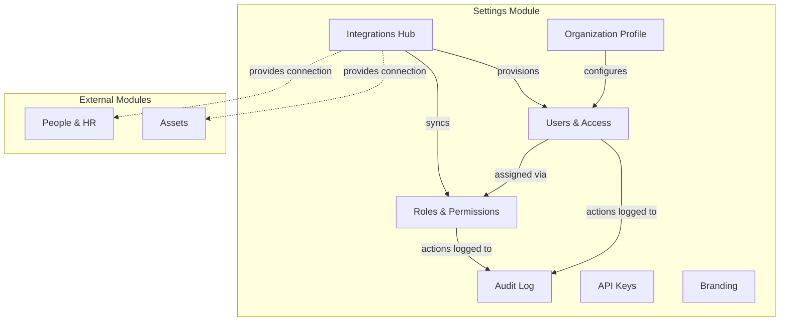
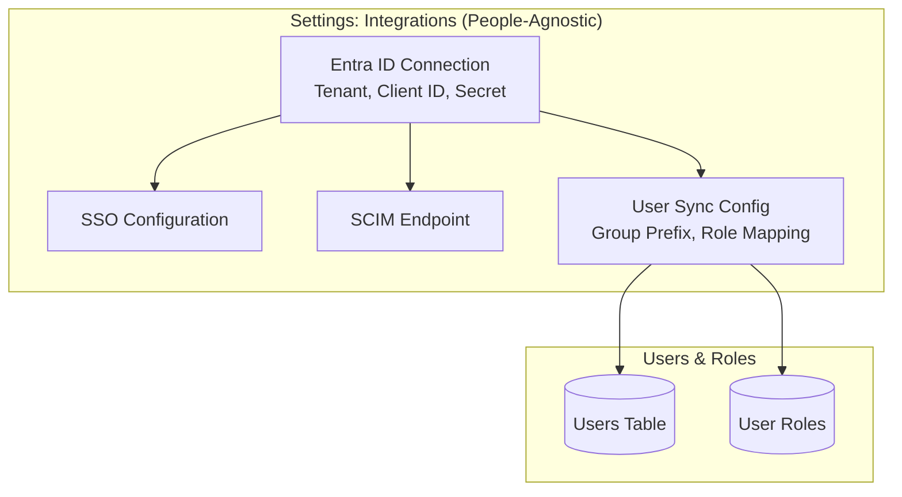
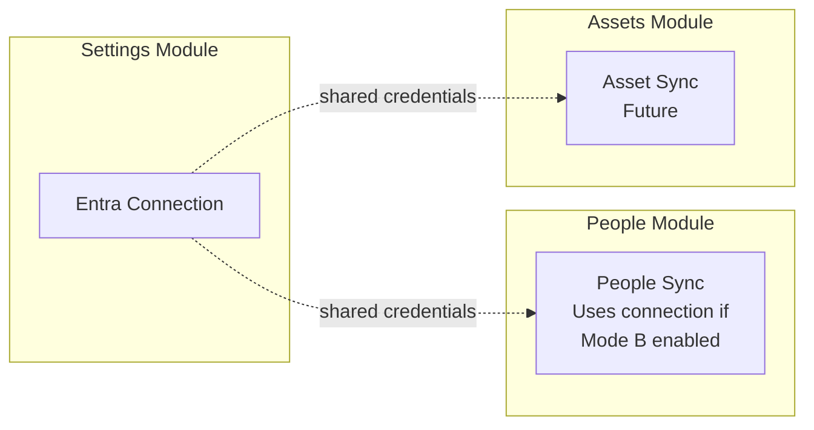
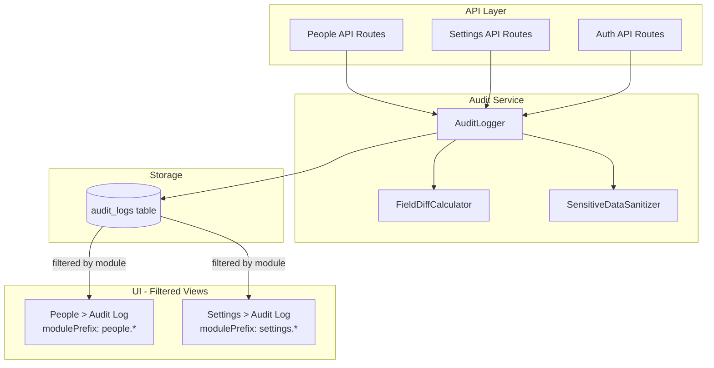
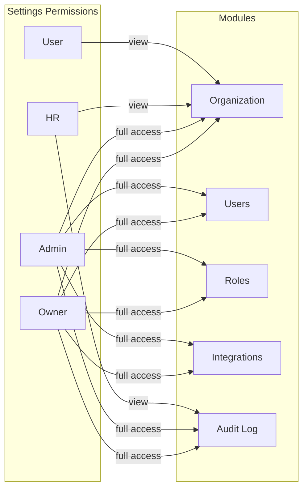
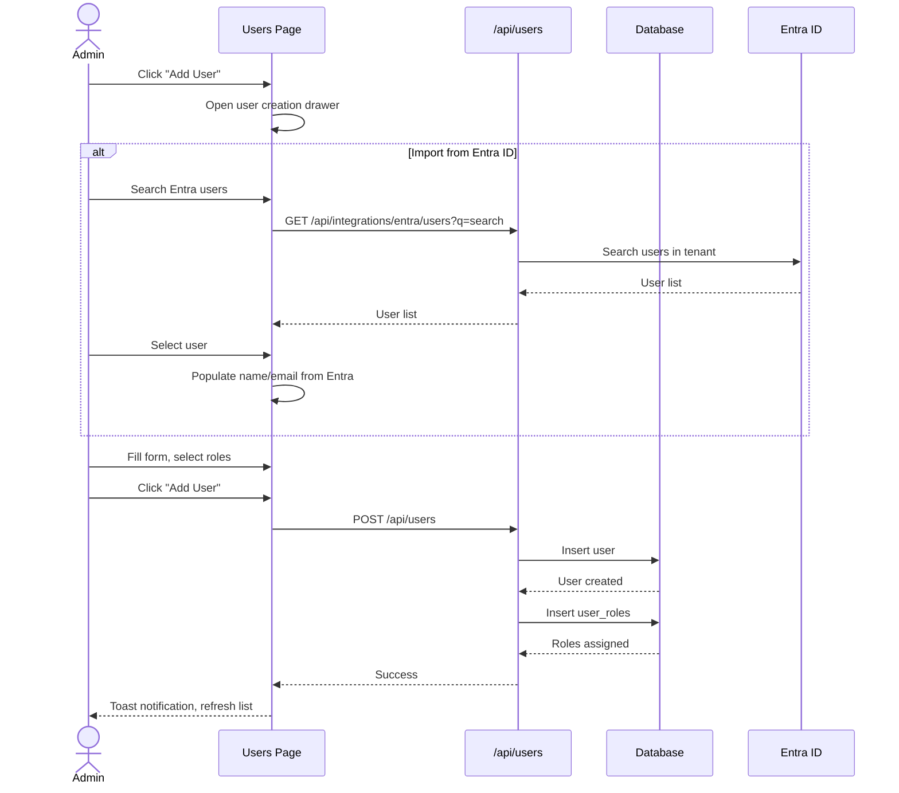
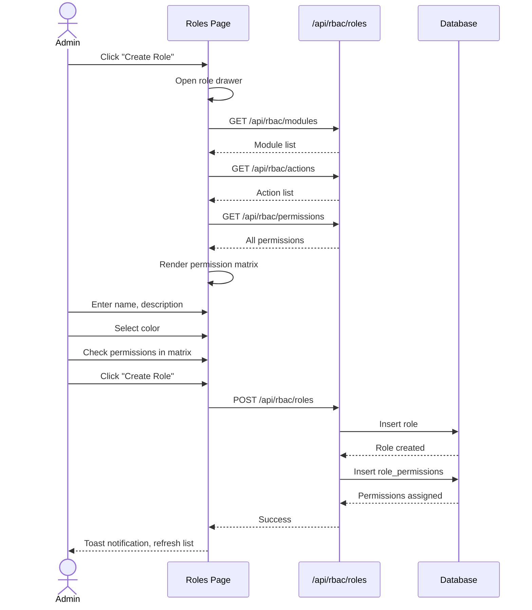
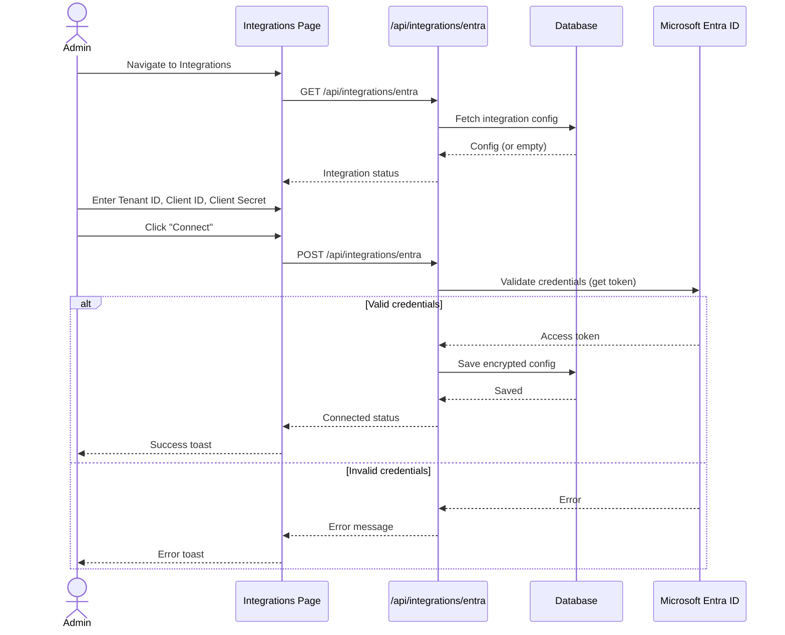
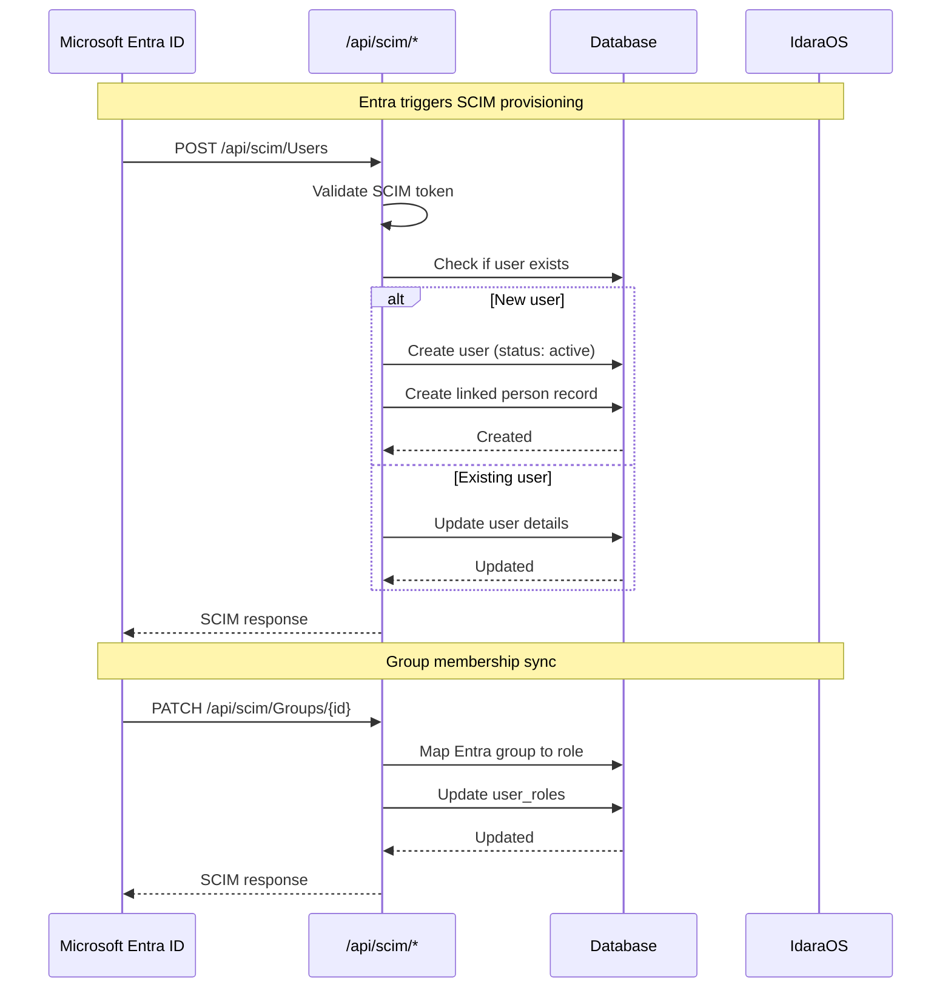
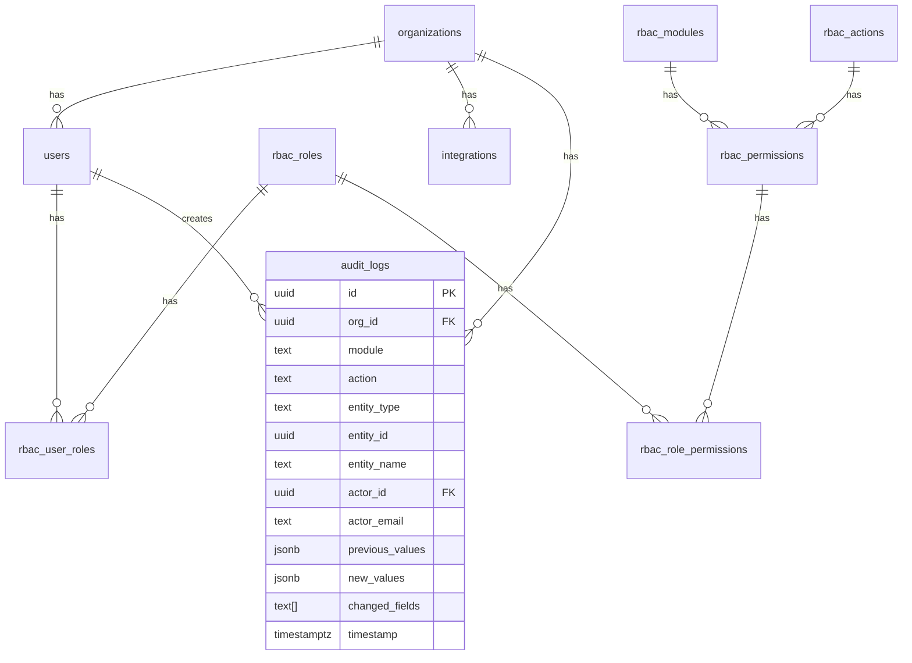

# Settings Module

## Overview

The Settings module provides organizational configuration and administration capabilities. It allows administrators to manage organization details, users, roles, integrations, and audit logs.

## Module Structure



## Integration Architecture

The Settings module owns the **identity provider connection** (Entra ID credentials, SSO config) and **user provisioning**. It is intentionally **people-agnostic** - it doesn't know about the People module.



### Module Responsibilities

| This Module Handles | Other Modules Handle |
|---------------------|---------------------|
| ✅ Entra connection credentials | People sync config (People > Settings) |
| ✅ SSO/authentication | Asset sync config (Assets > Settings) |
| ✅ User provisioning | Module-specific group patterns |
| ✅ Group → Role mapping | Module-specific field mapping |
| ✅ SCIM endpoint | Module-specific sync triggers |

### Connection Sharing

Other modules can **borrow** the Entra connection for their own sync needs:



The connection (tenant ID, client ID, secret) is shared, but each module has its own:
- Group pattern/prefix
- Field mapping
- Sync behavior settings
- Sync trigger

## Sub-Modules

### Organization Profile (`/settings`)

Manage organization-level settings and preferences.

**Features:**
- Organization name and application name
- Website and social links (LinkedIn, Twitter, YouTube)
- Regional settings (timezone, currency, date format)

### Users & Access (`/settings/users`)

Manage user accounts and their access to the system.

**Features:**
- List all users with roles and status
- Create users (manual or from Entra ID)
- Edit user details and status
- Assign/remove roles
- Link users to people in the directory
- Sync users from Microsoft Entra ID (SCIM)
- Role statistics dashboard

### Roles & Permissions (`/settings/roles`)

Define custom roles with granular permissions.

**Features:**
- List all roles with permission counts
- Create custom roles with color badges
- Edit role permissions via matrix UI
- System roles (read-only name/description)
- Permission matrix by module and action

### Integrations (`/settings/integrations`)

Connect third-party services for SSO and provisioning.

**Features:**
- Microsoft Entra ID (Azure AD) integration
  - SSO configuration (tenant ID, client ID, client secret)
  - SCIM provisioning for automatic user sync
  - Group prefix for role mapping (e.g., `IdaraOS-*`)
  - Group-to-role mapping
  - Bidirectional sync support
- Integration status monitoring
- Manual sync trigger for users

**People-Agnostic Design:**

This module is intentionally decoupled from the People module. It handles:
- ✅ User account provisioning
- ✅ Role assignment via groups
- ✅ SSO authentication
- ❌ People/Employee sync (managed in People > Settings)

If People sync is configured independently in People > Settings (Mode B), this module shows a notice:

```
⚠️ People sync is managed independently in People > Settings.
   User sync here only affects user accounts, not employee records.
```

See [People Module Architecture](../people/architecture.md) for People sync configuration.

### Audit Log (`/settings/audit-log`)

View system activity for compliance and security. This page shows audit logs specifically for the Settings module (organization settings, users, roles, integrations).

**Features:**
- Searchable, filterable audit log table
- Filter by action type (create, update, delete, login, sync)
- Filter by date range
- Full-text search by entity name, actor email
- View detailed change history with before/after comparison
- Export to CSV/JSON for compliance reporting
- Actor identification (who made the change)
- IP address and user agent tracking

**Audit Architecture:**



**Logged Actions:**

| Module | Actions Logged |
|--------|----------------|
| `settings.users` | User create, update, delete, role changes |
| `settings.roles` | Role create, update, delete, permission changes |
| `settings.organization` | Organization settings updates |
| `settings.integrations` | Connection changes (secrets masked) |
| `auth` | Login, logout events |

**Sensitive Data Handling:**

The audit logger automatically masks sensitive fields:
- Passwords and password hashes
- API keys and tokens
- Client secrets
- Encryption keys

Example masked output:
```json
{
  "changedFields": ["clientSecret"],
  "previousValues": { "clientSecret": "[REDACTED]" },
  "newValues": { "clientSecret": "[REDACTED]" }
}
```

### API Keys (`/settings/api-keys`) - Placeholder

Manage API tokens for programmatic access.

### Branding (`/settings/branding`) - Placeholder

Customize logos, colors, and themes.

---

## Permissions

### Permission Matrix

| Sub-Module | Action | Owner | Admin | HR | User |
|------------|--------|-------|-------|-----|------|
| Organization | View | Yes | Yes | Yes | Yes |
| Organization | Edit | Yes | Yes | No | No |
| Users | View | Yes | Yes | Yes | No |
| Users | Create | Yes | Yes | No | No |
| Users | Edit | Yes | Yes | No | No |
| Users | Delete | Yes | Yes | No | No |
| Roles | View | Yes | Yes | No | No |
| Roles | Create | Yes | Yes | No | No |
| Roles | Edit | Yes | Yes | No | No |
| Roles | Delete | Yes | Yes | No | No |
| Integrations | View | Yes | Yes | No | No |
| Integrations | Edit | Yes | Yes | No | No |
| Audit Log | View | Yes | Yes | Yes | No |

### Permission Diagram



---

## User Flows

### User Creation Flow



### Role Management Flow



### Entra ID SSO Configuration Flow



### SCIM User Provisioning Flow



---

## API Endpoints

### Users API

| Method | Path | Description |
|--------|------|-------------|
| GET | `/api/users` | List all users |
| POST | `/api/users` | Create user |
| GET | `/api/users/[id]` | Get user details |
| PATCH | `/api/users/[id]` | Update user |
| DELETE | `/api/users/[id]` | Delete user |

### RBAC API

| Method | Path | Description |
|--------|------|-------------|
| GET | `/api/rbac/roles` | List all roles |
| POST | `/api/rbac/roles` | Create role |
| GET | `/api/rbac/roles/[id]` | Get role with permissions |
| PATCH | `/api/rbac/roles/[id]` | Update role and permissions |
| DELETE | `/api/rbac/roles/[id]` | Delete role |
| GET | `/api/rbac/modules` | List all modules |
| GET | `/api/rbac/actions` | List all actions |
| GET | `/api/rbac/permissions` | List all permissions |
| GET | `/api/rbac/users/[id]/roles` | Get user's roles |
| PUT | `/api/rbac/users/[id]/roles` | Update user's roles |

### Organization API

| Method | Path | Description |
|--------|------|-------------|
| GET | `/api/organization` | Get organization details |
| PATCH | `/api/organization` | Update organization |

### Integrations API

| Method | Path | Description |
|--------|------|-------------|
| GET | `/api/integrations/entra` | Get Entra integration status |
| POST | `/api/integrations/entra` | Connect Entra ID |
| PATCH | `/api/integrations/entra` | Update Entra settings |
| DELETE | `/api/integrations/entra` | Disconnect Entra ID |
| POST | `/api/integrations/entra/sync` | Trigger manual sync |
| POST | `/api/integrations/entra/scim-token` | Regenerate SCIM token |
| GET | `/api/integrations/entra/users` | Search Entra users |

### SCIM API (Entra Provisioning)

| Method | Path | Description |
|--------|------|-------------|
| GET | `/api/scim/Users` | List users (SCIM) |
| POST | `/api/scim/Users` | Create user (SCIM) |
| GET | `/api/scim/Users/[id]` | Get user (SCIM) |
| PATCH | `/api/scim/Users/[id]` | Update user (SCIM) |
| DELETE | `/api/scim/Users/[id]` | Delete user (SCIM) |
| GET | `/api/scim/Groups` | List groups (SCIM) |
| PATCH | `/api/scim/Groups/[id]` | Update group (SCIM) |

### Audit Log API

| Method | Path | Description |
|--------|------|-------------|
| GET | `/api/audit/logs` | List audit logs with filtering |
| GET | `/api/audit/logs/[id]` | Get single audit log entry |
| GET | `/api/audit/logs/export` | Export logs as CSV/JSON |

**Query Parameters for `/api/audit/logs`:**

| Parameter | Type | Description |
|-----------|------|-------------|
| `module` | string | Exact module match (e.g., `settings.users`) |
| `modulePrefix` | string | Module prefix match (e.g., `settings.` for all settings) |
| `action` | string | Filter by action type (create, update, delete, etc.) |
| `entityType` | string | Filter by entity type (user, role, person, etc.) |
| `entityId` | uuid | Filter by specific entity ID |
| `actorId` | uuid | Filter by actor (who made the change) |
| `from` | ISO date | Start of date range |
| `to` | ISO date | End of date range |
| `search` | string | Full-text search in entity names, descriptions |
| `limit` | number | Max results (default 50, max 100) |
| `offset` | number | Pagination offset |

---

## Database Schema

### Core Tables

- `organizations` - Organization settings and preferences
- `users` - User accounts
- `rbac_roles` - Role definitions
- `rbac_modules` - Module definitions
- `rbac_actions` - Action definitions (view, create, edit, delete)
- `rbac_permissions` - Module + Action combinations
- `rbac_role_permissions` - Role to permission mappings
- `rbac_user_roles` - User to role assignments
- `integrations` - Integration configurations
- `audit_logs` - System activity log

### Audit Logs Table Schema

| Column | Type | Description |
|--------|------|-------------|
| `id` | UUID | Primary key |
| `org_id` | UUID | Organization reference |
| `module` | TEXT | Module identifier (e.g., `people.directory`) |
| `action` | TEXT | Action type (create, update, delete, etc.) |
| `entity_type` | TEXT | Type of entity affected (person, user, role) |
| `entity_id` | UUID | ID of the affected entity |
| `entity_name` | TEXT | Human-readable name for display |
| `actor_id` | UUID | User who performed the action |
| `actor_email` | TEXT | Actor's email at time of action |
| `actor_name` | TEXT | Actor's name at time of action |
| `actor_ip` | TEXT | IP address of the request |
| `actor_user_agent` | TEXT | Browser/client user agent |
| `previous_values` | JSONB | State before the change |
| `new_values` | JSONB | State after the change |
| `changed_fields` | TEXT[] | Array of changed field names |
| `metadata` | JSONB | Additional context |
| `description` | TEXT | Human-readable description |
| `timestamp` | TIMESTAMPTZ | When the action occurred |

### Key Relationships



---

## Components

### Key React Components

- `PageShell` - Consistent page layout with title, description, action
- `DataTableAdvanced` - Full-featured data table
- `FormDrawer` - Schema-driven form in a drawer
- `Protected` - RBAC-aware visibility wrapper
- `StatusBadge` - Colored status indicators
- `RolePermissionMatrix` - Permission grid UI

### React Query Hooks

- `useOrganization`, `useUpdateOrganization`
- `useUsersList`, `useCreateUser`, `useUpdateUser`, `useDeleteUser`
- `useRoles`, `useRole`, `useCreateRole`, `useUpdateRole`, `useDeleteRole`
- `useUserRoles`, `useUpdateUserRoles`
- `useEntraIntegration`, `useSaveEntraIntegration`, `useTriggerSync`
