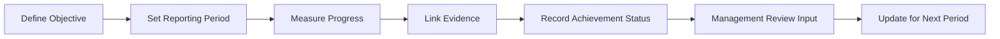

# ISO 27001:2022 Security Objectives Plan

## Purpose

This document defines how the organization establishes, monitors, and reports **information security objectives** in accordance with **ISO/IEC 27001:2022 Clause 6.2**.

Security objectives translate the information security policy into measurable outcomes. They are reviewed during management review (Clause 9.3) and inform continual improvement (Clause 10).

## Clause 6.2 Requirements

ISO 27001:2022 requires the organization to establish information security objectives at relevant functions and levels. When planning objectives, the organization shall determine:

1. What will be done
2. What resources will be required
3. Who will be responsible
4. When it will be completed
5. How results will be evaluated

Objectives shall be **monitored, communicated, and updated** as appropriate. They shall be **documented as retained information**.

## Objective Lifecycle in IdaraOS

## Reporting Periods

Objectives are tracked per **reporting period** to support annual ISMS planning and management review:

| Period Type | Example Label | Typical Use |
|-------------|---------------|-------------|
| Fiscal year | FY 2026 | Annual ISMS objectives |
| Quarter | Q1 2026 | Operational sub-objectives |
| Calendar year | CY 2026 | Cross-functional targets |

Each objective records:

- **Period label** — human-readable identifier
- **Period start / end** — measurement window
- **Target date** — deadline within the period

## Achievement Status

Achievement status records the **outcome** for the reporting period (distinct from workflow status):

| Status | Definition |
|--------|------------|
| Not Measured | Period not yet evaluated |
| Not Achieved | Target not met |
| Partially Achieved | Some criteria met |
| Achieved | All success criteria met |

Workflow status (Not Started, In Progress, Completed, On Hold) tracks execution; achievement status tracks the measured result.

## Evidence Requirements

Per Clause 6.2, retained information includes:

- Security objectives document (this plan)
- Objective measurement records
- Resource plans
- Responsibility assignments
- Progress reports

In IdaraOS, link evidence from the **Evidence Store** to each objective. Acceptable evidence types:

| Evidence Type | Examples |
|---------------|----------|
| Report | Quarterly security metrics report |
| Document | Objective register, resource allocation plan |
| Attestation | Management sign-off on achievement |
| Log | Automated metric collection logs |
| Configuration | Dashboard screenshots showing KPI values |

## Example Objectives

| ID | Objective | Success Criteria | Period |
|----|-----------|------------------|--------|
| ISO-OBJ-001 | Reduce critical vulnerabilities within 30 days | ≥ 95% of critical CVEs patched within SLA | FY 2026 |
| ISO-OBJ-002 | Achieve MFA coverage for privileged accounts | 100% of admin accounts enrolled in MFA | FY 2026 |
| ISO-OBJ-003 | Complete annual security awareness training | ≥ 98% employee completion rate | FY 2026 |
| ISO-OBJ-004 | Maintain ISMS audit readiness | Zero major non-conformities in internal audit | FY 2026 |

## Roles and Responsibilities

| Role | Responsibility |
|------|----------------|
| CISO / Security Lead | Define and approve objectives |
| Objective Owner | Execute plan, report progress, link evidence |
| ISMS Manager | Monitor achievement across periods |
| Management | Review fulfillment in Clause 9.3 management review |

## Management Review Inputs

Clause 9.3.2 requires management review to consider the **fulfillment of information security objectives**. Export objective achievement summaries from:

**Security → Frameworks → ISO 27001 → Security Objectives**

Filter by reporting period and verify each achieved objective has linked evidence before the management review meeting.

## Module Location

- **Security objectives**: `/security/objectives`
- **Evidence Store**: `/security/evidence`
