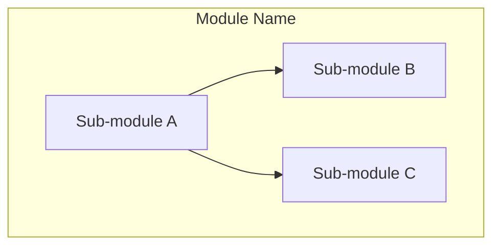
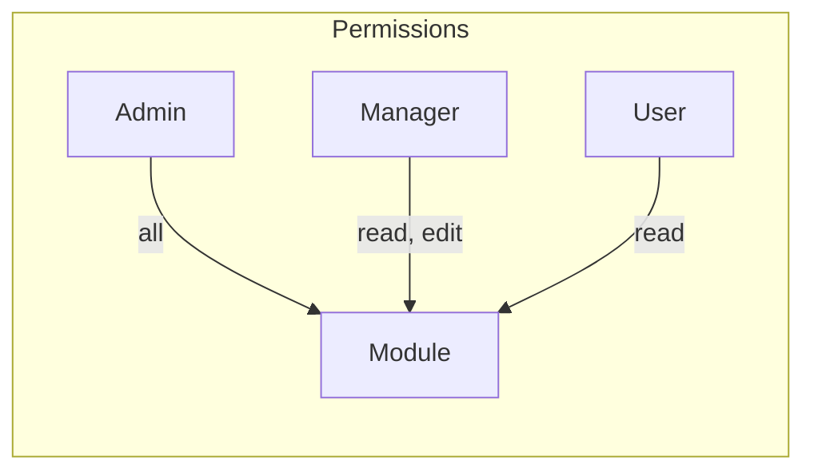
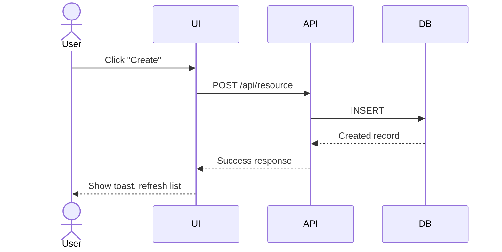

# Contributing to IdaraOS

## Development Philosophy

IdaraOS uses a **design-first, iterative development** approach. Every module starts with architecture documentation before implementation, and evolves as new features are added.

---

## Module Development Workflow

### Step 1: Design the Module

Before writing code, create an architecture document in `docs/modules/<module-name>/architecture.md`.

The architecture document should include:

#### Module Overview Diagram

A Mermaid graph showing the module's sub-modules and their relationships:



#### Permissions Matrix

Define what roles can perform which actions:



Or as a table:

| Action | Admin | Manager | User |
|--------|-------|---------|------|
| View   | Yes   | Yes     | Yes  |
| Create | Yes   | Yes     | No   |
| Edit   | Yes   | Yes     | No   |
| Delete | Yes   | No      | No   |

#### User Flow Diagrams

Sequence diagrams for key user interactions:



### Step 2: Define the Database Schema

Add tables to `apps/web/lib/db/schema.ts` using Drizzle ORM:

```typescript
export const myTable = pgTable("my_table", {
  id: uuid("id").primaryKey().defaultRandom(),
  orgId: uuid("org_id").notNull().references(() => organizations.id),
  name: varchar("name", { length: 255 }).notNull(),
  status: varchar("status", { length: 50 }).notNull().default("active"),
  createdAt: timestamp("created_at").notNull().defaultNow(),
  updatedAt: timestamp("updated_at").notNull().defaultNow(),
})
```

Create a migration:

```bash
pnpm db:generate
pnpm db:migrate
```

### Step 3: Create API Routes

Add API routes in `apps/web/app/api/<module>/`:

```typescript
// app/api/my-module/route.ts
import { NextResponse } from "next/server"
import { db } from "@/lib/db"
import { myTable } from "@/lib/db/schema"

export async function GET() {
  const items = await db.select().from(myTable)
  return NextResponse.json(items)
}

export async function POST(request: Request) {
  const body = await request.json()
  const [item] = await db.insert(myTable).values(body).returning()
  return NextResponse.json(item)
}
```

### Step 4: Create React Query Hooks

Add hooks in `apps/web/lib/api/<module>.ts`:

```typescript
import { useQuery, useMutation, useQueryClient } from "@tanstack/react-query"

export const myModuleKeys = {
  all: ["my-module"] as const,
  lists: () => [...myModuleKeys.all, "list"] as const,
  detail: (id: string) => [...myModuleKeys.all, "detail", id] as const,
}

export function useMyModuleList() {
  return useQuery({
    queryKey: myModuleKeys.lists(),
    queryFn: async () => {
      const res = await fetch("/api/my-module")
      if (!res.ok) throw new Error("Failed to fetch")
      return res.json()
    },
  })
}

export function useCreateMyItem() {
  const queryClient = useQueryClient()
  return useMutation({
    mutationFn: async (data: CreateMyItem) => {
      const res = await fetch("/api/my-module", {
        method: "POST",
        headers: { "Content-Type": "application/json" },
        body: JSON.stringify(data),
      })
      if (!res.ok) throw new Error("Failed to create")
      return res.json()
    },
    onSuccess: () => {
      queryClient.invalidateQueries({ queryKey: myModuleKeys.lists() })
    },
  })
}
```

### Step 5: Configure RBAC Permissions

Add permissions in `apps/web/lib/rbac/`:

```typescript
// In your RBAC configuration
{
  module: "my-module",
  actions: ["view", "create", "edit", "delete"],
  roles: {
    Admin: ["view", "create", "edit", "delete"],
    Manager: ["view", "create", "edit"],
    User: ["view"],
  },
}
```

### Step 6: Build Page Components

Create pages in `apps/web/app/(dashboard)/<module>/`:

```tsx
"use client"

import { PageShell } from "@/components/primitives/page-shell"
import { DataTableAdvanced } from "@/components/primitives/data-table-advanced"
import { Protected } from "@/components/primitives/protected"
import { Button } from "@/components/ui/button"
import { useMyModuleList } from "@/lib/api/my-module"

export default function MyModulePage() {
  const { data, isLoading } = useMyModuleList()
  
  return (
    <PageShell
      title="My Module"
      description="Manage your items"
      action={
        <Protected module="my-module" action="create">
          <Button>Add Item</Button>
        </Protected>
      }
    >
      <DataTableAdvanced
        columns={columns}
        data={data ?? []}
        loading={isLoading}
        searchKey="name"
      />
    </PageShell>
  )
}
```

### Step 7: Add Navigation

Update sidebar configuration to include your module.

### Step 8: Iterate and Evolve

As you add new features:

1. Update the architecture document with new diagrams
2. Add new permissions as needed
3. Extend the schema, API, and UI
4. Keep documentation in sync with implementation

---

## Coding Standards

### TypeScript

- Use strict mode
- Avoid `any` types - use proper typing
- Prefer `const` over `let`
- Use descriptive variable names
- Export types for reusability

### React

- Functional components only
- Use hooks for state and effects
- Keep components small (< 200 lines)
- Extract logic to custom hooks
- Use `"use client"` directive only when needed

### Styling

- Use Tailwind utility classes
- Follow design system tokens
- Mobile-first responsive design
- Support light and dark modes
- Use semantic HTML

### Forms

- Always validate with Zod (client + server)
- Use react-hook-form for all forms
- Show field-level errors
- Disable submit during submission
- Success toast on completion

### Tables

- Use DataTableAdvanced primitive
- Server-side pagination for 50+ rows
- Add filters for searchable fields
- Enable column visibility toggle
- Provide CSV export when relevant

### Accessibility

- Semantic HTML elements
- ARIA labels where needed
- Keyboard navigation support
- Focus management in modals
- Color contrast ratios (WCAG AA)

---

## Pull Request Process

1. **Create a branch**: `feature/<module-name>` or `fix/<issue-number>`
2. **Design first**: Create/update architecture document if adding new functionality
3. **Write code**: Follow the module development workflow
4. **Test**: Verify functionality works as designed
5. **Lint**: `pnpm lint` (auto-fix with `pnpm lint --fix`)
6. **Commit**: Use conventional commits
   - `feat: add employee directory`
   - `fix: correct date validation in forms`
   - `docs: update architecture document`
7. **Push**: Push to your branch
8. **PR**: Open PR with description and screenshots
9. **Review**: Address feedback
10. **Merge**: Squash and merge when approved

---

## Using AI (Cursor)

Cursor prompts are available in `docs/prompts/`. Use them to assist with:

- Planning implementations
- Generating boilerplate code
- Reviewing and improving code

---

## Architecture Document Template

When creating a new module, use this template for `docs/modules/<module>/architecture.md`:

```markdown
# [Module Name] Module

## Overview

Brief description of what this module does.

## Module Structure

\`\`\`mermaid
graph TB
    subgraph "Module Name"
        A[Sub-module A]
        B[Sub-module B]
    end
\`\`\`

## Permissions

| Action | Admin | Manager | User |
|--------|-------|---------|------|
| View   | Yes   | Yes     | Yes  |
| Create | Yes   | Yes     | No   |
| Edit   | Yes   | Yes     | No   |
| Delete | Yes   | No      | No   |

## User Flows

### [Flow Name]

\`\`\`mermaid
sequenceDiagram
    actor User
    participant UI
    participant API
    participant DB
    
    User->>UI: Action
    UI->>API: Request
    API->>DB: Query
    DB-->>API: Response
    API-->>UI: Response
    UI-->>User: Feedback
\`\`\`

## API Endpoints

| Method | Path | Description |
|--------|------|-------------|
| GET    | /api/module | List items |
| POST   | /api/module | Create item |
| GET    | /api/module/[id] | Get item |
| PATCH  | /api/module/[id] | Update item |
| DELETE | /api/module/[id] | Delete item |

## Database Schema

Tables used by this module.

## Components

Key React components used in this module.
```

---

## Questions?

- Check `docs/DECISIONS.md` for technical decisions
- Review existing module architectures in `docs/modules/`
- Open a discussion for clarification

---

**Remember**: Design first, build second, iterate always.
