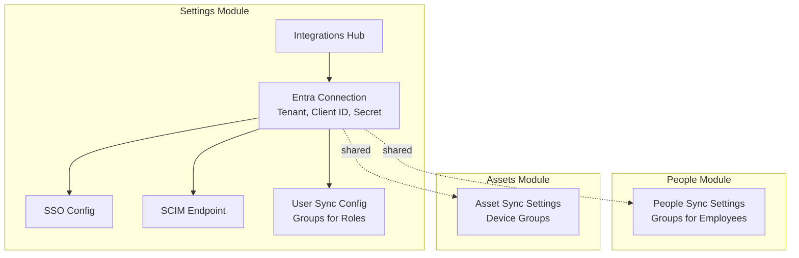

# IdaraOS Modules

## Overview

IdaraOS is organized into modules that handle different aspects of organizational management. Each module has its own architecture documentation in `docs/modules/<module-name>/architecture.md`.

## Complete Module List

### Core (Foundation)

- **Settings** - Organization configuration, users, roles, integrations
- **People & HR** - Employee directory, org chart, roles, teams

### Operations (Planned)

- **Assets** - Hardware, software licenses, equipment tracking
- **Documents** - File storage, version control, policies
- **Vendors** - Supplier management, contracts, evaluations
- **Workflows** - Approval flows, automation, task routing

### Finance (Planned)

- **Expenses** - Expense reports, reimbursements, approvals
- **Budgets** - Department budgets, tracking, forecasting
- **Contracts** - Legal agreements, renewals, obligations

### Security & Compliance (Planned)

- **ISMS** - Risk register, controls, audits, incidents
- **Policies** - Company policies, attestations, acknowledgments
- **Access Reviews** - Periodic access certifications
- **Training** - Compliance training, certifications

### Employee Experience (Planned)

- **Onboarding** - New hire checklists, tasks, provisioning
- **Offboarding** - Exit checklists, deprovisioning
- **Time Off** - Leave requests, calendars, balances

### Communication (Planned)

- **Announcements** - Company-wide communications
- **Knowledge Base** - Internal wiki, FAQs
- **Feedback** - Surveys, suggestions, pulse checks

---

## Implemented Modules

### Settings Module

**Location:** `/settings`

**Sub-modules:**
- Organization Profile - Company settings and preferences
- Users & Access - User management and role assignment
- Roles & Permissions - Custom roles with permission matrix
- Integrations Hub - Entra ID connection, SSO, SCIM, user sync
- Audit Log - System activity tracking

**Note:** The Integrations Hub owns the Entra ID **connection** (credentials, SSO), while individual modules (People, Assets) own their **sync configurations**.

**Architecture:** [docs/modules/settings/architecture.md](modules/settings/architecture.md)

### People & HR Module

**Location:** `/people`

**Sub-modules:**
- Overview Dashboard - Workforce metrics
- People Directory - Employee listing and management
- Person Detail - Individual profiles
- Onboarding - New hire workflows (placeholder)
- Time Off - Leave management (placeholder)
- Sync Settings - Entra group sync for employees (planned)

**Architecture:** [docs/modules/people/architecture.md](modules/people/architecture.md)

---

## Building a New Module

See [CONTRIBUTING.md](CONTRIBUTING.md) for the complete development workflow.

### Quick Steps

1. **Design** - Create architecture document with Mermaid diagrams
2. **Schema** - Add database tables in `lib/db/schema.ts`
3. **API** - Create routes in `app/api/<module>/`
4. **Hooks** - Add React Query hooks in `lib/api/<module>.ts`
5. **RBAC** - Configure permissions
6. **Pages** - Build UI in `app/(dashboard)/<module>/`
7. **Navigation** - Add to sidebar

### Module Architecture Template

Each module should have documentation in `docs/modules/<module>/architecture.md` including:

- Module overview and structure diagram
- Permission matrix
- User flow sequence diagrams
- API endpoints
- Database schema
- Key components

---

## Dependencies

### Module Dependencies

```
Settings
├── Users & Access (foundation for auth)
├── Roles & Permissions (foundation for RBAC)
└── Integrations Hub (Entra connection, SSO)

People & HR
├── Settings.Users (linked accounts)
├── Settings.Integrations (borrows Entra connection)
└── People Sync Settings (module-specific sync config)

Assets (Future)
├── People & HR (assignment to people)
├── Settings.Integrations (borrows Entra connection)
└── Asset Sync Settings (device groups, etc.)

Future modules → People & HR (references people as owners/assignees)
```

### Integration Pattern: Connection vs Configuration



**Key Principle:** 
- **Centralized**: Identity provider connection (one Entra app, one set of credentials)
- **Distributed**: Sync configuration (each module decides what/how to sync)

### Build Order

When implementing new modules:

1. **First:** Settings (users, roles, permissions, integrations hub)
2. **Second:** People & HR (employee data, people sync settings)
3. **Then:** Any other module (they reference people, may have own sync settings)

---

## Tech Stack Per Module

Each module typically includes:

| Layer | Technology |
|-------|------------|
| Database | PostgreSQL + Drizzle ORM |
| API | Next.js API Routes |
| State | TanStack Query (React Query) |
| UI | React + shadcn/ui + Tailwind |
| Forms | react-hook-form + Zod |
| Tables | TanStack Table |
| Auth | NextAuth.js + RBAC |
