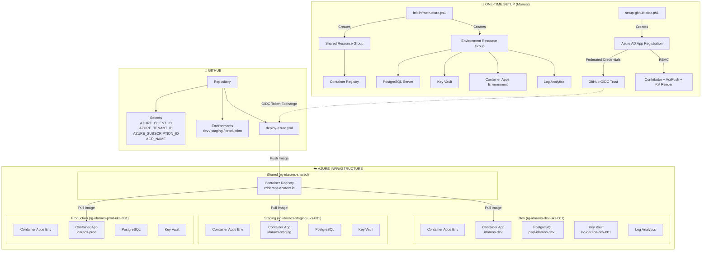
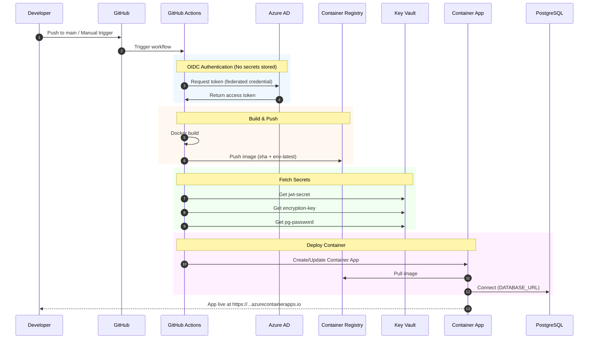
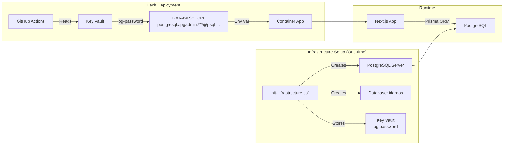

# IdaraOS Deployment Architecture

## Infrastructure & Deployment Flow

## Deployment Pipeline Flow

## Database Handling

## Key Points

| Aspect | How It Works |
|--------|--------------|
| **Auth** | OIDC federation - no secrets stored in GitHub |
| **Database** | Pre-provisioned PostgreSQL, app connects via `DATABASE_URL` |
| **Secrets** | Stored in Key Vault, fetched at deploy time |
| **Images** | Pushed to shared ACR, tagged with SHA + environment |
| **Scaling** | Container Apps auto-scale (1-3 dev, 2-10 prod) |
| **Migrations** | Run via Prisma on app startup (not in pipeline) |
