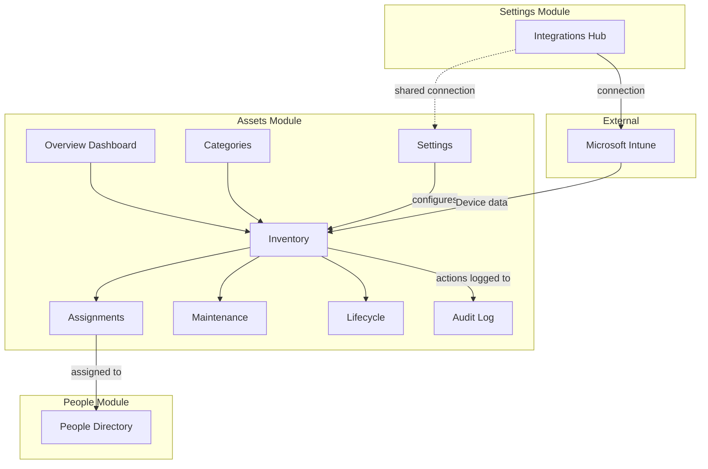
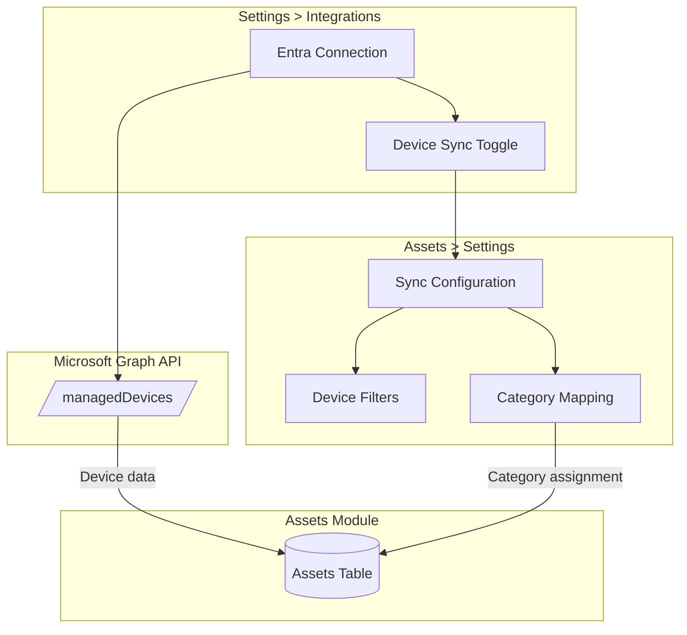
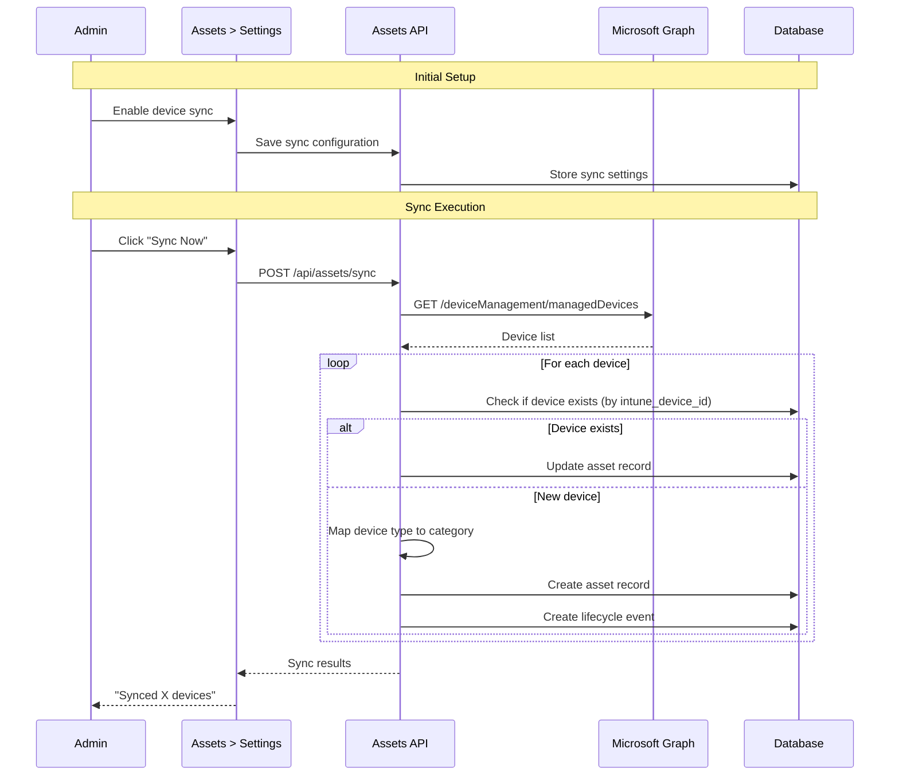
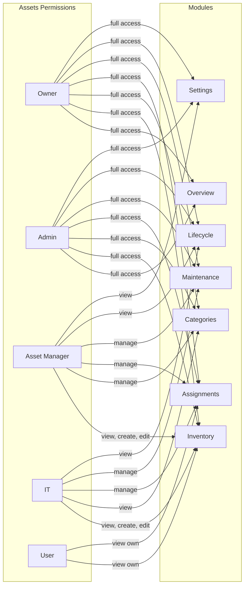
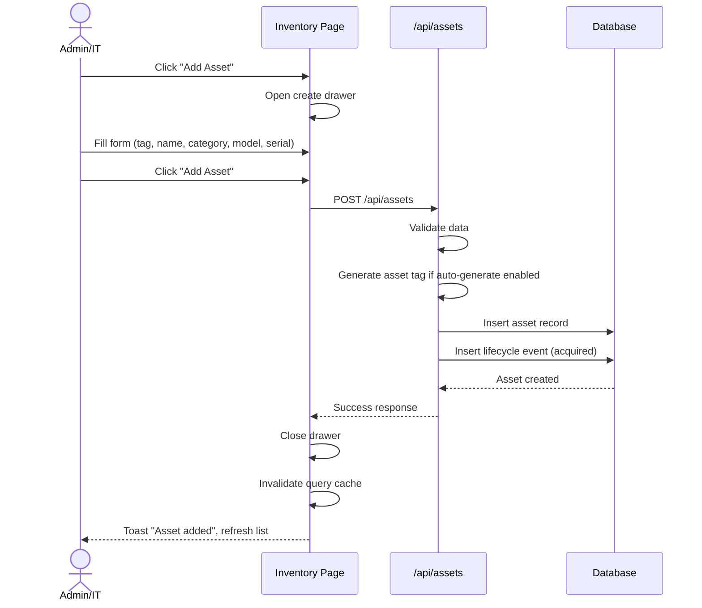
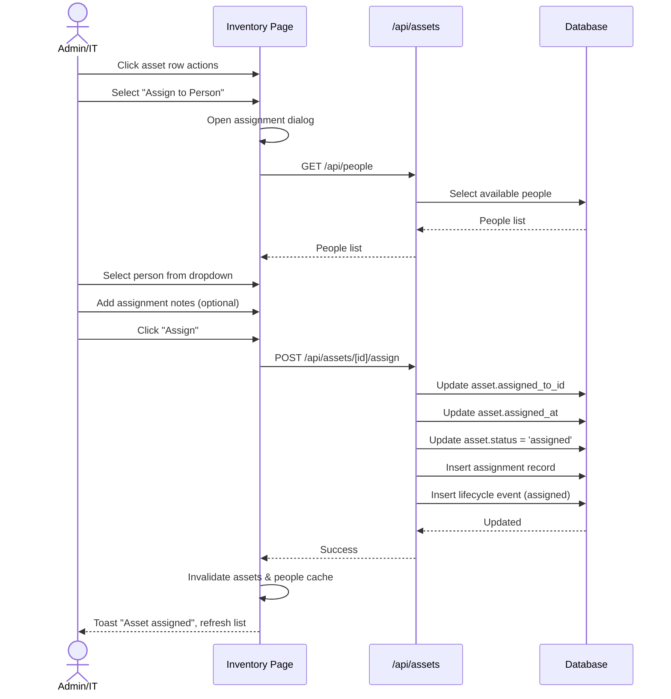
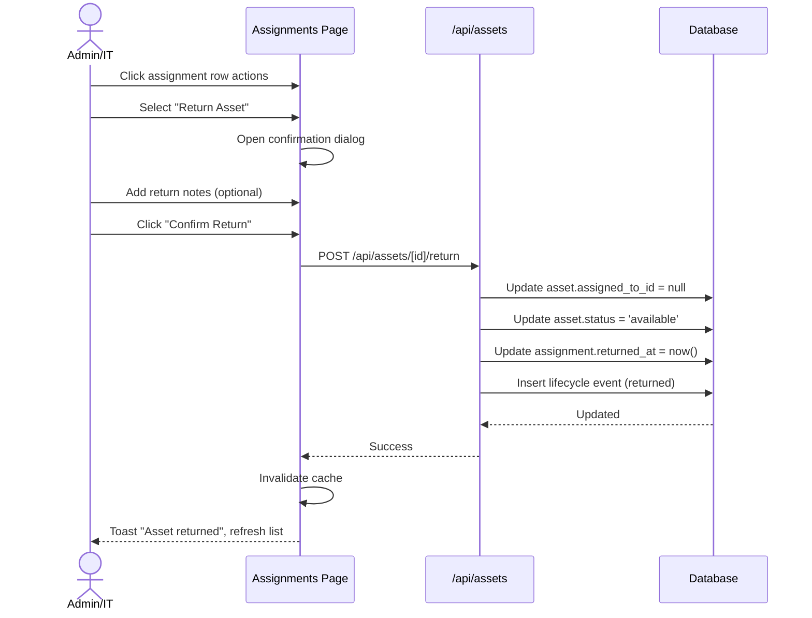
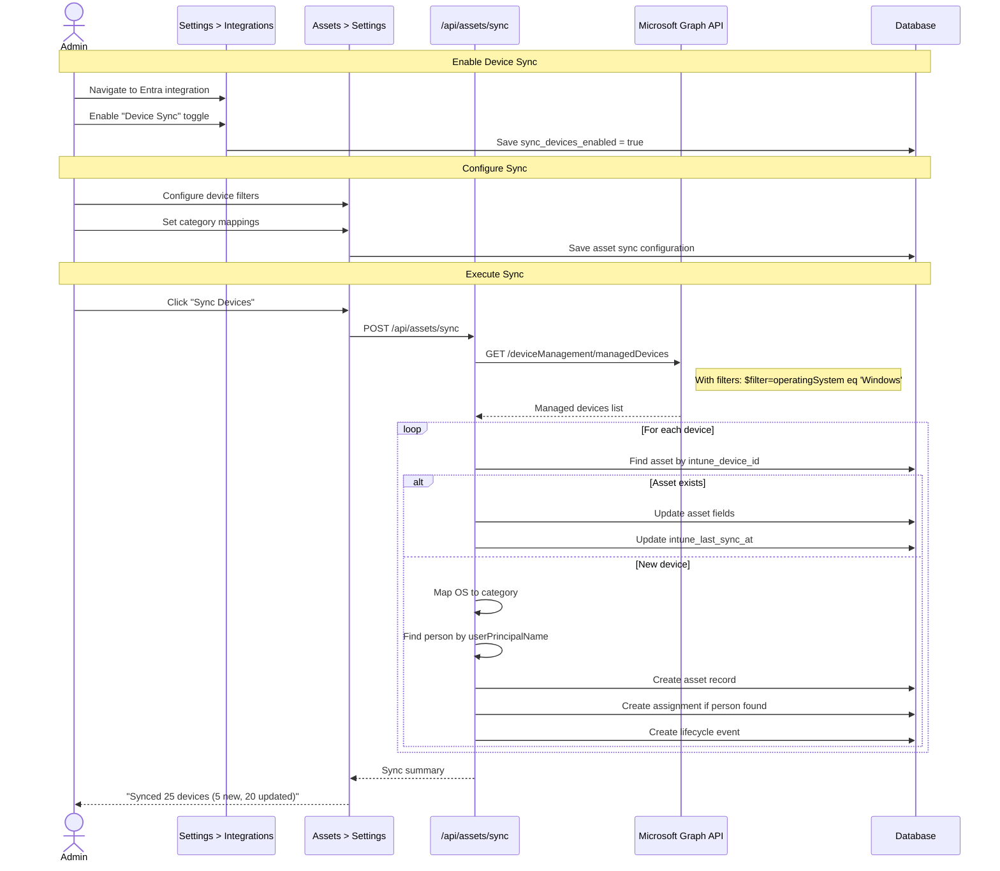
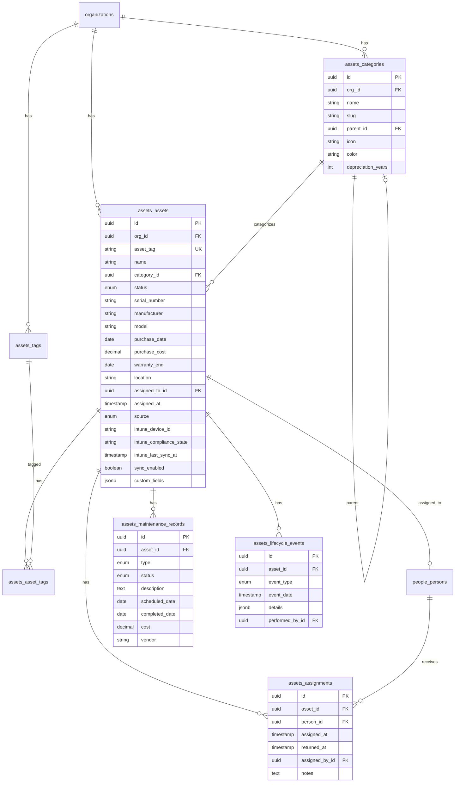

# Assets Module

## Overview

The Assets module manages organizational hardware, software licenses, and equipment. It supports both manual asset management and automated device sync from Microsoft Intune. The module follows the same architectural patterns as the Settings and People modules.

## Module Structure



## Integration Architecture

### Microsoft Intune Sync

The Assets module leverages the existing Entra ID connection from Settings > Integrations to sync devices from Microsoft Intune. This follows the "centralized connection, distributed configuration" pattern.



### Sync Flow



## Sub-Modules

### Overview Dashboard (`/assets`)

High-level view of asset metrics and quick access to sub-modules.

**Features:**
- Total assets count
- Assets by status (available, assigned, maintenance, retired)
- Assets by category breakdown
- Recent activity timeline
- Quick links to sub-modules

### Inventory (`/assets/inventory`)

Central asset registry with full CRUD capabilities.

**Features:**
- Searchable, filterable data table
- Faceted filters (status, category, location, assignee)
- Create asset via drawer form
- Edit asset via drawer form
- Delete asset with confirmation
- Assign/unassign to person
- Column visibility toggle
- CSV export
- Click row to view details
- Stats cards (total, available, assigned, maintenance)
- Intune sync indicator badge

### Asset Detail (`/assets/inventory/[id]`)

Individual asset profile view with comprehensive information.

**Features:**
- Asset card with icon, tag, model, status badge
- Specification details (serial, manufacturer, purchase info)
- Current assignee display with link to person
- Edit/Delete capabilities with RBAC

**Tabs:**
- **Overview**: Specifications, purchase details, warranty info
- **Assignments**: Assignment history with dates and assignees
- **Maintenance**: Maintenance records and repair history
- **Activity**: Lifecycle events timeline

**Intune Integration Section (for synced assets):**
- Sync status indicator
- Compliance state badge
- Last sync timestamp
- Enrollment type
- Warning about manual changes being overwritten

### Categories (`/assets/categories`)

Hierarchical asset type management.

**Features:**
- Tree view of categories
- Create category with icon and color
- Edit category
- Delete category (with asset reassignment)
- Set default depreciation period
- Subcategory support

**Default Categories:**
- Hardware
  - Laptops
  - Desktops
  - Monitors
  - Phones
  - Tablets
  - Peripherals
- Software
  - Licenses
- Furniture
- Vehicles

### Assignments (`/assets/assignments`)

Track asset allocations to people.

**Features:**
- View all current assignments
- Filter by person, department, asset type
- Assign asset to person
- Return asset (end assignment)
- Assignment history per asset
- Bulk assign/unassign

### Maintenance (`/assets/maintenance`)

Repair tickets and maintenance schedules.

**Features:**
- List of maintenance records
- Filter by status, type, date range
- Create maintenance ticket
- Update ticket status
- Track costs and vendors
- Schedule preventive maintenance
- Link to asset detail

### Lifecycle (`/assets/lifecycle`)

Asset lifecycle tracking and disposal management.

**Features:**
- View lifecycle events for all assets
- Filter by event type, date range
- Depreciation overview (optional)
- Disposal records
- Audit trail of all changes

### Settings (`/assets/settings`)

Module-level settings for Assets, including Intune sync configuration.

**Sections:**

#### General Settings
- Default status for new assets
- Required fields configuration
- Auto-generate asset tags toggle

#### Intune Sync Settings (shown only if Entra is connected)

**Device Sync Toggle**: Enable/disable sync

**Device Filters:**
- OS platform filter (Windows, macOS, iOS, Android)
- Compliance state filter
- Management state filter

**Category Mapping:**
| Intune Device Type | Maps To Category |
|--------------------|------------------|
| Windows | Hardware > Laptops/Desktops |
| macOS | Hardware > Laptops/Desktops |
| iOS | Hardware > Phones/Tablets |
| Android | Hardware > Phones/Tablets |

**Sync Behavior:**
- Auto-delete assets when removed from Intune
- Auto-create people for unknown assignees
- Sync frequency (manual only for now)

---

## Permissions

### Permission Matrix

| Sub-Module | Action | Owner | Admin | Asset Manager | IT | User |
|------------|--------|-------|-------|---------------|-----|------|
| Overview | View | Yes | Yes | Yes | Yes | Yes |
| Inventory | View | Yes | Yes | Yes | Yes | Own |
| Inventory | Create | Yes | Yes | Yes | Yes | No |
| Inventory | Edit | Yes | Yes | Yes | Yes | No |
| Inventory | Delete | Yes | Yes | Yes | No | No |
| Categories | View | Yes | Yes | Yes | Yes | Yes |
| Categories | Manage | Yes | Yes | Yes | No | No |
| Assignments | View | Yes | Yes | Yes | Yes | Own |
| Assignments | Manage | Yes | Yes | Yes | Yes | No |
| Maintenance | View | Yes | Yes | Yes | Yes | No |
| Maintenance | Manage | Yes | Yes | Yes | Yes | No |
| Lifecycle | View | Yes | Yes | Yes | Yes | No |
| Settings | View | Yes | Yes | Yes | No | No |
| Settings | Configure | Yes | Yes | No | No | No |

### Permission Diagram



---

## User Flows

### Create Asset Flow



### Assign Asset Flow



### Return Asset Flow



### Intune Sync Flow



---

## API Endpoints

### Assets API

| Method | Path | Description |
|--------|------|-------------|
| GET | `/api/assets` | List all assets |
| POST | `/api/assets` | Create asset |
| GET | `/api/assets/[id]` | Get asset details |
| PATCH | `/api/assets/[id]` | Update asset |
| DELETE | `/api/assets/[id]` | Delete asset |
| POST | `/api/assets/[id]/assign` | Assign asset to person |
| POST | `/api/assets/[id]/return` | Return asset |
| POST | `/api/assets/sync` | Trigger Intune sync |

### Categories API

| Method | Path | Description |
|--------|------|-------------|
| GET | `/api/assets/categories` | List all categories |
| POST | `/api/assets/categories` | Create category |
| PATCH | `/api/assets/categories/[id]` | Update category |
| DELETE | `/api/assets/categories/[id]` | Delete category |

### Assignments API

| Method | Path | Description |
|--------|------|-------------|
| GET | `/api/assets/assignments` | List all assignments |
| GET | `/api/assets/[id]/assignments` | Get assignment history for asset |

### Maintenance API

| Method | Path | Description |
|--------|------|-------------|
| GET | `/api/assets/maintenance` | List all maintenance records |
| POST | `/api/assets/maintenance` | Create maintenance record |
| GET | `/api/assets/[id]/maintenance` | Get maintenance for asset |
| PATCH | `/api/assets/maintenance/[id]` | Update maintenance record |

---

## Database Schema

### Entity Relationships



---

## Status Definitions

| Status | Description | Badge Color |
|--------|-------------|-------------|
| `available` | Ready for assignment | Green |
| `assigned` | Currently assigned to a person | Blue |
| `maintenance` | Under repair or maintenance | Amber |
| `retired` | No longer in active use | Gray |
| `disposed` | Permanently removed | Red |

---

## Components

### Key React Components

- `PageShell` - Page layout with title and actions
- `DataTableAdvanced` - Full-featured data table
- `FormDrawer` - Schema-driven form drawer
- `Protected` - RBAC visibility wrapper
- `StatusBadge` - Asset status indicators
- `StatsCard` - Metric display cards
- `CategoryTree` - Hierarchical category view

### React Query Hooks

Located in `lib/api/assets.ts`:

- `useAssetsList()` - Fetch all assets
- `useAsset(id)` - Fetch single asset
- `useCreateAsset()` - Create mutation
- `useUpdateAsset()` - Update mutation
- `useDeleteAsset()` - Delete mutation
- `useAssignAsset()` - Assign mutation
- `useReturnAsset()` - Return mutation
- `useCategoriesList()` - Fetch categories
- `useSyncDevices()` - Trigger Intune sync

---

## Integration Points

### With People Module

- Assets can be assigned to people in the directory
- Person detail page shows assigned assets
- When person is deleted, assets are unassigned

### With Settings Module

- Borrows Entra ID connection for Intune sync
- Device Sync toggle in Settings > Integrations
- Asset sync configuration in Assets > Settings

### Intune Sync Details

**Required API Permissions:**
```
DeviceManagementManagedDevices.Read.All
DeviceManagementServiceConfig.Read.All
```

**Data Mapping:**

| Intune Property | Asset Field |
|-----------------|-------------|
| `id` | `intune_device_id` |
| `deviceName` | `name` |
| `serialNumber` | `serial_number` |
| `manufacturer` | `manufacturer` |
| `model` | `model` |
| `complianceState` | `intune_compliance_state` |
| `enrolledDateTime` | `purchase_date` (if not set) |
| `lastSyncDateTime` | `intune_last_sync_at` |
| `operatingSystem` | Mapped to category |
| `userPrincipalName` | Used to find/create person |

