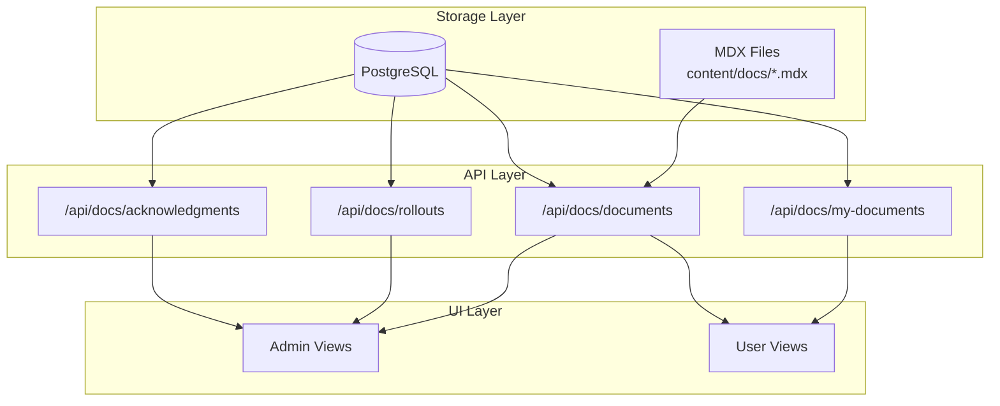
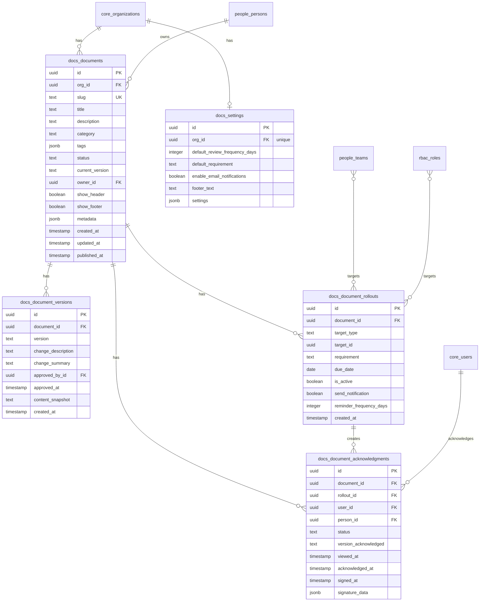
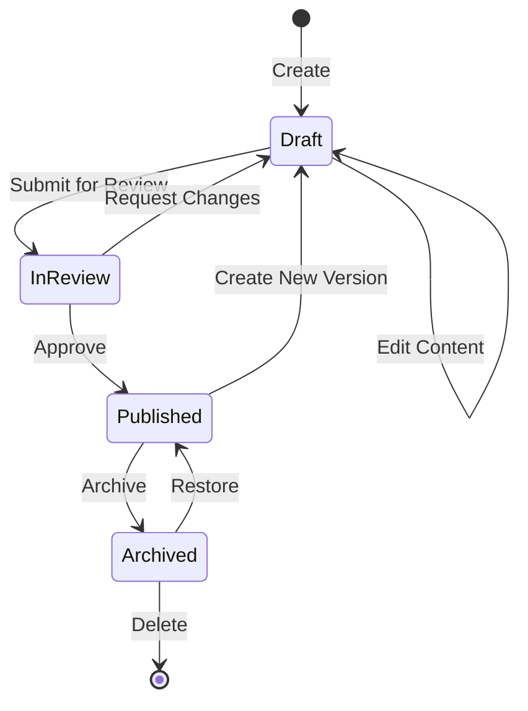
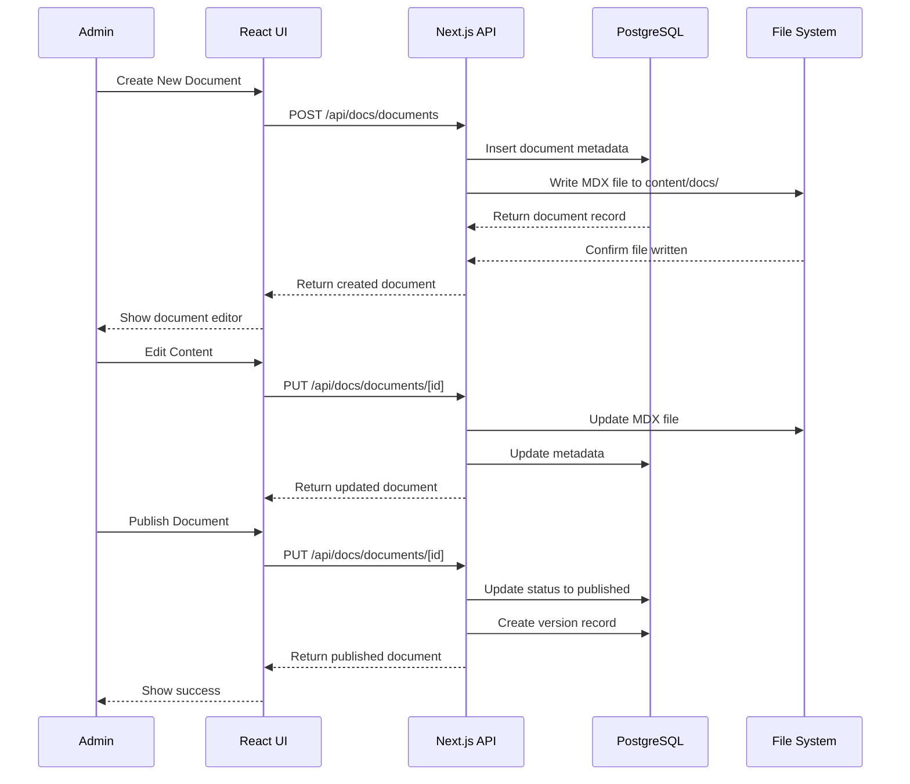
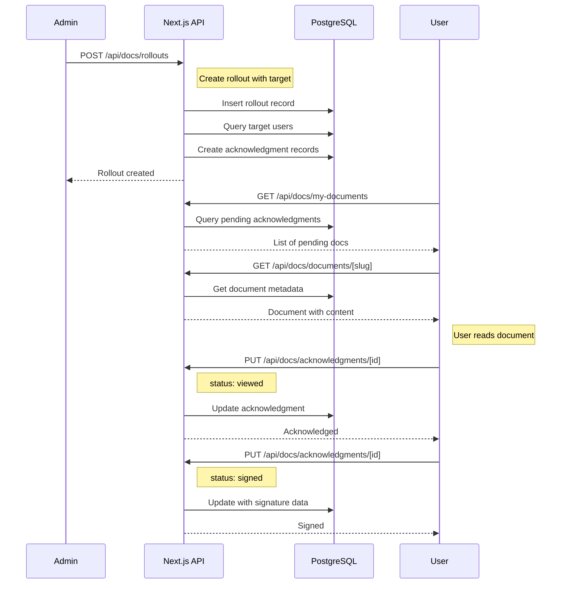
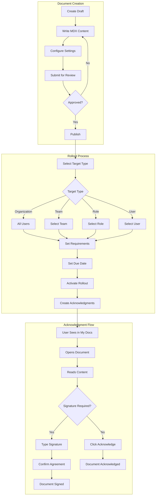
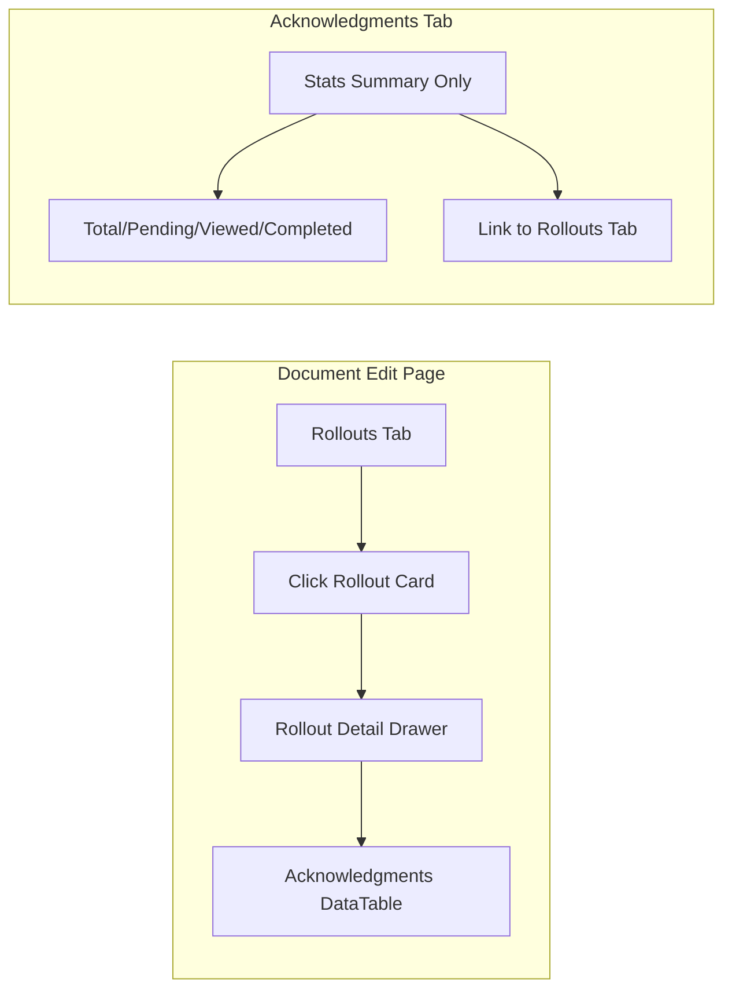
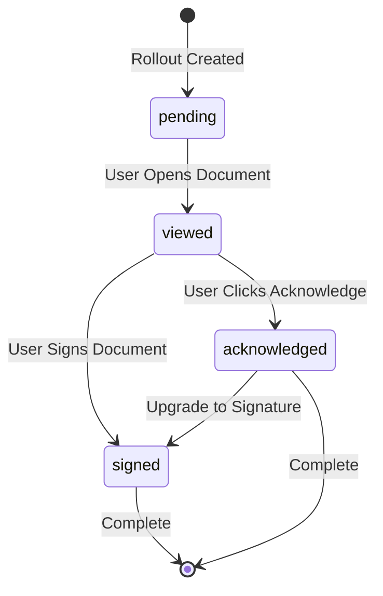

# Documentation Module Architecture

## Overview

The Documentation module provides a comprehensive system for managing organizational documentation including policies, procedures, guidelines, and training materials. It supports:

- **Document Management**: Create, edit, version, and publish documents
- **MDX Rendering**: Rich Markdown/MDX content with custom components
- **Mermaid Diagrams**: Flowcharts, sequence diagrams with pan/zoom/fullscreen
- **Rollout Management**: Target documents to teams, roles, or the entire organization
- **Acknowledgment Tracking**: Track read status, acknowledgments, and signatures
- **RBAC Integration**: Fine-grained permissions for document management

## Architecture Overview



## Database Entity Relationship Diagram



## Document Lifecycle



## Document Creation Sequence



## Rollout and Acknowledgment Flow



## High-Level Process Flow



## Admin Acknowledgment Tracking UX

Acknowledgments are accessed through a document-centric workflow:



**Key UX Decisions:**
- No standalone attestations page - acknowledgments are per-document
- Rollout cards are clickable and show progress bars
- Clicking a rollout opens a slide-out drawer with a paginated DataTable
- Acknowledgments tab shows only aggregate statistics
- Edit button on document view page (RBAC-gated)

## Acknowledgment State Machine



## Database Schema Tables

### docs_documents
Primary table for document metadata.

| Column | Type | Description |
|--------|------|-------------|
| id | UUID | Primary key |
| org_id | UUID | Organization reference |
| slug | TEXT | URL-friendly identifier |
| title | TEXT | Document title |
| description | TEXT | Brief description |
| category | ENUM | policy, procedure, guideline, manual, template, training, general |
| tags | JSONB | Array of tags |
| status | ENUM | draft, in_review, published, archived |
| current_version | TEXT | Current version string (e.g., "1.0") |
| owner_id | UUID | Person who owns the document |
| show_header | BOOLEAN | Display metadata header |
| show_footer | BOOLEAN | Display version history footer |
| show_version_history | BOOLEAN | Display collapsible version history |
| metadata | JSONB | Additional metadata (effectiveDate, confidentiality, etc.) |

### docs_document_versions
Version history for documents.

| Column | Type | Description |
|--------|------|-------------|
| id | UUID | Primary key |
| document_id | UUID | Document reference |
| version | TEXT | Version string |
| change_description | TEXT | Detailed change notes |
| change_summary | TEXT | Brief summary |
| approved_by_id | UUID | Person who approved |
| approved_at | TIMESTAMP | Approval timestamp |
| content_snapshot | TEXT | Optional MDX content snapshot |

### docs_document_rollouts
Defines who needs to read/acknowledge documents.

| Column | Type | Description |
|--------|------|-------------|
| id | UUID | Primary key |
| document_id | UUID | Document reference |
| target_type | ENUM | organization, team, role, user |
| target_id | UUID | Target entity (null for org-wide) |
| requirement | ENUM | optional, required, required_with_signature |
| due_date | DATE | When acknowledgment is due |
| is_active | BOOLEAN | Whether rollout is active |
| send_notification | BOOLEAN | Send email notifications |

### docs_document_acknowledgments
Tracks user reading/signing.

| Column | Type | Description |
|--------|------|-------------|
| id | UUID | Primary key |
| document_id | UUID | Document reference |
| rollout_id | UUID | Rollout reference |
| user_id | UUID | User who needs to acknowledge |
| status | ENUM | pending, viewed, acknowledged, signed |
| version_acknowledged | TEXT | Version they acknowledged |
| viewed_at | TIMESTAMP | When first viewed |
| acknowledged_at | TIMESTAMP | When acknowledged |
| signed_at | TIMESTAMP | When signed |
| signature_data | JSONB | Signature method and value |

## MDX Components

### Available in Documents

```mdx
# Standard Markdown
- Headers (h1-h6)
- Bold, italic, code
- Lists (ordered/unordered)
- Links and images
- Tables
- Code blocks

# Custom Components
<DocumentHeader
  title="Policy Name"
  version="1.0"
  status="published"
  category="policy"
  owner={{ name: "John Doe" }}
  effectiveDate="2024-01-01"
  confidentiality="internal"
  tags={["security", "hr"]}
/>

<Callout variant="warning" title="Important">
  This is a warning callout.
</Callout>

<MermaidDiagram chart={`
flowchart LR
    A[Start] --> B[Process] --> C[End]
`} />

<DocumentFooter
  showVersionHistory={true}
  versions={[...]}
  lastReviewedAt="2024-01-01"
  nextReviewAt="2025-01-01"
/>
```

### Mermaid Diagram Features
- Pan: Click and drag
- Zoom: Mouse wheel
- Fullscreen: Expand button
- Reset: Reset view button

## RBAC Permissions

| Permission | Actions | Roles |
|------------|---------|-------|
| docs.overview | read | User, HR, Security, Auditor, Admin, Owner |
| docs.documents | read | User, HR, Security, Auditor, Admin, Owner |
| docs.documents.write | create, edit | HR, Security, Admin, Owner |
| docs.documents.delete | delete | Admin, Owner |
| docs.documents.publish | publish | HR, Security, Admin, Owner |
| docs.rollouts | read | HR, Security, Admin, Owner |
| docs.rollouts.write | create, edit, delete | HR, Security, Admin, Owner |
| docs.acknowledgments | read | HR, Security, Auditor, Admin, Owner |
| docs.settings | read, write | Admin, Owner |

## File Structure

```
apps/web/
├── app/
│   ├── api/docs/
│   │   ├── documents/
│   │   │   ├── route.ts           # List/create documents
│   │   │   └── [id]/
│   │   │       └── route.ts       # Get/update/delete document
│   │   ├── rollouts/
│   │   │   ├── route.ts           # List/create rollouts
│   │   │   └── [id]/
│   │   │       └── route.ts       # Get/update/delete rollout
│   │   ├── acknowledgments/
│   │   │   ├── route.ts           # List acknowledgments (supports rolloutId filter)
│   │   │   └── [id]/
│   │   │       └── route.ts       # Update acknowledgment
│   │   └── my-documents/
│   │       └── route.ts           # User's pending documents
│   └── (dashboard)/docs/
│       ├── page.tsx               # Overview
│       ├── documents/
│       │   ├── page.tsx           # Document library
│       │   ├── new/
│       │   │   └── page.tsx       # Create document
│       │   └── [slug]/
│       │       ├── page.tsx       # Edit document (with rollout drawer)
│       │       └── rollouts/
│       │           └── new/
│       │               └── page.tsx # Create rollout
│       ├── my-documents/
│       │   └── page.tsx           # My pending docs
│       ├── view/
│       │   └── [slug]/
│       │       └── page.tsx       # Document viewer (with edit button)
│       ├── policies/
│       │   └── page.tsx           # Policy documents
│       ├── procedures/
│       │   └── page.tsx           # SOP documents
│       └── settings/
│           └── page.tsx           # Module settings
├── components/docs/
│   ├── index.ts                   # Exports
│   ├── mdx-renderer.tsx           # MDX rendering
│   ├── document-header.tsx        # Header component
│   ├── document-footer.tsx        # Footer component
│   ├── mermaid-diagram.tsx        # Mermaid with pan/zoom
│   ├── callout.tsx                # Callout boxes
│   ├── table-of-contents.tsx      # ToC with scrollspy
│   └── rollout-detail-drawer.tsx  # Rollout acknowledgments drawer
├── content/docs/
│   └── *.mdx                      # MDX document files
└── lib/
    ├── api/docs.ts                # React Query hooks
    ├── docs/
    │   ├── mdx.ts                 # MDX file utilities
    │   └── types.ts               # TypeScript types & Zod schemas
    └── db/schema/docs.ts          # Drizzle schema
```

## Integration Points

### Security Module
- Link documents to security controls via `linked_control_ids`
- Reference in compliance frameworks via `linked_framework_codes`
- Track as evidence for audits

### Workflows Module
- Approval workflows for publishing
- Review workflows for periodic reviews

### People Module
- Owner assignment from person directory
- Team-based rollouts
- Role-based rollouts

## Future Enhancements

- [ ] Document templates
- [ ] AI-assisted writing
- [ ] Document comparison/diff view
- [ ] Export to PDF
- [ ] Email notifications for rollouts
- [ ] Slack integration for reminders
- [ ] Analytics dashboard
- [ ] Document search (full-text)
- [ ] Version bump wizard on publish
- [ ] Bulk rollout management
- [ ] Document expiry alerts
