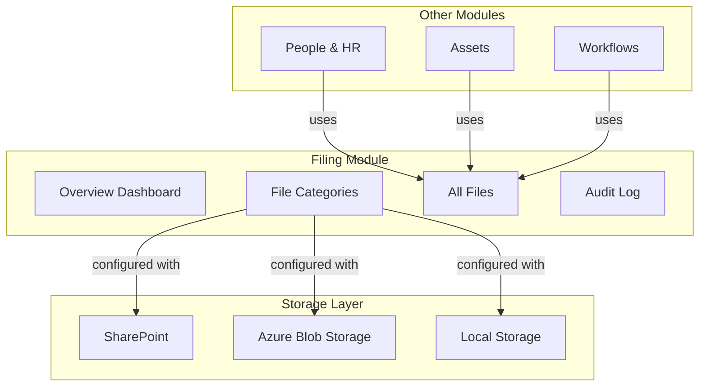
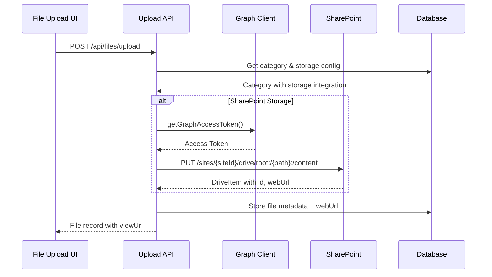
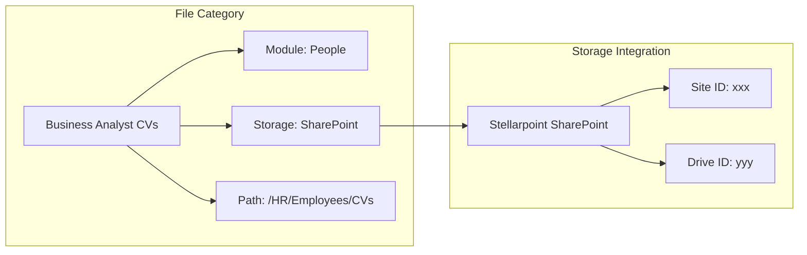
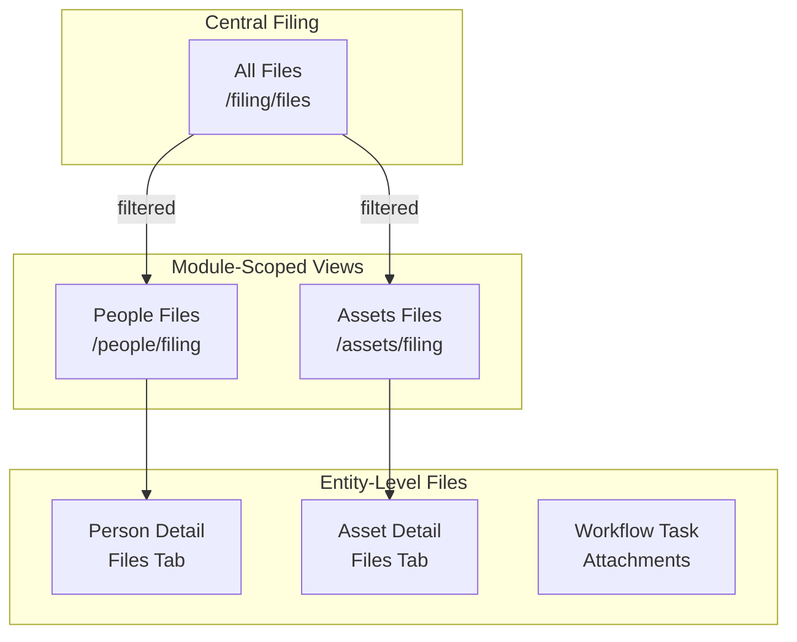
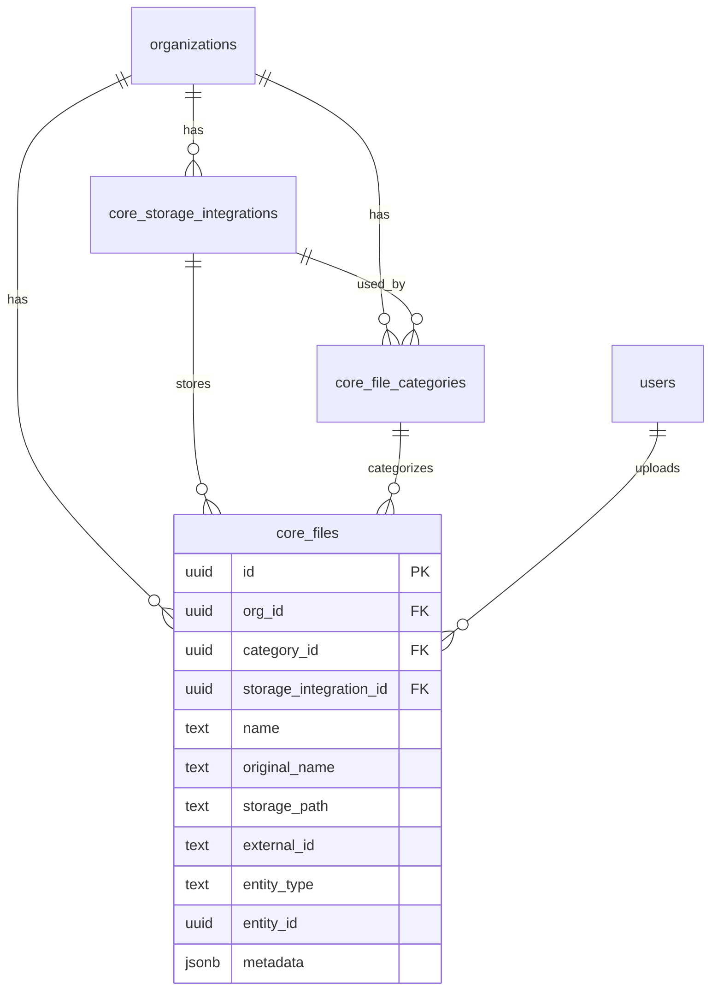

# Filing Module

## Overview

The Filing module provides centralized file management across all modules in IdaraOS. It enables organizations to store, categorize, and manage documents with configurable storage backends including SharePoint, Azure Blob Storage, and local storage.

## Module Structure

## Architecture

### Storage Integration Flow

### File Category Architecture

Each file category defines:
- **Module Scope**: Which module it belongs to (People, Assets, Workflows, etc.)
- **Storage Integration**: Where files are physically stored
- **Folder Path**: Sub-folder within the storage location
- **Validation Rules**: Max file size, allowed MIME types
- **Required Flag**: Whether files in this category are mandatory

## Sub-Modules

### Overview (`/filing`)

Dashboard showing file statistics and recent activity.

**Features:**
- Total files across all modules
- Storage usage by provider
- Recent uploads
- Quick links to categories and files

### File Categories (`/filing/categories`)

Create and manage file categories for organizing documents.

**Features:**
- Create categories scoped to specific modules
- Assign storage integrations (SharePoint, Blob, Local)
- Configure folder paths within storage
- Set file validation rules (size limits, MIME types)
- Mark categories as required for compliance
- Visual icon and color customization

### All Files (`/filing/files`)

Browse and manage all files across the organization.

**Features:**
- DataTable with filtering by module, category, date
- Search by file name
- Download files (generates pre-authenticated URLs)
- View in Storage (opens file in SharePoint/Blob)
- View linked entity (person, asset, workflow task)
- Delete files (soft delete)
- Pagination for large file sets

### Audit Log (`/filing/audit-log`)

Track all file-related activities for compliance.

**Features:**
- File upload, download, delete events
- Category create, update, delete events
- Filter by date range, action type
- Export for compliance reporting

## Module-Scoped Filing

Each module has its own filing sub-section showing only files relevant to that module:

- **People & HR** → `/people/filing`
- **Assets** → `/assets/filing`
- **Workflows** → Attachments on workflow tasks

## Storage Providers

### SharePoint Integration

Uses Microsoft Graph API for file operations.

**Requirements:**
- Microsoft 365 integration configured in Settings → Integrations
- Entra app with `Sites.ReadWrite.All` **Application** permission
- Admin consent granted

**Flow:**
1. Test connection fetches Site ID and Drive ID from SharePoint
2. Uploads use `PUT /sites/{siteId}/drives/{driveId}/root:/{path}:/content`
3. Downloads use `@microsoft.graph.downloadUrl` from drive items
4. webUrl stored for "View in SharePoint" feature

### Azure Blob Storage

**Requirements:**
- Storage account name and container name
- Connection string (encrypted) or managed identity

**Status:** Configuration validated, full upload/download pending Azure SDK integration.

### Local Storage

Development-only storage for testing.

**Status:** Metadata storage only, no actual file persistence.

## Permissions

### Permission Matrix

| Sub-Module | Action | Owner | Admin | HR | User |
|------------|--------|-------|-------|-----|------|
| Overview | View | Yes | Yes | Yes | Yes |
| Categories | View | Yes | Yes | Yes | No |
| Categories | Create | Yes | Yes | No | No |
| Categories | Edit | Yes | Yes | No | No |
| Categories | Delete | Yes | Yes | No | No |
| Files | View | Yes | Yes | Yes | Yes* |
| Files | Create | Yes | Yes | Yes | Yes* |
| Files | Delete | Yes | Yes | No | No |
| Audit Log | View | Yes | Yes | Yes | No |

*Users can view/upload files only for entities they have access to.

## API Endpoints

### Categories API

| Method | Path | Description |
|--------|------|-------------|
| GET | `/api/filing/categories` | List all categories |
| POST | `/api/filing/categories` | Create category |
| GET | `/api/filing/categories/[id]` | Get category details |
| PATCH | `/api/filing/categories/[id]` | Update category |
| DELETE | `/api/filing/categories/[id]` | Delete category |

### Files API

| Method | Path | Description |
|--------|------|-------------|
| GET | `/api/files` | List files with filters |
| POST | `/api/files/upload` | Upload file |
| GET | `/api/files/[id]` | Get file details |
| PATCH | `/api/files/[id]` | Update file metadata |
| DELETE | `/api/files/[id]` | Soft delete file |
| GET | `/api/files/[id]/download` | Get download URL |

**Query Parameters for `/api/files`:**

| Parameter | Type | Description |
|-----------|------|-------------|
| `moduleScope` | string | Filter by module (people, assets, workflows) |
| `categoryId` | uuid | Filter by category |
| `entityType` | string | Filter by entity type (person, asset, workflow_step) |
| `entityId` | uuid | Filter by specific entity |
| `search` | string | Search in file names |
| `includeDeleted` | boolean | Include soft-deleted files |
| `page` | number | Page number (default 1) |
| `limit` | number | Results per page (default 50, max 100) |

## Database Schema

### Tables

#### `core_storage_integrations`

Configured in Settings → Integrations → File Storage.

| Column | Type | Description |
|--------|------|-------------|
| `id` | UUID | Primary key |
| `org_id` | UUID | Organization |
| `provider` | TEXT | sharepoint, azure_blob, local |
| `name` | TEXT | Display name |
| `status` | TEXT | connected, disconnected, error |
| `site_url` | TEXT | SharePoint site URL |
| `site_id` | TEXT | SharePoint site ID (from Graph) |
| `drive_id` | TEXT | SharePoint drive ID (from Graph) |
| `account_name` | TEXT | Azure storage account |
| `container_name` | TEXT | Azure blob container |
| `connection_string_encrypted` | TEXT | Encrypted connection string |
| `base_path` | TEXT | Root folder path |
| `use_entra_auth` | BOOLEAN | Use Entra ID auth |

#### `core_file_categories`

| Column | Type | Description |
|--------|------|-------------|
| `id` | UUID | Primary key |
| `org_id` | UUID | Organization |
| `name` | TEXT | Category name |
| `slug` | TEXT | URL-safe identifier |
| `module_scope` | TEXT | people, assets, workflows, etc. |
| `storage_integration_id` | UUID | FK to storage integration |
| `folder_path` | TEXT | Sub-folder within storage |
| `is_required` | BOOLEAN | Required category flag |
| `max_file_size` | INTEGER | Max size in bytes |
| `allowed_mime_types` | JSONB | Array of allowed types |
| `icon` | TEXT | Lucide icon name |
| `color` | TEXT | Badge color |

#### `core_files`

| Column | Type | Description |
|--------|------|-------------|
| `id` | UUID | Primary key |
| `org_id` | UUID | Organization |
| `category_id` | UUID | FK to category |
| `name` | TEXT | Display name |
| `original_name` | TEXT | Original filename |
| `mime_type` | TEXT | File MIME type |
| `size` | INTEGER | File size in bytes |
| `storage_integration_id` | UUID | FK to storage integration |
| `storage_path` | TEXT | Full path in storage |
| `external_id` | TEXT | SharePoint item ID |
| `entity_type` | TEXT | person, asset, workflow_step |
| `entity_id` | UUID | ID of linked entity |
| `module_scope` | TEXT | Denormalized for queries |
| `is_deleted` | BOOLEAN | Soft delete flag |
| `metadata` | JSONB | webUrl, storageProvider, etc. |
| `uploaded_by_id` | UUID | FK to user |

### Relationships

## Components

### Key React Components

- `FileUpload` - Drag-and-drop file upload with category selection
- `PageShell` - Consistent page layout
- `DataTable` - File listing with filters
- `StatusBadge` - Storage status indicators
- `FormDrawer` - Category create/edit form

### React Query Hooks

- `useFilesList(options)` - List files with filters
- `useEntityFiles(entityType, entityId)` - Files for a specific entity
- `useModuleFiles(moduleScope)` - Files for a module
- `useUploadFile()` - Upload mutation
- `useDeleteFile()` - Delete mutation
- `useFileDownload()` - Get download URL
- `useFileCategoriesList()` - List categories
- `useCreateFileCategory()` - Create category
- `useUpdateFileCategory()` - Update category
- `useDeleteFileCategory()` - Delete category

## Graph Client Utility

Located at `lib/graph/client.ts`, provides SharePoint operations:

| Function | Description |
|----------|-------------|
| `getGraphAccessToken()` | Get OAuth token using Entra credentials |
| `getSiteByUrl(url)` | Resolve SharePoint site from URL |
| `getSiteDrive(siteId)` | Get default document library |
| `uploadFile(...)` | Upload file to SharePoint |
| `getDownloadUrl(...)` | Get pre-authenticated download URL |
| `testSharePointConnection(url)` | Test and return site/drive IDs |
