# People & HR Module

## Overview

The People & HR module manages workforce information, employee lifecycle, and HR operations. It serves as a foundational module that other modules reference for people-related data (assignees, owners, approvers).

## Module Structure

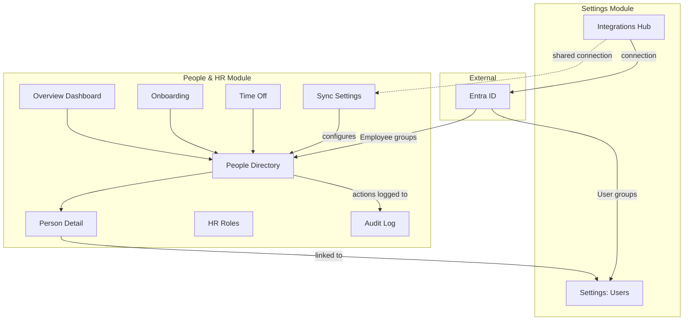
```mermaid
graph TB
    subgraph "People & HR Module"
        OVERVIEW[Overview Dashboard]
        DIR[People Directory]
        DETAIL[Person Detail]
        ONBOARD[Onboarding]
        TIMEOFF[Time Off]
        ROLES[HR Roles]
        SYNC[Sync Settings]
        AUDIT[Audit Log]
    end
    
    OVERVIEW --> DIR
    DIR --> DETAIL
    DETAIL --> |linked to| USERS[Settings: Users]
    ONBOARD --> DIR
    TIMEOFF --> DIR
    SYNC --> |configures| DIR
    DIR --> |actions logged to| AUDIT
    
    subgraph "Settings Module"
        USERS
        INT[Integrations Hub]
    end
    
    subgraph "External"
        ENTRA[Entra ID]
    end
    
    INT --> |connection| ENTRA
    INT -.-> |shared connection| SYNC
    ENTRA --> |User groups| USERS
    ENTRA --> |Employee groups| DIR
```

## Integration Architecture

### Two Sync Modes

The People module supports two mutually exclusive sync modes:

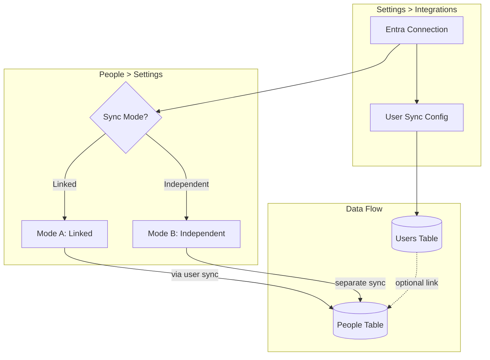
```mermaid
graph TB
    subgraph "Settings > Integrations"
        ENTRA[Entra Connection]
        USER_SYNC[User Sync Config]
    end
    
    subgraph "People > Settings"
        MODE{Sync Mode?}
        MODE_A[Mode A: Linked]
        MODE_B[Mode B: Independent]
    end
    
    subgraph "Data Flow"
        USERS[(Users Table)]
        PEOPLE[(People Table)]
    end
    
    ENTRA --> USER_SYNC
    ENTRA --> MODE
    
    MODE -->|Linked| MODE_A
    MODE -->|Independent| MODE_B
    
    USER_SYNC --> USERS
    MODE_A --> |via user sync| PEOPLE
    MODE_B --> |separate sync| PEOPLE
    USERS -.-> |optional link| PEOPLE
```

### Mode Comparison

| Aspect | Mode A: Linked | Mode B: Independent |
|--------|---------------|---------------------|
| People created from | User sync | Separate group sync |
| Can have users without people | No | Yes |
| Can have people without users | No | Yes |
| Group configuration | In Settings | In People > Settings |
| Use case | Simple: all users = employees | Complex: separate populations |

### Mode A: Linked to User Sync (Default)

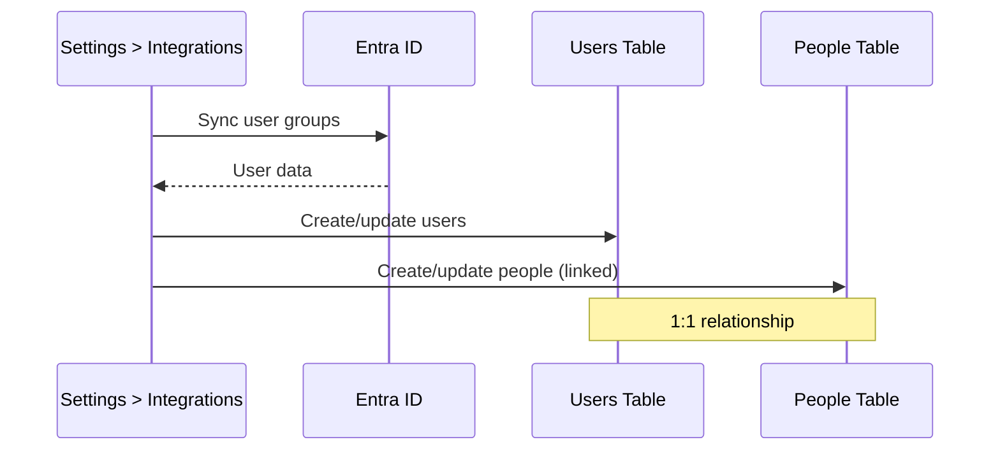
```mermaid
sequenceDiagram
    participant Settings as Settings > Integrations
    participant Entra as Entra ID
    participant Users as Users Table
    participant People as People Table
    
    Settings->>Entra: Sync user groups
    Entra-->>Settings: User data
    Settings->>Users: Create/update users
    Settings->>People: Create/update people (linked)
    Note over Users,People: 1:1 relationship
```

### Mode B: Independent People Sync

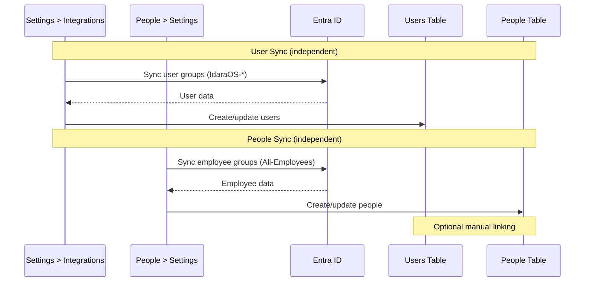
```mermaid
sequenceDiagram
    participant Settings as Settings > Integrations
    participant PeopleSettings as People > Settings
    participant Entra as Entra ID
    participant Users as Users Table
    participant People as People Table
    
    Note over Settings,People: User Sync (independent)
    Settings->>Entra: Sync user groups (IdaraOS-*)
    Entra-->>Settings: User data
    Settings->>Users: Create/update users
    
    Note over Settings,People: People Sync (independent)
    PeopleSettings->>Entra: Sync employee groups (All-Employees)
    Entra-->>PeopleSettings: Employee data
    PeopleSettings->>People: Create/update people
    
    Note over Users,People: Optional manual linking
```

### Mutual Exclusivity

When Mode B is enabled in People > Settings:
- The "Sync People with Users" toggle in Settings > Integrations is **disabled**
- A message appears: "People sync is managed in People > Settings"
- The user must go to People > Settings to configure or disable

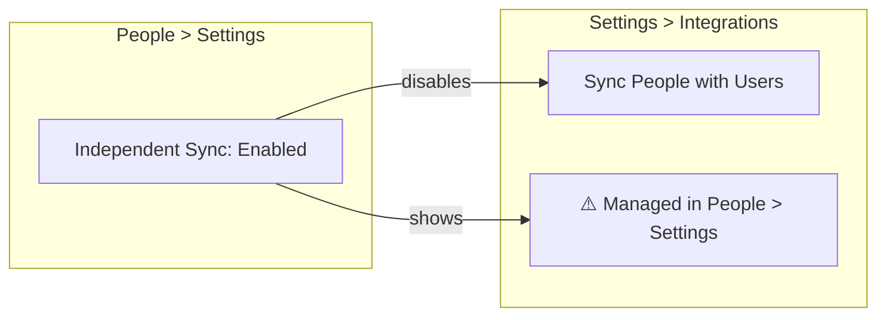
```mermaid
graph LR
    subgraph "Settings > Integrations"
        TOGGLE[Sync People with Users]
        MSG[⚠️ Managed in People > Settings]
    end
    
    subgraph "People > Settings"
        MODE_B[Independent Sync: Enabled]
    end
    
    MODE_B -->|disables| TOGGLE
    MODE_B -->|shows| MSG
```

## Sub-Modules

### Overview Dashboard (`/people`)

High-level view of workforce metrics and quick access to sub-modules.

**Features:**
- Total people count
- Active employees count
- Onboarding in progress
- Teams count
- Quick links to sub-modules
- Recent activity timeline

### People Directory (`/people/directory`)

Central employee listing with full CRUD capabilities.

**Features:**
- Searchable, filterable data table
- Faceted filters (status, team, role, start date)
- Create person via drawer form
- Edit person via drawer form
- Delete person with confirmation
- Link/unlink to user account
- Column visibility toggle
- CSV export
- Click row to view details
- Stats cards (total, active, recent hires, teams)

### Person Detail (`/people/directory/[slug]`)

Individual employee profile view with comprehensive integration information.

**Features:**
- Profile card with avatar, contact info, status badge
- Employment details (ID, department, role, location, dates)
- Bio section
- Linked user account display with status
- Edit/Delete capabilities with RBAC

**Tabs:**
- **Overview**: Employment details, bio, linked user card, quick stats
- **Integrations**: Entra ID sync status, source group, last sync time, linked user system access
- **Documents**: Document management (planned)
- **Activity**: Activity timeline with sync events, updates, creation

**Entra Integration Section:**
- Sync status indicator (synced vs manual)
- Source Entra group name
- Last sync timestamp
- Sync enabled toggle status
- Warning about manual changes being overwritten
- Linked user system access status

### Onboarding (`/people/onboarding`)

**Status:** Needs Update - Currently uses placeholder data

New hire workflow tracking, now powered by the Workflows module.

**Architecture Change (2024-12):**
- Onboarding is now handled via **Workflows** rather than a custom sub-module
- When a person's status changes to "onboarding", a workflow instance auto-starts
- This page should display workflow instances for people in "onboarding" status

**Needs Implementation:**
- Connect to `/api/workflows/instances?entityType=person&status=onboarding`
- Show progress from actual workflow instance steps
- Link to full workflow instance detail page
- Remove hardcoded seed data

### Time Off (`/people/time-off`) - Deferred

Leave request and calendar management.

**Status:** Placeholder - Not in MVP scope

**Future Options:**
- Third-party integration (BambooHR, Personio, etc.)
- Custom implementation with leave policies
- Workflow-based approval system

### HR Roles (`/people/roles`) - Simplified

**Status:** Placeholder - Uses seed data

**Current Approach:**
- Teams and roles are free-text fields on Person records
- No separate entity management for MVP

**Future Enhancement:**
- Consider structured Teams table with manager hierarchy
- Job catalog with levels and bands

### Audit Log (`/people/audit-log`)

View audit trail for all People & HR module activities.

**Features:**
- Searchable, filterable audit log table
- Filter by action type (create, update, delete)
- Filter by date range
- View detailed change history with before/after comparison
- Export to CSV/JSON
- Actor identification (who made the change)
- IP address and user agent tracking

**Audit Log Data Flow:**

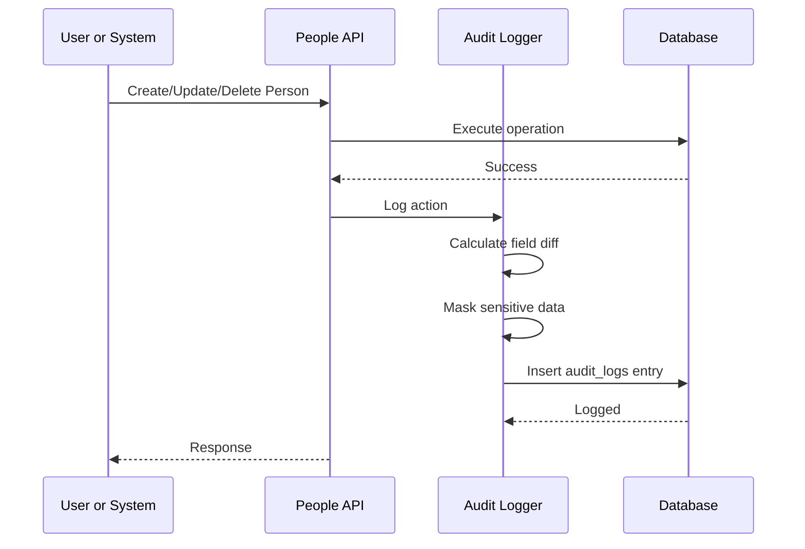
```mermaid
sequenceDiagram
    participant User as User or System
    participant API as People API
    participant AuditService as Audit Logger
    participant DB as Database
    
    User->>API: Create/Update/Delete Person
    API->>DB: Execute operation
    DB-->>API: Success
    API->>AuditService: Log action
    AuditService->>AuditService: Calculate field diff
    AuditService->>AuditService: Mask sensitive data
    AuditService->>DB: Insert audit_logs entry
    DB-->>AuditService: Logged
    API-->>User: Response
```

**Audit Entry Structure:**

| Field | Description |
|-------|-------------|
| `module` | Module identifier (e.g., `people.directory`) |
| `action` | Action type (create, update, delete) |
| `entityType` | Entity type (e.g., `person`) |
| `entityId` | UUID of affected entity |
| `entityName` | Human-readable name |
| `actorEmail` | Email of the actor |
| `actorIp` | IP address of the request |
| `previousValues` | JSON of values before the change |
| `newValues` | JSON of values after the change |
| `changedFields` | Array of field names that changed |
| `timestamp` | When the action occurred |

### Settings (`/people/settings`) - Planned

Module-level settings for People & HR, including Entra sync configuration.

**Sections:**

#### General Settings
- Default status for new employees
- Required fields configuration
- Archive vs delete behavior

#### Entra Sync Settings (shown only if Entra is connected in Settings > Integrations)

Two mutually exclusive modes:

**Mode A: Linked to User Sync** (default)
- People records are created/updated when users are synced
- Inherits from Settings > Integrations user sync
- Simple 1:1 relationship between users and people

**Mode B: Independent People Sync**
- Separate Entra group pattern specifically for People
- Can sync employees who are NOT system users
- People and Users are independent data sets
- Disables "create people from users" in core module

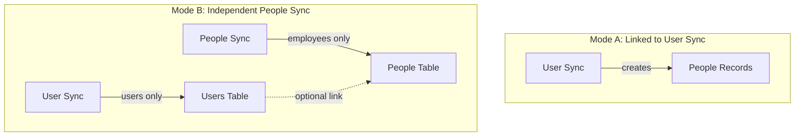
```mermaid
graph TB
    subgraph "Mode A: Linked to User Sync"
        USERS1[User Sync] --> |creates| PEOPLE1[People Records]
    end
    
    subgraph "Mode B: Independent People Sync"
        USERS2[User Sync] --> |users only| USER_TABLE[Users Table]
        PEOPLE_SYNC[People Sync] --> |employees only| PEOPLE_TABLE[People Table]
        USER_TABLE -.-> |optional link| PEOPLE_TABLE
    end
```

**Mode B Settings (when enabled):**
- Group pattern (e.g., `All-Employees`, `Employees-*`)
- Property mapping (Entra fields → People fields)
- Auto-delete when removed from groups
- Sync frequency
- Manual sync trigger

**Key Difference from Settings > Integrations:**

| Settings > Integrations | People > Settings |
|------------------------|-------------------|
| Entra connection (credentials) | Sync mode selection |
| SSO configuration | Group pattern for people |
| SCIM endpoint for users | Property mapping |
| User → Role mapping | Delete behavior |
| ~~Sync People with Users~~ | Moved here ↗ |

**Important:** When Mode B is enabled in People > Settings, the "Sync People with Users" option in Settings > Integrations is disabled and shows a message directing users to People > Settings.

---

## Permissions

### Permission Matrix

| Sub-Module | Action | Owner | Admin | HR | User |
|------------|--------|-------|-------|-----|------|
| Overview | View | Yes | Yes | Yes | Yes |
| Directory | View | Yes | Yes | Yes | Yes |
| Directory | Create | Yes | Yes | Yes | No |
| Directory | Edit | Yes | Yes | Yes | No |
| Directory | Delete | Yes | Yes | No | No |
| Person Detail | View | Yes | Yes | Yes | Yes |
| Person Detail | Edit | Yes | Yes | Yes | No |
| Onboarding | View | Yes | Yes | Yes | No |
| Onboarding | Manage | Yes | Yes | Yes | No |
| Time Off | View | Yes | Yes | Yes | Own |
| Time Off | Request | Yes | Yes | Yes | Yes |
| Time Off | Approve | Yes | Yes | Yes | No |
| Audit Log | View | Yes | Yes | Yes | No |
| Sync Settings | View | Yes | Yes | Yes | No |
| Sync Settings | Configure | Yes | Yes | No | No |
| Sync Settings | Trigger Sync | Yes | Yes | Yes | No |

### Permission Diagram

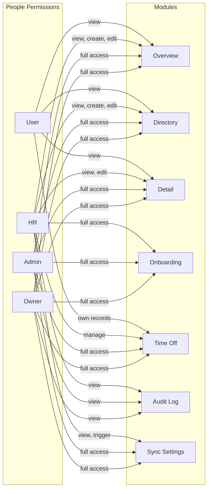
```mermaid
graph LR
    subgraph "People Permissions"
        OWNER[Owner]
        ADMIN[Admin]
        HR[HR]
        USER[User]
    end
    
    subgraph "Modules"
        OVR[Overview]
        DIR[Directory]
        DET[Detail]
        ONB[Onboarding]
        TOF[Time Off]
        AUD[Audit Log]
        SYNC[Sync Settings]
    end
    
    OWNER -->|full access| OVR
    OWNER -->|full access| DIR
    OWNER -->|full access| DET
    OWNER -->|full access| ONB
    OWNER -->|full access| TOF
    OWNER -->|view| AUD
    OWNER -->|full access| SYNC
    
    ADMIN -->|full access| OVR
    ADMIN -->|full access| DIR
    ADMIN -->|full access| DET
    ADMIN -->|full access| ONB
    ADMIN -->|full access| TOF
    ADMIN -->|view| AUD
    ADMIN -->|full access| SYNC
    
    HR -->|view, create, edit| OVR
    HR -->|view, create, edit| DIR
    HR -->|view, edit| DET
    HR -->|full access| ONB
    HR -->|manage| TOF
    HR -->|view| AUD
    HR -->|view, trigger| SYNC
    
    USER -->|view| OVR
    USER -->|view| DIR
    USER -->|view| DET
    USER -->|own records| TOF
```

---

## User Flows

### Create Person Flow

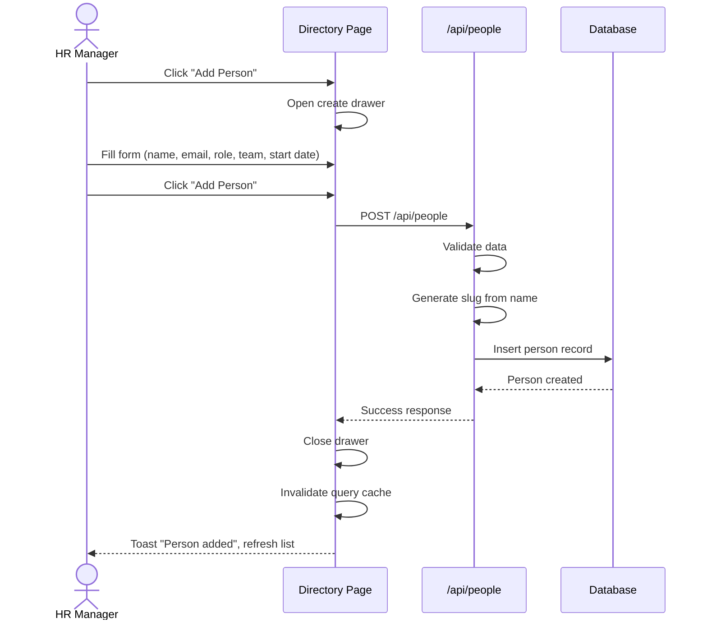
```mermaid
sequenceDiagram
    actor HR as HR Manager
    participant UI as Directory Page
    participant API as /api/people
    participant DB as Database
    
    HR->>UI: Click "Add Person"
    UI->>UI: Open create drawer
    HR->>UI: Fill form (name, email, role, team, start date)
    HR->>UI: Click "Add Person"
    
    UI->>API: POST /api/people
    API->>API: Validate data
    API->>API: Generate slug from name
    API->>DB: Insert person record
    DB-->>API: Person created
    API-->>UI: Success response
    UI->>UI: Close drawer
    UI->>UI: Invalidate query cache
    UI-->>HR: Toast "Person added", refresh list
```

### Person Lifecycle Flow

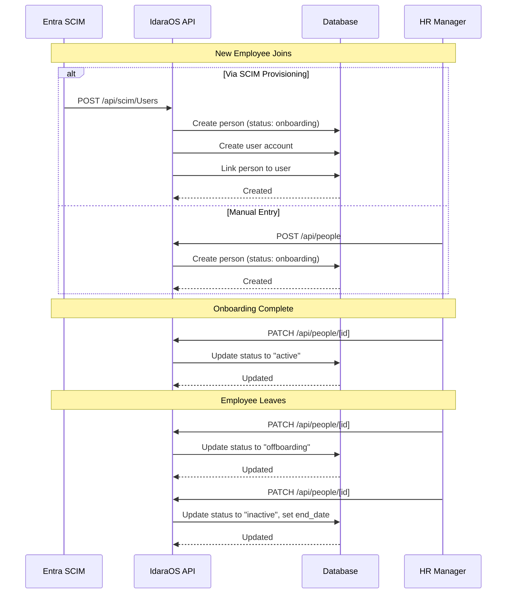
```mermaid
sequenceDiagram
    participant SCIM as Entra SCIM
    participant API as IdaraOS API
    participant DB as Database
    participant HR as HR Manager
    
    Note over SCIM,HR: New Employee Joins
    
    alt Via SCIM Provisioning
        SCIM->>API: POST /api/scim/Users
        API->>DB: Create person (status: onboarding)
        API->>DB: Create user account
        API->>DB: Link person to user
        DB-->>API: Created
    else Manual Entry
        HR->>API: POST /api/people
        API->>DB: Create person (status: onboarding)
        DB-->>API: Created
    end
    
    Note over SCIM,HR: Onboarding Complete
    
    HR->>API: PATCH /api/people/[id]
    API->>DB: Update status to "active"
    DB-->>API: Updated
    
    Note over SCIM,HR: Employee Leaves
    
    HR->>API: PATCH /api/people/[id]
    API->>DB: Update status to "offboarding"
    DB-->>API: Updated
    
    HR->>API: PATCH /api/people/[id]
    API->>DB: Update status to "inactive", set end_date
    DB-->>API: Updated
```

### Link Person to User Account Flow

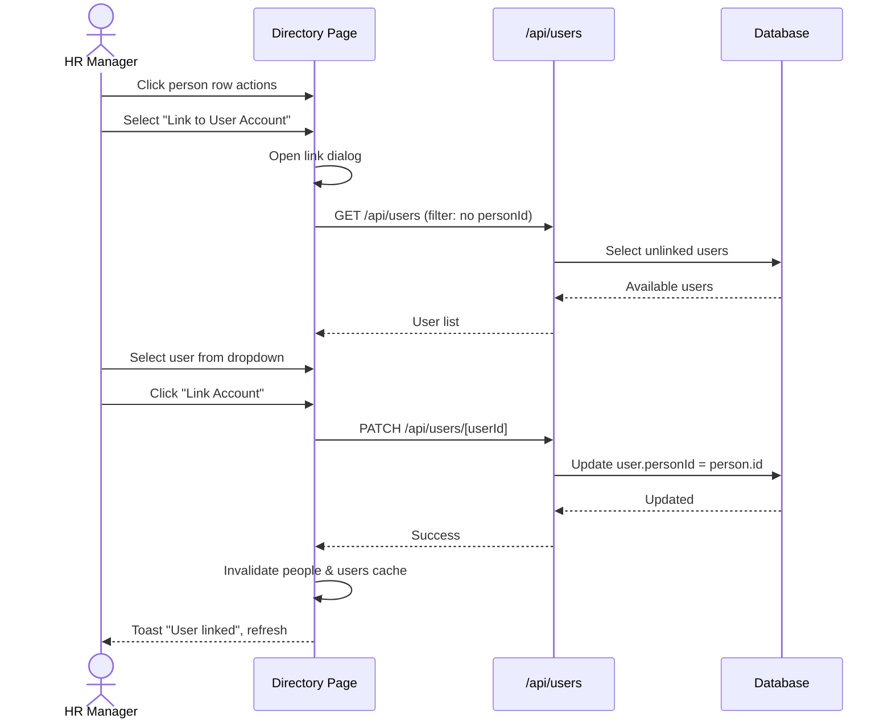
```mermaid
sequenceDiagram
    actor HR as HR Manager
    participant UI as Directory Page
    participant API as /api/users
    participant DB as Database
    
    HR->>UI: Click person row actions
    HR->>UI: Select "Link to User Account"
    UI->>UI: Open link dialog
    
    UI->>API: GET /api/users (filter: no personId)
    API->>DB: Select unlinked users
    DB-->>API: Available users
    API-->>UI: User list
    
    HR->>UI: Select user from dropdown
    HR->>UI: Click "Link Account"
    
    UI->>API: PATCH /api/users/[userId]
    API->>DB: Update user.personId = person.id
    DB-->>API: Updated
    API-->>UI: Success
    
    UI->>UI: Invalidate people & users cache
    UI-->>HR: Toast "User linked", refresh
```

### Edit Person Flow

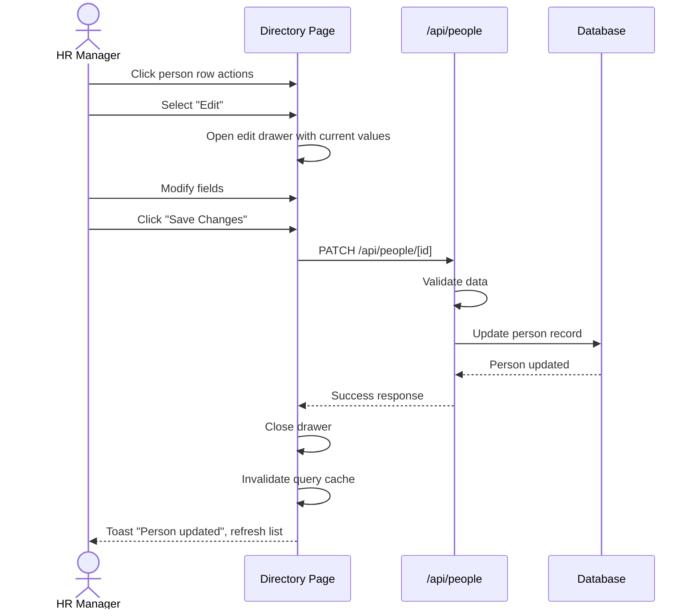
```mermaid
sequenceDiagram
    actor HR as HR Manager
    participant UI as Directory Page
    participant API as /api/people
    participant DB as Database
    
    HR->>UI: Click person row actions
    HR->>UI: Select "Edit"
    UI->>UI: Open edit drawer with current values
    
    HR->>UI: Modify fields
    HR->>UI: Click "Save Changes"
    
    UI->>API: PATCH /api/people/[id]
    API->>API: Validate data
    API->>DB: Update person record
    DB-->>API: Person updated
    API-->>UI: Success response
    UI->>UI: Close drawer
    UI->>UI: Invalidate query cache
    UI-->>HR: Toast "Person updated", refresh list
```

### Delete Person Flow

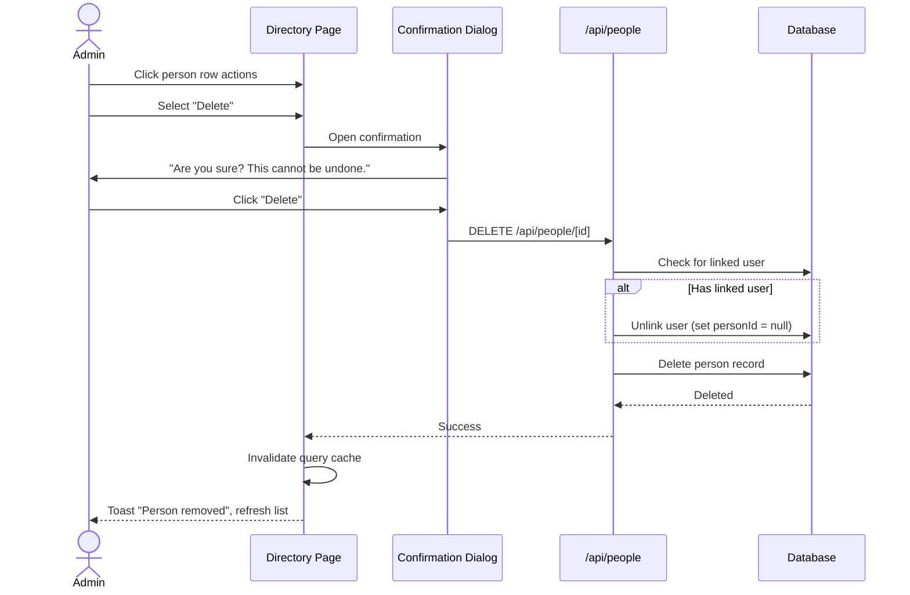
```mermaid
sequenceDiagram
    actor Admin
    participant UI as Directory Page
    participant Dialog as Confirmation Dialog
    participant API as /api/people
    participant DB as Database
    
    Admin->>UI: Click person row actions
    Admin->>UI: Select "Delete"
    UI->>Dialog: Open confirmation
    
    Dialog->>Admin: "Are you sure? This cannot be undone."
    Admin->>Dialog: Click "Delete"
    
    Dialog->>API: DELETE /api/people/[id]
    API->>DB: Check for linked user
    
    alt Has linked user
        API->>DB: Unlink user (set personId = null)
    end
    
    API->>DB: Delete person record
    DB-->>API: Deleted
    API-->>UI: Success
    UI->>UI: Invalidate query cache
    UI-->>Admin: Toast "Person removed", refresh list
```

---

## API Endpoints

### People API

| Method | Path | Description |
|--------|------|-------------|
| GET | `/api/people` | List all people |
| POST | `/api/people` | Create person |
| GET | `/api/people/[id]` | Get person details |
| PATCH | `/api/people/[id]` | Update person |
| DELETE | `/api/people/[id]` | Delete person |

### Request/Response Examples

**GET /api/people**

```json
[
  {
    "id": "uuid",
    "slug": "john-doe",
    "name": "John Doe",
    "email": "john@example.com",
    "role": "Software Engineer",
    "team": "Engineering",
    "status": "active",
    "startDate": "2024-01-15",
    "endDate": null,
    "phone": "+1-555-0100",
    "location": "New York",
    "source": "sync",
    "entraId": "entra-object-id",
    "entraGroupId": "group-uuid",
    "entraGroupName": "All-Employees",
    "lastSyncedAt": "2024-01-20T10:30:00Z",
    "syncEnabled": true,
    "createdAt": "2024-01-15T09:00:00Z",
    "updatedAt": "2024-01-20T10:30:00Z",
    "hasLinkedUser": true,
    "hasEntraLink": true,
    "linkedUser": {
      "id": "uuid",
      "name": "John Doe",
      "email": "john@example.com",
      "status": "active",
      "hasEntraLink": true
    }
  }
]
```

**POST /api/people**

```json
{
  "name": "Jane Smith",
  "email": "jane@example.com",
  "role": "Product Manager",
  "team": "Product",
  "startDate": "2024-02-01",
  "phone": "+1-555-0101",
  "location": "San Francisco"
}
```

---

## Database Schema

### Core Tables

- `people` - Employee records

### People Table Schema

| Column | Type | Description |
|--------|------|-------------|
| `id` | UUID | Primary key |
| `org_id` | UUID | Organization (multi-tenant) |
| `slug` | VARCHAR | URL-friendly identifier |
| `name` | VARCHAR | Full name |
| `email` | VARCHAR | Email address (unique per org) |
| `role` | VARCHAR | Job title/role |
| `team` | VARCHAR | Team name |
| `status` | ENUM | active, onboarding, offboarding, inactive |
| `start_date` | DATE | Employment start date |
| `end_date` | DATE | Employment end date (nullable) |
| `phone` | VARCHAR | Phone number |
| `location` | VARCHAR | Office location |
| `avatar` | VARCHAR | Avatar URL |
| `bio` | TEXT | Biography |
| `source` | ENUM | manual, sync - How the record was created |
| `entra_id` | VARCHAR | Microsoft Entra ID (nullable) |
| `entra_group_id` | VARCHAR | Source Entra group ID |
| `entra_group_name` | VARCHAR | Source Entra group display name |
| `last_synced_at` | TIMESTAMP | Last sync timestamp |
| `sync_enabled` | BOOLEAN | Whether Entra is source of truth |
| `created_at` | TIMESTAMP | Record creation time |
| `updated_at` | TIMESTAMP | Last update time |

### Relationships

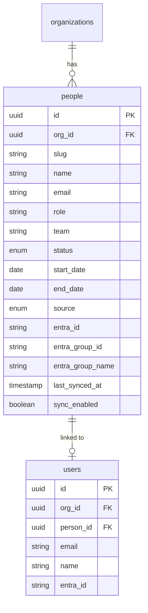
```mermaid
erDiagram
    organizations ||--o{ people : has
    people ||--o| users : "linked to"
    people {
        uuid id PK
        uuid org_id FK
        string slug
        string name
        string email
        string role
        string team
        enum status
        date start_date
        date end_date
        enum source
        string entra_id
        string entra_group_id
        string entra_group_name
        timestamp last_synced_at
        boolean sync_enabled
    }
    users {
        uuid id PK
        uuid org_id FK
        uuid person_id FK
        string email
        string name
        string entra_id
    }
```

---

## Components

### Key React Components

- `PageShell` - Page layout with title and actions
- `DataTableAdvanced` - Full-featured data table
- `FormDrawer` - Schema-driven form drawer
- `Protected` - RBAC visibility wrapper
- `StatusBadge` - Employee status indicators
- `StatsCard` - Metric display cards
- `QuickLinkCard` - Navigation cards with counts

### React Query Hooks

Located in `lib/api/people.ts`:

- `usePeopleList()` - Fetch all people
- `useCreatePerson()` - Create mutation
- `useUpdatePerson()` - Update mutation
- `useDeletePerson()` - Delete mutation

### Form Configuration

Located in `lib/generated/people/person/`:

- `formConfig` - Field definitions
- `createFormSchema` - Zod schema for creation
- `editFormSchema` - Zod schema for editing
- `getFormFields(mode)` - Fields for create/edit modes

### Table Columns

Located in `lib/generated/people/person/columns.tsx`:

- Name (with avatar)
- Email
- Role
- Team
- Status (with badge)
- Start Date
- Entra Group (source group name if synced)
- Links:
  - **Sync** badge (green) - Record was synced from Entra
  - **User** badge (outline) - Has linked user account
  - **Entra** badge (blue) - Has direct Entra ID link
  - **Manual** badge (gray) - Created manually
- Actions (Edit, Delete, Link/Unlink)

---

## Status Definitions

| Status | Description | Badge Color |
|--------|-------------|-------------|
| `active` | Currently employed | Green |
| `onboarding` | New hire in progress | Blue |
| `offboarding` | Leaving the organization | Amber |
| `inactive` | No longer employed | Gray |

---

## User Flows (Settings)

### Configure People Sync Flow

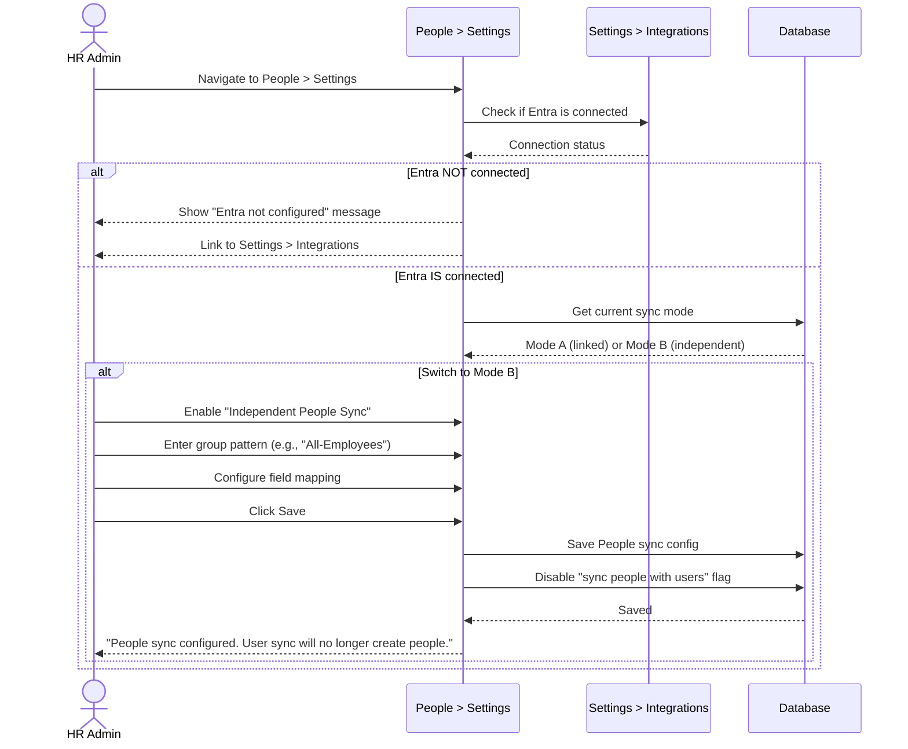
```mermaid
sequenceDiagram
    actor HR as HR Admin
    participant UI as People > Settings
    participant Settings as Settings > Integrations
    participant DB as Database
    
    HR->>UI: Navigate to People > Settings
    UI->>Settings: Check if Entra is connected
    Settings-->>UI: Connection status
    
    alt Entra NOT connected
        UI-->>HR: Show "Entra not configured" message
        UI-->>HR: Link to Settings > Integrations
    else Entra IS connected
        UI->>DB: Get current sync mode
        DB-->>UI: Mode A (linked) or Mode B (independent)
        
        alt Switch to Mode B
            HR->>UI: Enable "Independent People Sync"
            HR->>UI: Enter group pattern (e.g., "All-Employees")
            HR->>UI: Configure field mapping
            HR->>UI: Click Save
            UI->>DB: Save People sync config
            UI->>DB: Disable "sync people with users" flag
            DB-->>UI: Saved
            UI-->>HR: "People sync configured. User sync will no longer create people."
        end
    end
```

### Sync Button Behavior

The sync button on the People Directory page behaves differently based on mode:

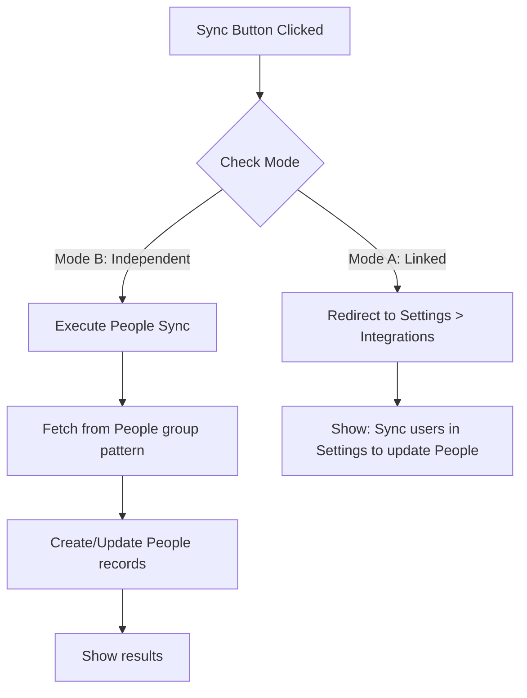
```mermaid
graph TB
    SYNC[Sync Button Clicked]
    
    SYNC --> CHECK{Check Mode}
    
    CHECK -->|Mode A: Linked| REDIRECT[Redirect to Settings > Integrations]
    CHECK -->|Mode B: Independent| PEOPLE_SYNC[Execute People Sync]
    
    PEOPLE_SYNC --> FETCH[Fetch from People group pattern]
    FETCH --> UPSERT[Create/Update People records]
    UPSERT --> DONE[Show results]
    
    REDIRECT --> MSG[Show: Sync users in Settings to update People]
```

**Mode A (Linked):** Sync button either redirects to Settings or shows a message explaining that syncing users will also sync people.

**Mode B (Independent):** Sync button triggers People-specific sync using the configured group pattern.

---

## Integration Points

### With Settings Module

- **Users**: People can be linked to user accounts for system access
- **Integrations**: Borrows the Entra ID connection for People-specific sync (Mode B)
- **Mutual Exclusivity**: When Mode B is enabled, Settings module shows that people sync is managed elsewhere

### Entra ID Sync Architecture

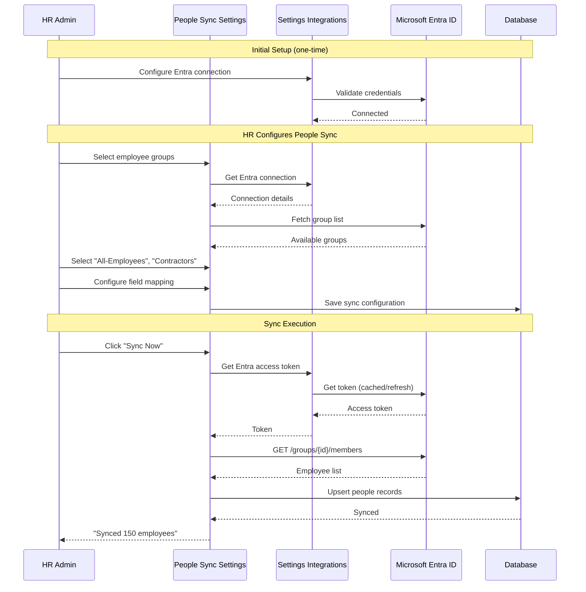
```mermaid
sequenceDiagram
    participant Admin as HR Admin
    participant People as People Sync Settings
    participant Settings as Settings Integrations
    participant Entra as Microsoft Entra ID
    participant DB as Database
    
    Note over Admin,DB: Initial Setup (one-time)
    Admin->>Settings: Configure Entra connection
    Settings->>Entra: Validate credentials
    Entra-->>Settings: Connected
    
    Note over Admin,DB: HR Configures People Sync
    Admin->>People: Select employee groups
    People->>Settings: Get Entra connection
    Settings-->>People: Connection details
    People->>Entra: Fetch group list
    Entra-->>People: Available groups
    Admin->>People: Select "All-Employees", "Contractors"
    Admin->>People: Configure field mapping
    People->>DB: Save sync configuration
    
    Note over Admin,DB: Sync Execution
    Admin->>People: Click "Sync Now"
    People->>Settings: Get Entra access token
    Settings->>Entra: Get token (cached/refresh)
    Entra-->>Settings: Access token
    Settings-->>People: Token
    People->>Entra: GET /groups/{id}/members
    Entra-->>People: Employee list
    People->>DB: Upsert people records
    DB-->>People: Synced
    People-->>Admin: "Synced 150 employees"
```

### Data Flow: Users vs People

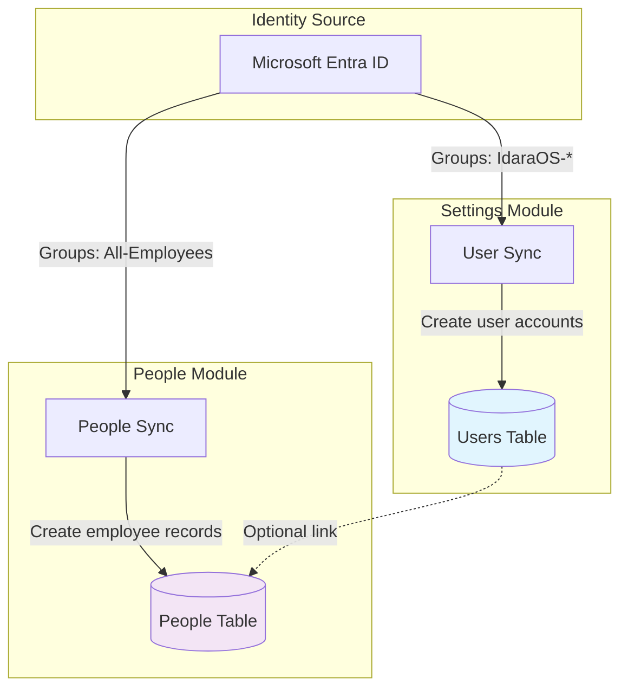
```mermaid
graph TB
    subgraph "Identity Source"
        ENTRA[Microsoft Entra ID]
    end
    
    subgraph "Settings Module"
        USER_SYNC[User Sync]
        USERS[(Users Table)]
    end
    
    subgraph "People Module"
        PEOPLE_SYNC[People Sync]
        PEOPLE[(People Table)]
    end
    
    ENTRA -->|Groups: IdaraOS-*| USER_SYNC
    ENTRA -->|Groups: All-Employees| PEOPLE_SYNC
    
    USER_SYNC -->|Create user accounts| USERS
    PEOPLE_SYNC -->|Create employee records| PEOPLE
    
    USERS -.->|Optional link| PEOPLE
    
    style USERS fill:#e1f5fe
    style PEOPLE fill:#f3e5f5
```

### With Future Modules

- **Assets**: Assign assets to people (could have own Entra sync for devices)
- **Documents**: Link documents to people
- **Expenses**: People submit expense reports
- **Workflows**: People as approvers/assignees
