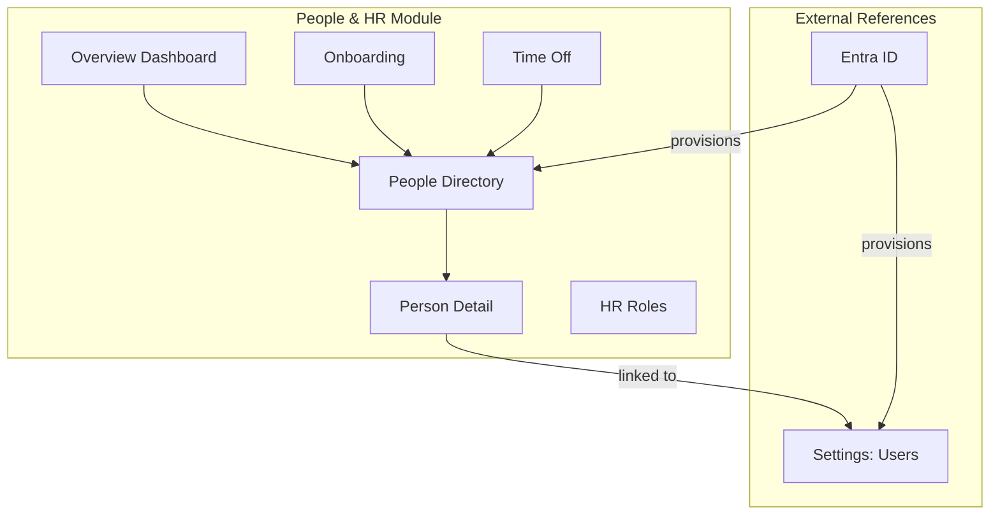
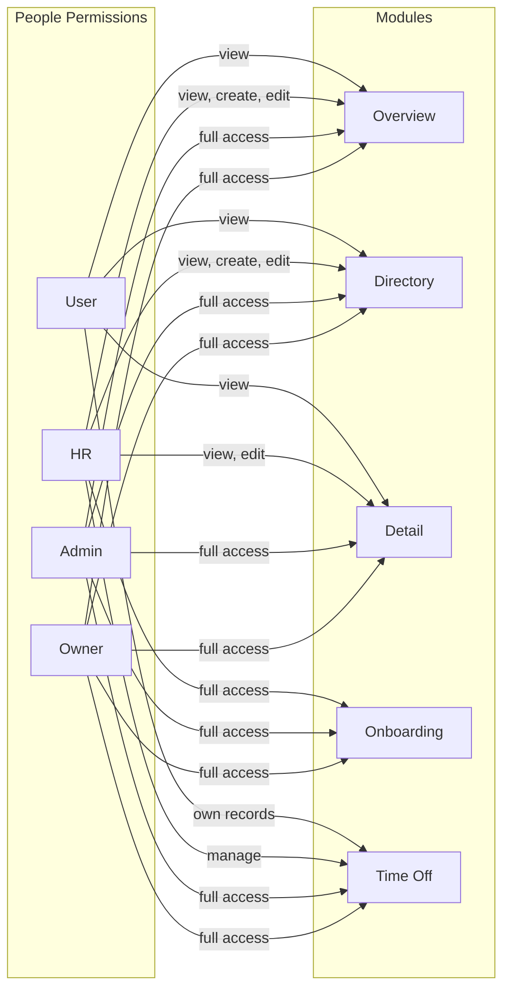
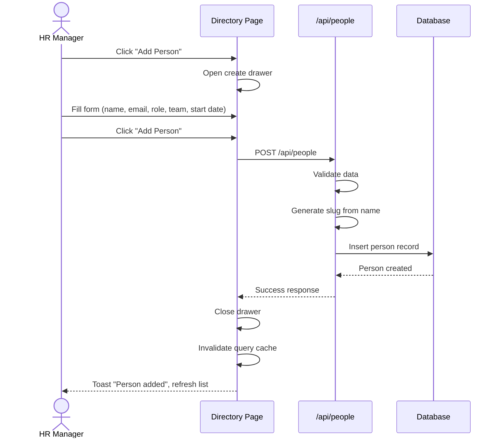
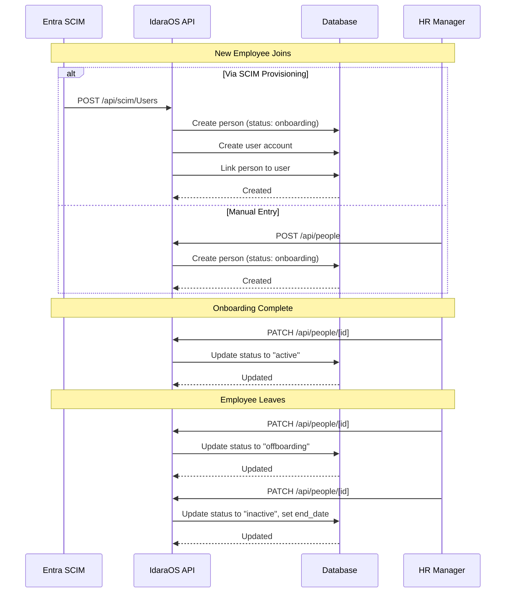
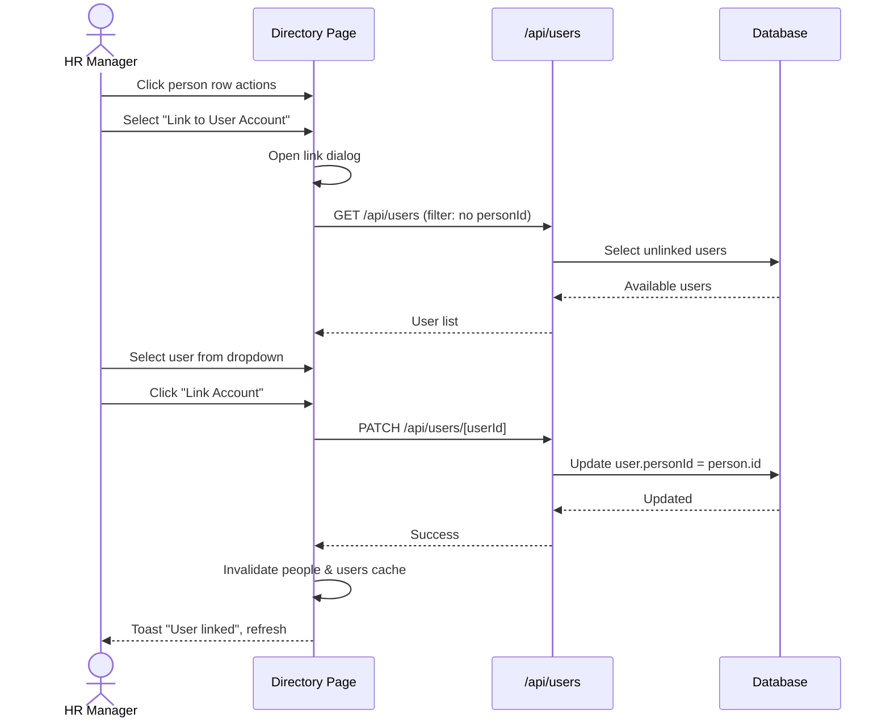
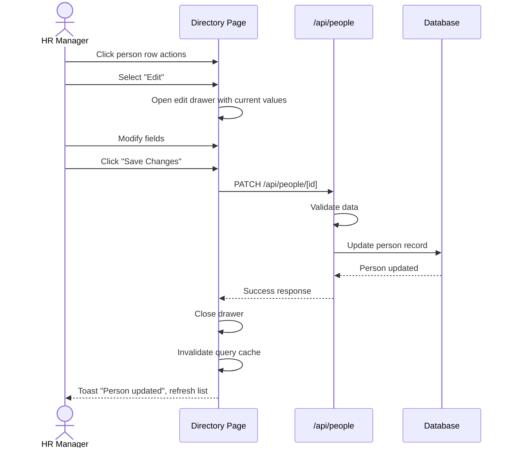
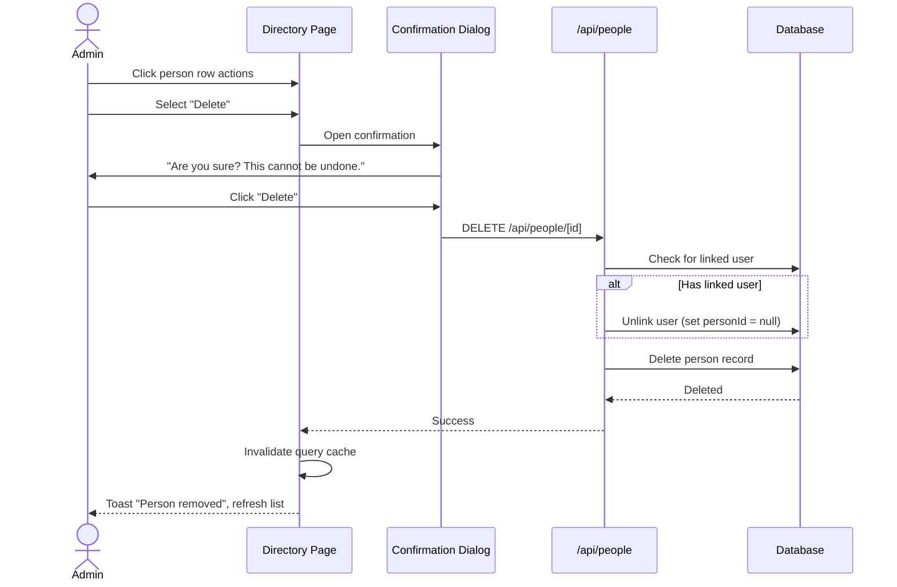
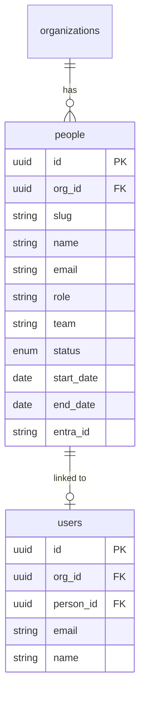

# People & HR Module

## Overview

The People & HR module manages workforce information, employee lifecycle, and HR operations. It serves as a foundational module that other modules reference for people-related data (assignees, owners, approvers).

## Module Structure



## Sub-Modules

### Overview Dashboard (`/people`)

High-level view of workforce metrics and quick access to sub-modules.

**Features:**
- Total people count
- Active employees count
- Onboarding in progress
- Teams count
- Quick links to sub-modules
- Recent activity timeline

### People Directory (`/people/directory`)

Central employee listing with full CRUD capabilities.

**Features:**
- Searchable, filterable data table
- Faceted filters (status, team, role, start date)
- Create person via drawer form
- Edit person via drawer form
- Delete person with confirmation
- Link/unlink to user account
- Column visibility toggle
- CSV export
- Click row to view details
- Stats cards (total, active, recent hires, teams)

### Person Detail (`/people/directory/[slug]`)

Individual employee profile view.

**Features:**
- Profile information display
- Edit capability
- Link to user account
- Status indicators
- Entra ID badge if synced

### Onboarding (`/people/onboarding`) - Placeholder

New hire workflow management.

**Planned Features:**
- Onboarding checklist templates
- Task assignment and tracking
- Progress indicators
- Automated provisioning triggers

### Time Off (`/people/time-off`) - Placeholder

Leave request and calendar management.

**Planned Features:**
- Leave request submission
- Approval workflow
- Calendar view
- Balance tracking
- Policy configuration

### HR Roles (`/people/roles`) - Placeholder

HR-specific role management.

**Planned Features:**
- Job title definitions
- Reporting structures
- Compensation bands

---

## Permissions

### Permission Matrix

| Sub-Module | Action | Owner | Admin | HR | User |
|------------|--------|-------|-------|-----|------|
| Overview | View | Yes | Yes | Yes | Yes |
| Directory | View | Yes | Yes | Yes | Yes |
| Directory | Create | Yes | Yes | Yes | No |
| Directory | Edit | Yes | Yes | Yes | No |
| Directory | Delete | Yes | Yes | No | No |
| Person Detail | View | Yes | Yes | Yes | Yes |
| Person Detail | Edit | Yes | Yes | Yes | No |
| Onboarding | View | Yes | Yes | Yes | No |
| Onboarding | Manage | Yes | Yes | Yes | No |
| Time Off | View | Yes | Yes | Yes | Own |
| Time Off | Request | Yes | Yes | Yes | Yes |
| Time Off | Approve | Yes | Yes | Yes | No |

### Permission Diagram



---

## User Flows

### Create Person Flow



### Person Lifecycle Flow



### Link Person to User Account Flow



### Edit Person Flow



### Delete Person Flow



---

## API Endpoints

### People API

| Method | Path | Description |
|--------|------|-------------|
| GET | `/api/people` | List all people |
| POST | `/api/people` | Create person |
| GET | `/api/people/[id]` | Get person details |
| PATCH | `/api/people/[id]` | Update person |
| DELETE | `/api/people/[id]` | Delete person |

### Request/Response Examples

**GET /api/people**

```json
[
  {
    "id": "uuid",
    "slug": "john-doe",
    "name": "John Doe",
    "email": "john@example.com",
    "role": "Software Engineer",
    "team": "Engineering",
    "status": "active",
    "startDate": "2024-01-15",
    "endDate": null,
    "phone": "+1-555-0100",
    "location": "New York",
    "hasLinkedUser": true,
    "hasEntraLink": true,
    "linkedUser": {
      "id": "uuid",
      "email": "john@example.com"
    }
  }
]
```

**POST /api/people**

```json
{
  "name": "Jane Smith",
  "email": "jane@example.com",
  "role": "Product Manager",
  "team": "Product",
  "startDate": "2024-02-01",
  "phone": "+1-555-0101",
  "location": "San Francisco"
}
```

---

## Database Schema

### Core Tables

- `people` - Employee records

### People Table Schema

| Column | Type | Description |
|--------|------|-------------|
| `id` | UUID | Primary key |
| `org_id` | UUID | Organization (multi-tenant) |
| `slug` | VARCHAR | URL-friendly identifier |
| `name` | VARCHAR | Full name |
| `email` | VARCHAR | Email address (unique per org) |
| `role` | VARCHAR | Job title/role |
| `team` | VARCHAR | Team name |
| `status` | ENUM | active, onboarding, offboarding, inactive |
| `start_date` | DATE | Employment start date |
| `end_date` | DATE | Employment end date (nullable) |
| `phone` | VARCHAR | Phone number |
| `location` | VARCHAR | Office location |
| `avatar` | VARCHAR | Avatar URL |
| `bio` | TEXT | Biography |
| `entra_id` | VARCHAR | Microsoft Entra ID (nullable) |
| `created_at` | TIMESTAMP | Record creation time |
| `updated_at` | TIMESTAMP | Last update time |

### Relationships



---

## Components

### Key React Components

- `PageShell` - Page layout with title and actions
- `DataTableAdvanced` - Full-featured data table
- `FormDrawer` - Schema-driven form drawer
- `Protected` - RBAC visibility wrapper
- `StatusBadge` - Employee status indicators
- `StatsCard` - Metric display cards
- `QuickLinkCard` - Navigation cards with counts

### React Query Hooks

Located in `lib/api/people.ts`:

- `usePeopleList()` - Fetch all people
- `useCreatePerson()` - Create mutation
- `useUpdatePerson()` - Update mutation
- `useDeletePerson()` - Delete mutation

### Form Configuration

Located in `lib/generated/people/person/`:

- `formConfig` - Field definitions
- `createFormSchema` - Zod schema for creation
- `editFormSchema` - Zod schema for editing
- `getFormFields(mode)` - Fields for create/edit modes

### Table Columns

Located in `lib/generated/people/person/columns.tsx`:

- Name (with avatar)
- Email
- Role
- Team
- Status (with badge)
- Start Date
- Links (User badge, Entra badge)
- Actions (Edit, Delete, Link/Unlink)

---

## Status Definitions

| Status | Description | Badge Color |
|--------|-------------|-------------|
| `active` | Currently employed | Green |
| `onboarding` | New hire in progress | Blue |
| `offboarding` | Leaving the organization | Amber |
| `inactive` | No longer employed | Gray |

---

## Integration Points

### With Settings Module

- **Users**: People can be linked to user accounts for system access
- **Entra ID**: People are auto-created via SCIM provisioning

### With Future Modules

- **Assets**: Assign assets to people
- **Documents**: Link documents to people
- **Expenses**: People submit expense reports
- **Workflows**: People as approvers/assignees
