# Security Module Architecture

## Overview

The Security module provides a comprehensive compliance and security management system (GRC - Governance, Risk, and Compliance). It features a generic foundation layer that applies to all security frameworks, with framework-specific sub-modules for ISO 27001, SOC 2, and other certifications.

## Key Principles

1. **Generic Foundation**: Core entities (risks, controls, evidence) are framework-agnostic
2. **Framework-Specific Views**: SoA, dashboards, and gap analysis are tailored per framework
3. **Unified Control Mapping**: Organization implements controls once, maps to multiple frameworks
4. **Pre-loaded Reference Library**: Standard controls from ISO 27001 Annex A and SOC 2 TSC included
5. **Evidence-Based Compliance**: All assertions backed by documented evidence

## Architecture Diagram

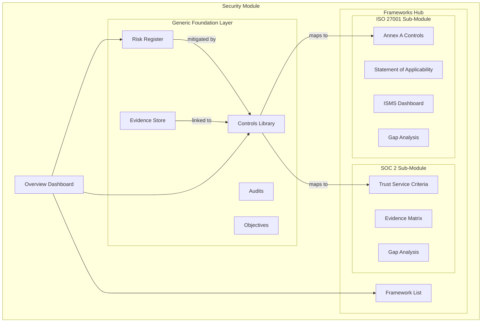

## Module Navigation Structure

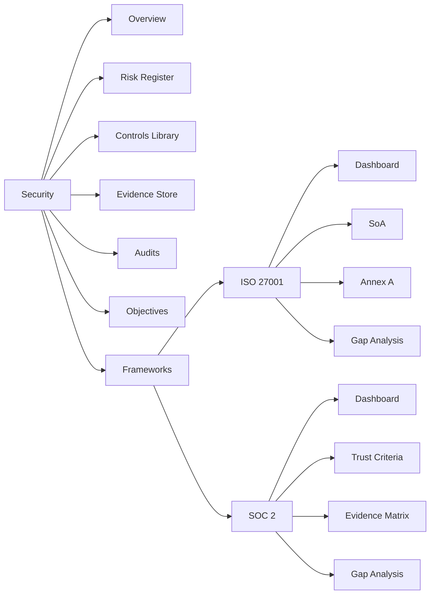

## Data Model

### Entity Relationship Diagram

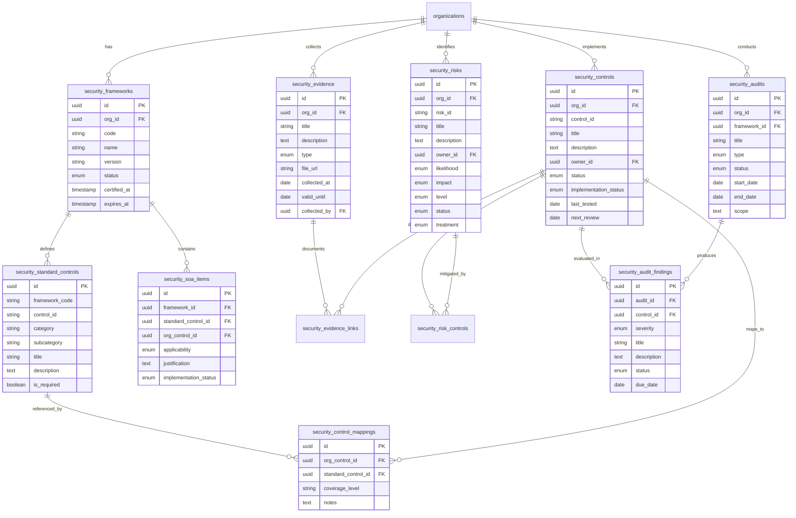

### Control Mapping Flow

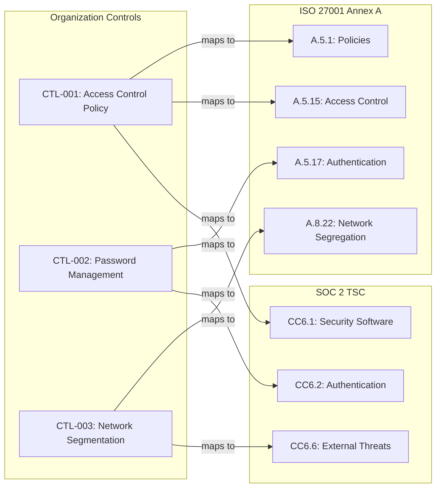

### Risk Assessment Flow

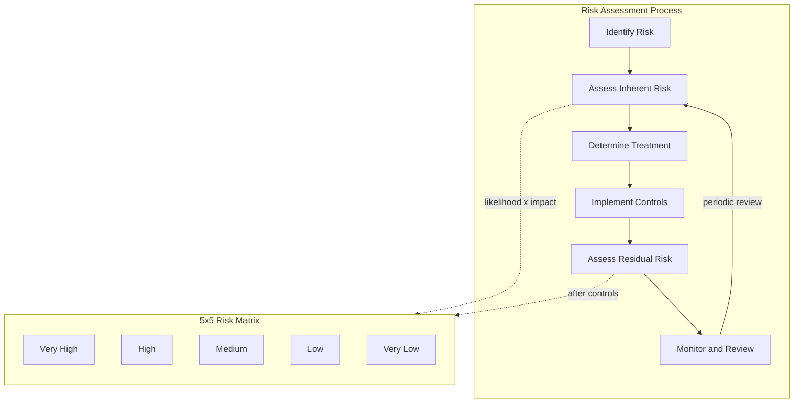

### Compliance Workflow

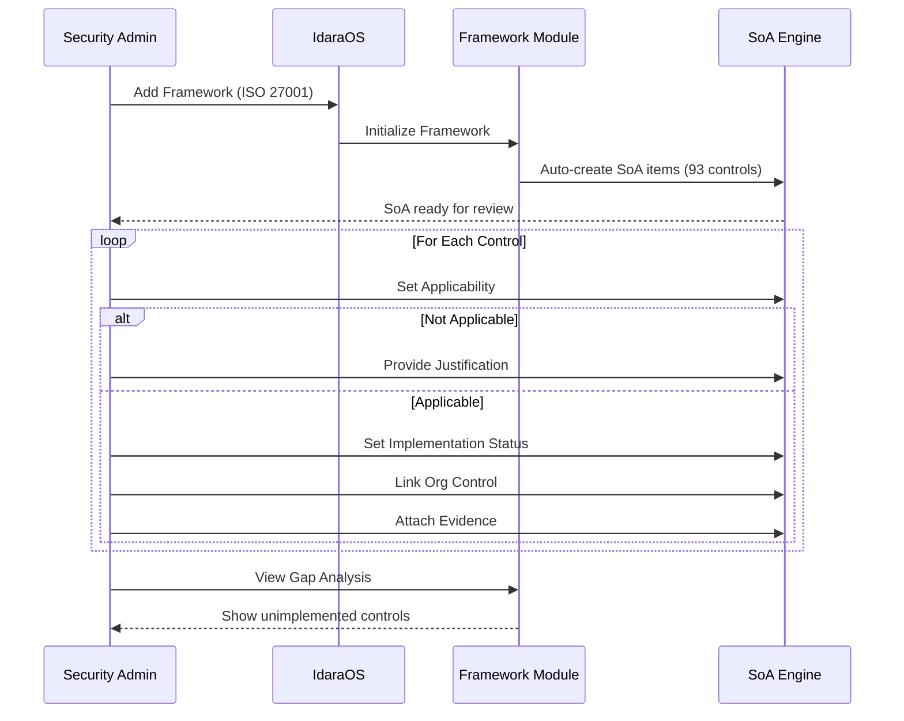

## Database Tables

| Table | Purpose |
|-------|---------|
| `security_frameworks` | Registered compliance frameworks per org |
| `security_standard_controls` | Pre-loaded reference controls (93 ISO 27001, 61 SOC 2) |
| `security_standard_clauses` | ISO 27001 ISMS clauses (4-10) definitions |
| `security_controls` | Organization's implemented controls (unified, single source of truth) |
| `security_control_mappings` | Links org controls to standard framework controls (many-to-many) |
| `security_risks` | Risk register with likelihood/impact scoring |
| `security_risk_controls` | Junction: which controls mitigate which risks |
| `security_evidence` | Evidence artifacts (documents, screenshots, etc.) |
| `security_evidence_links` | Junction: evidence linked to controls |
| `security_soa_items` | Statement of Applicability items (status derived from org control) |
| `security_clause_compliance` | ISMS clause compliance tracking per org/framework |
| `security_audits` | Internal/external audit records |
| `security_audit_findings` | Findings and NCRs from audits |
| `security_objectives` | Security objectives and treatment plans |

## API Routes

| Method | Path | Description |
|--------|------|-------------|
| GET/POST | `/api/security/frameworks` | List/create frameworks |
| GET/PATCH/DELETE | `/api/security/frameworks/[id]` | CRUD for framework |
| GET | `/api/security/standard-controls` | Get pre-loaded standard controls |
| GET | `/api/security/standard-clauses` | Get ISO 27001 ISMS clauses (4-10) |
| GET/POST | `/api/security/controls` | List/create org controls |
| GET/PATCH/DELETE | `/api/security/controls/[id]` | CRUD for org control |
| GET/POST/DELETE | `/api/security/controls/[id]/mappings` | Manage control-to-standard mappings |
| POST | `/api/security/controls/create-from-standard` | Batch create controls from standard controls |
| GET/POST | `/api/security/risks` | List/create risks |
| GET/PATCH/DELETE | `/api/security/risks/[id]` | CRUD for risk |
| GET/POST | `/api/security/evidence` | List/create evidence |
| GET/PATCH/DELETE | `/api/security/evidence/[id]` | CRUD for evidence |
| GET | `/api/security/soa/[frameworkId]` | Get SoA items (status derived from org control) |
| PATCH | `/api/security/soa/[frameworkId]/items/[itemId]` | Update SoA item |
| GET/POST | `/api/security/clauses` | List/create clause compliance records |
| GET/PATCH/DELETE | `/api/security/clauses/[id]` | CRUD for clause compliance |
| GET/POST | `/api/security/audits` | List/create audits |

## Core Features

### 1. Risk Register

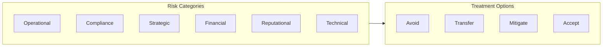

- **Risk Assessment**: 5x5 likelihood/impact matrix (Inherent and Residual)
- **Control Linking**: Associate controls that mitigate each risk

### 2. Controls Library (Single Source of Truth)

The Controls Library is the **single source of truth** for control implementation. Framework compliance status is derived from org control status.

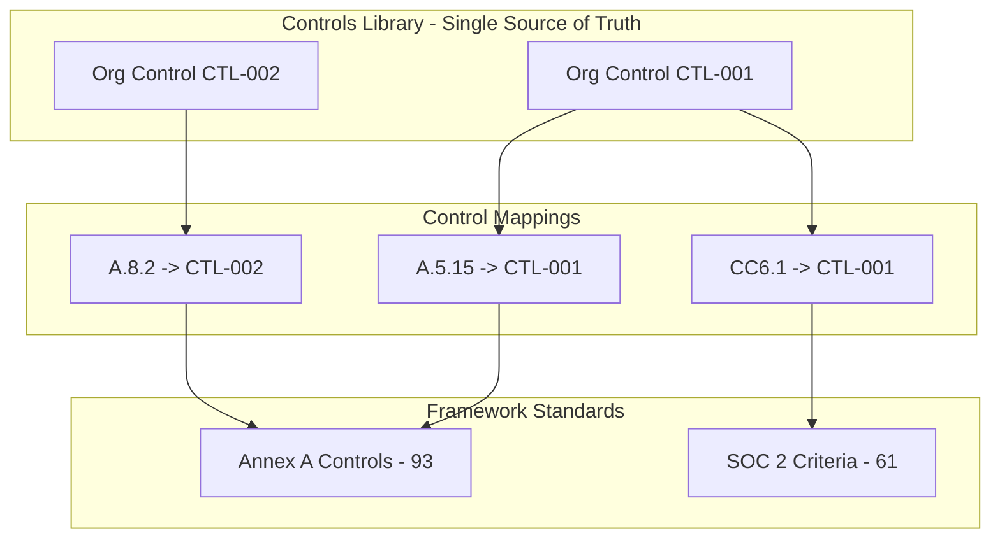

- **Unified Controls**: Org defines controls once, implementation-agnostic
- **Framework Mapping**: Map to multiple framework controls (ISO 27001, SOC 2)
- **Derived Status**: SoA implementation status is derived from linked org control
- **Create from Standards**: Easily create org controls from Annex A or SOC 2 criteria
- **Framework Coverage**: See which frameworks each control satisfies
- **Status Tracking**: Not Implemented → Partially Implemented → Implemented → Effective
- **Evidence Linking**: Attach evidence to demonstrate control effectiveness
- **Review Scheduling**: Set review frequency, track last tested date

#### Control Creation Workflow

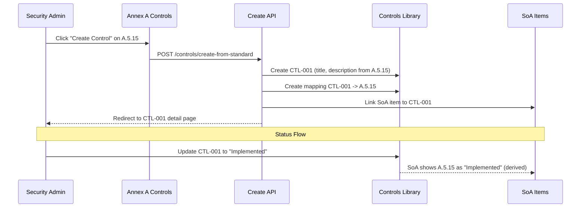

### 3. Evidence Store

- **Evidence Types**: Document, Screenshot, Log, Report, Attestation, Configuration
- **Validity Tracking**: Collection date and expiry
- **Control Links**: Associate evidence with one or more controls
- **External References**: Link to external systems (Jira, Confluence, etc.)

### 4. Framework Management

- **Pre-loaded Controls**: ISO 27001:2022 Annex A (93), SOC 2 TSC (~60)
- **Statement of Applicability**: Track applicability and justification per control
- **Gap Analysis**: Identify missing or partially implemented controls
- **Compliance Metrics**: % complete, by category, over time

### 5. Audit Management

- **Audit Types**: Internal, External, Surveillance, Certification, Recertification
- **Finding Tracking**: Severity (Observation, Minor, Major, Critical)
- **Remediation Workflow**: Track responsible person, due date, resolution
- **Integration**: Link findings to specific controls

## Framework-Specific Features

### ISO 27001:2022

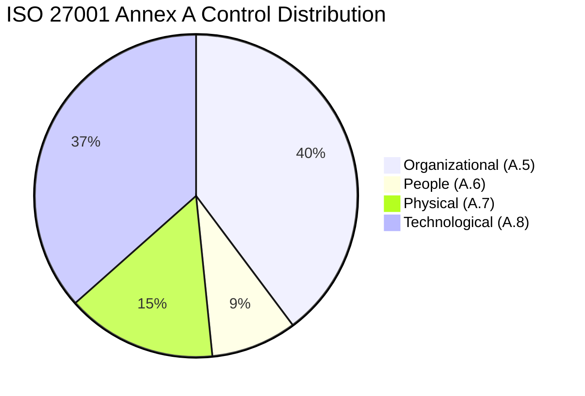

- **93 Annex A Controls** across 4 themes
- **Statement of Applicability** with justification for exclusions
- **ISMS Dashboard** with certification status and metrics

### SOC 2 Type II

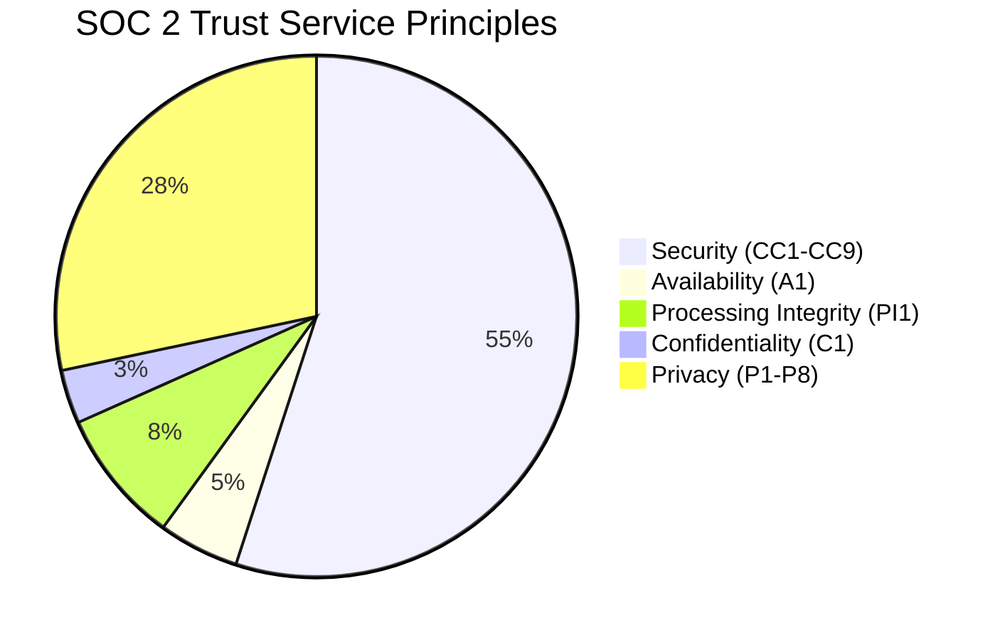

- **Trust Service Criteria** organized by principle
- **Evidence Matrix** for audit preparation
- **Audit Readiness** metrics per TSC

## Permissions

| Resource | Owner | Admin | Security | Auditor | User |
|----------|-------|-------|----------|---------|------|
| security.overview | View | View | View | View | View |
| security.risks | Full | Full | Full | View | - |
| security.controls | Full | Full | Full | View | - |
| security.evidence | Full | Full | Full | View | - |
| security.audits | Full | Full | Full | View | - |
| security.frameworks | Full | Full | Full | View | - |
| security.soa | Full | Full | Full | View | - |
| security.settings | Full | Full | Edit | - | - |

## Integration Points

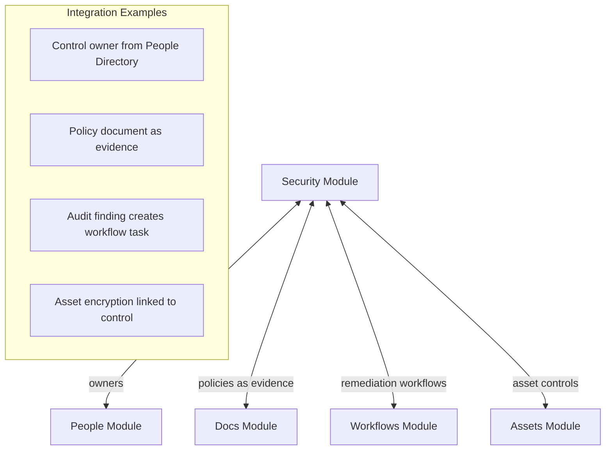

## File Structure

```
apps/web/
├── app/
│   ├── api/security/
│   │   ├── controls/route.ts
│   │   ├── controls/[id]/route.ts
│   │   ├── controls/[id]/mappings/route.ts
│   │   ├── controls/create-from-standard/route.ts  # Batch create from standards
│   │   ├── evidence/route.ts
│   │   ├── evidence/[id]/route.ts
│   │   ├── risks/route.ts
│   │   ├── risks/[id]/route.ts
│   │   ├── frameworks/route.ts
│   │   ├── frameworks/[id]/route.ts
│   │   ├── standard-controls/route.ts
│   │   ├── standard-clauses/route.ts               # ISO 27001 ISMS clauses
│   │   ├── clauses/route.ts                        # Clause compliance
│   │   ├── clauses/[id]/route.ts
│   │   ├── soa/[frameworkId]/route.ts              # Derives status from org control
│   │   ├── soa/[frameworkId]/items/[itemId]/route.ts
│   │   └── audits/route.ts
│   └── (dashboard)/security/
│       ├── page.tsx                    # Overview
│       ├── risks/page.tsx              # Risk Register
│       ├── controls/
│       │   ├── page.tsx                # Controls Library (with framework badges)
│       │   └── [id]/
│       │       ├── page.tsx            # Control detail
│       │       └── mappings/page.tsx   # Manage framework mappings
│       ├── evidence/page.tsx           # Evidence Store
│       ├── audits/page.tsx             # Audits
│       ├── objectives/page.tsx         # Objectives
│       └── frameworks/
│           ├── page.tsx                # Frameworks list
│           ├── iso-27001/
│           │   ├── page.tsx            # ISO 27001 Dashboard
│           │   ├── soa/page.tsx        # Statement of Applicability
│           │   ├── controls/page.tsx   # Annex A browser (with Create Control buttons)
│           │   ├── clauses/page.tsx    # ISMS Clauses (4-10) tracking
│           │   ├── evidence/page.tsx   # Evidence matrix
│           │   └── gaps/page.tsx       # Gap analysis
│           └── soc-2/
│               ├── page.tsx            # SOC 2 Dashboard
│               ├── criteria/page.tsx   # TSC browser (with Create Control buttons)
│               ├── soa/page.tsx        # Statement of Applicability
│               ├── evidence/page.tsx   # Evidence matrix
│               └── gaps/page.tsx       # Gap analysis
├── lib/
│   ├── api/security.ts                 # React Query hooks
│   └── db/schema/security.ts           # Database schema
└── scripts/
    └── seed-security-controls.ts       # Pre-load standard controls + ISMS clauses
```

## Usage Examples

### Adding ISO 27001 Framework

1. Navigate to Security → Frameworks
2. Click "Add Framework"
3. Select "ISO/IEC 27001:2022"
4. SoA items are auto-created for all 93 Annex A controls
5. Review and update applicability for each control

### Creating Controls from Annex A (Recommended Workflow)

1. Navigate to Security → Frameworks → ISO 27001 → Annex A Controls
2. Browse controls by category (Organizational, People, Physical, Technological)
3. For each applicable control, click the "+" button to create an org control
4. Or click "Create All Controls" to batch create all unmapped controls
5. The system auto-generates control IDs (CTL-001, CTL-002, etc.)
6. Each control is automatically mapped to its source Annex A control
7. Navigate to the control detail page to set owner, status, and add evidence

### Creating an Org Control Manually

1. Navigate to Security → Controls Library
2. Click "New Control"
3. Enter control details (ID, title, description)
4. Navigate to the control and click "Manage Mappings"
5. Map to framework standard controls (Annex A, SOC 2 criteria)
6. Link supporting evidence
7. Set review schedule

### Managing Control Mappings

1. Navigate to Security → Controls Library
2. Click on a control to view details
3. Go to "Framework Mappings" tab or click "Manage Mappings"
4. Add mappings by selecting framework and standard control
5. Set coverage level (Full or Partial)
6. One org control can map to multiple framework controls

### Framework Compliance from Controls (Derived Status)

1. In Controls Library, update a control's implementation status to "Implemented"
2. Navigate to ISO 27001 → Statement of Applicability
3. All Annex A controls mapped to that org control now show "Implemented"
4. Same applies to SOC 2 criteria linked to the same control

### Updating SoA for ISO 27001

1. Navigate to Security → Frameworks → ISO 27001 → Statement of Applicability
2. Click on a control to edit
3. Set applicability (Applicable / Not Applicable)
4. If N/A, provide justification (required)
5. Note: Implementation status is derived from linked org control

## Future Enhancements

- [ ] Additional frameworks (NIST CSF, GDPR, HIPAA)
- [ ] Automated evidence collection via integrations
- [ ] Risk heat maps and trend analysis
- [ ] Control testing automation
- [ ] Audit workflow integration
- [ ] Export to PDF/Excel for auditors
- [ ] AI-assisted gap analysis recommendations
- [ ] Control effectiveness scoring
- [ ] Compliance timeline and trend charts
- [ ] Cross-framework control mapping suggestions
