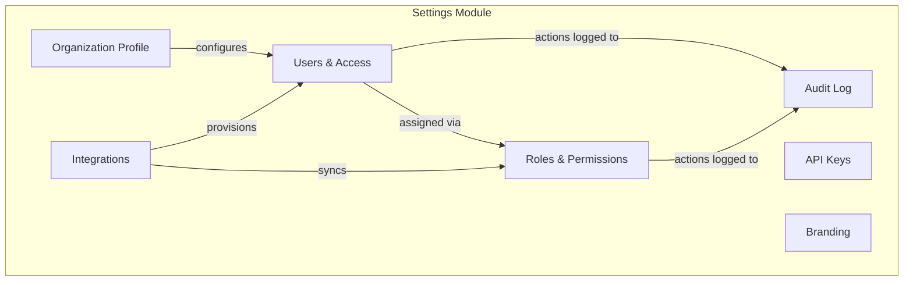
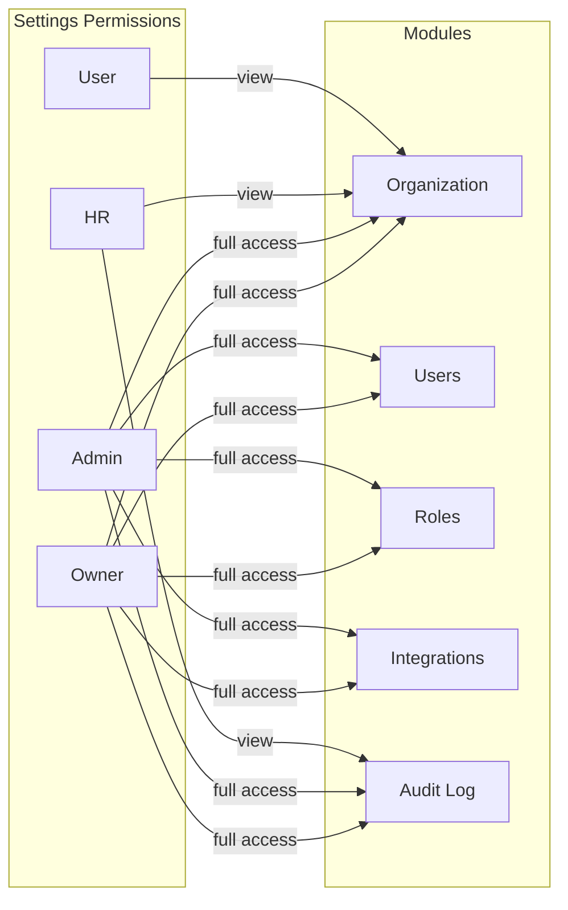
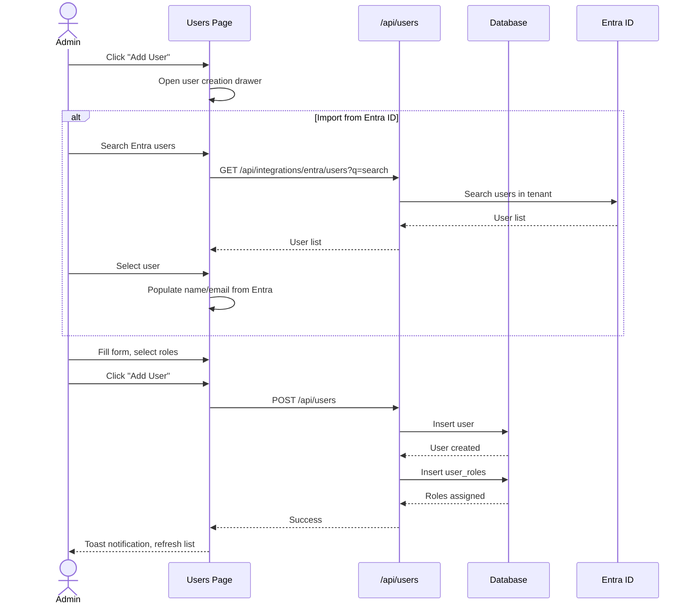
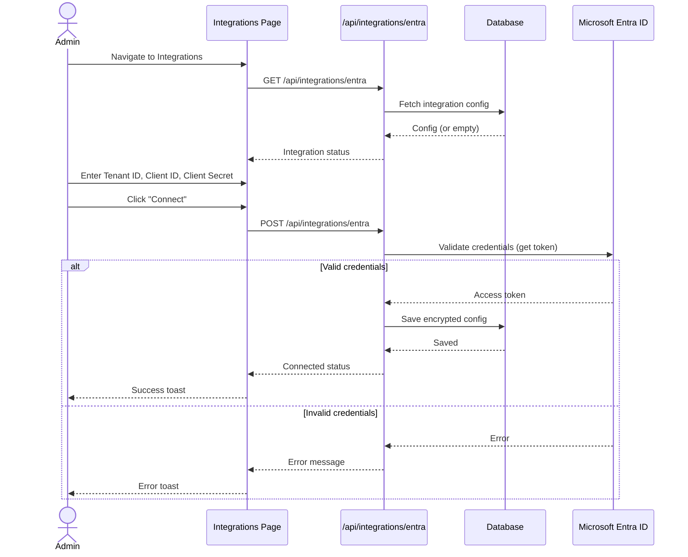
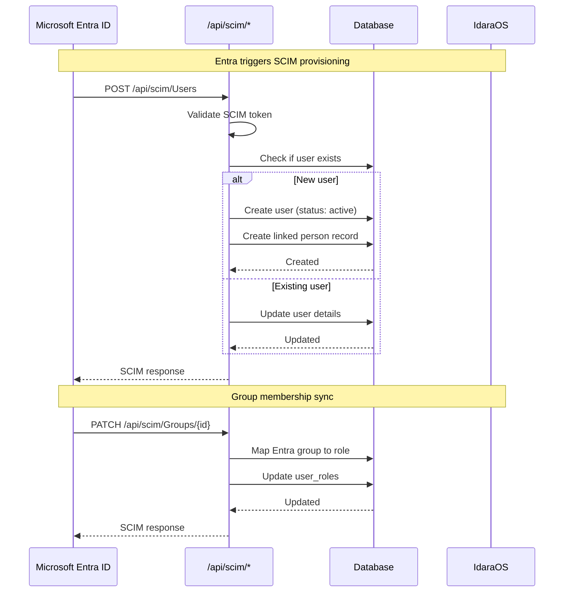
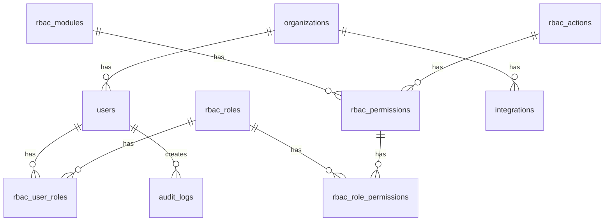

# Settings Module

## Overview

The Settings module provides organizational configuration and administration capabilities. It allows administrators to manage organization details, users, roles, integrations, and audit logs.

## Module Structure

## Sub-Modules

### Organization Profile (`/settings`)

Manage organization-level settings and preferences.

**Features:**
- Organization name and application name
- Website and social links (LinkedIn, Twitter, YouTube)
- Regional settings (timezone, currency, date format)

### Users & Access (`/settings/users`)

Manage user accounts and their access to the system.

**Features:**
- List all users with roles and status
- Create users (manual or from Entra ID)
- Edit user details and status
- Assign/remove roles
- Link users to people in the directory
- Sync users from Microsoft Entra ID (SCIM)
- Role statistics dashboard

### Roles & Permissions (`/settings/roles`)

Define custom roles with granular permissions.

**Features:**
- List all roles with permission counts
- Create custom roles with color badges
- Edit role permissions via matrix UI
- System roles (read-only name/description)
- Permission matrix by module and action

### Integrations (`/settings/integrations`)

Connect third-party services for SSO and provisioning.

**Features:**
- Microsoft Entra ID (Azure AD) integration
  - SSO configuration (tenant ID, client ID, client secret)
  - SCIM provisioning for automatic user sync
  - Group-to-role mapping
  - Bidirectional sync support
- Integration status monitoring
- Manual sync trigger

### Audit Log (`/settings/audit-log`)

View system activity for compliance and security.

**Features:**
- Activity timeline with filters
- Search by action, actor, or target
- Export capability
- Color-coded event types

### API Keys (`/settings/api-keys`) - Placeholder

Manage API tokens for programmatic access.

### Branding (`/settings/branding`) - Placeholder

Customize logos, colors, and themes.

---

## Permissions

### Permission Matrix

| Sub-Module | Action | Owner | Admin | HR | User |
|------------|--------|-------|-------|-----|------|
| Organization | View | Yes | Yes | Yes | Yes |
| Organization | Edit | Yes | Yes | No | No |
| Users | View | Yes | Yes | Yes | No |
| Users | Create | Yes | Yes | No | No |
| Users | Edit | Yes | Yes | No | No |
| Users | Delete | Yes | Yes | No | No |
| Roles | View | Yes | Yes | No | No |
| Roles | Create | Yes | Yes | No | No |
| Roles | Edit | Yes | Yes | No | No |
| Roles | Delete | Yes | Yes | No | No |
| Integrations | View | Yes | Yes | No | No |
| Integrations | Edit | Yes | Yes | No | No |
| Audit Log | View | Yes | Yes | Yes | No |

### Permission Diagram

---

## User Flows

### User Creation Flow

### Role Management Flow

```mermaid
sequenceDiagram
    actor Admin
    participant UI as Roles Page
    participant API as /api/rbac/roles
    participant DB as Database
    
    Admin->>UI: Click "Create Role"
    UI->>UI: Open role drawer
    
    UI->>API: GET /api/rbac/modules
    API-->>UI: Module list
    UI->>API: GET /api/rbac/actions
    API-->>UI: Action list
    UI->>API: GET /api/rbac/permissions
    API-->>UI: All permissions
    
    UI->>UI: Render permission matrix
    Admin->>UI: Enter name, description
    Admin->>UI: Select color
    Admin->>UI: Check permissions in matrix
    Admin->>UI: Click "Create Role"
    
    UI->>API: POST /api/rbac/roles
    API->>DB: Insert role
    DB-->>API: Role created
    API->>DB: Insert role_permissions
    DB-->>API: Permissions assigned
    API-->>UI: Success
    UI-->>Admin: Toast notification, refresh list
```

### Entra ID SSO Configuration Flow

### SCIM User Provisioning Flow

---

## API Endpoints

### Users API

| Method | Path | Description |
|--------|------|-------------|
| GET | `/api/users` | List all users |
| POST | `/api/users` | Create user |
| GET | `/api/users/[id]` | Get user details |
| PATCH | `/api/users/[id]` | Update user |
| DELETE | `/api/users/[id]` | Delete user |

### RBAC API

| Method | Path | Description |
|--------|------|-------------|
| GET | `/api/rbac/roles` | List all roles |
| POST | `/api/rbac/roles` | Create role |
| GET | `/api/rbac/roles/[id]` | Get role with permissions |
| PATCH | `/api/rbac/roles/[id]` | Update role and permissions |
| DELETE | `/api/rbac/roles/[id]` | Delete role |
| GET | `/api/rbac/modules` | List all modules |
| GET | `/api/rbac/actions` | List all actions |
| GET | `/api/rbac/permissions` | List all permissions |
| GET | `/api/rbac/users/[id]/roles` | Get user's roles |
| PUT | `/api/rbac/users/[id]/roles` | Update user's roles |

### Organization API

| Method | Path | Description |
|--------|------|-------------|
| GET | `/api/organization` | Get organization details |
| PATCH | `/api/organization` | Update organization |

### Integrations API

| Method | Path | Description |
|--------|------|-------------|
| GET | `/api/integrations/entra` | Get Entra integration status |
| POST | `/api/integrations/entra` | Connect Entra ID |
| PATCH | `/api/integrations/entra` | Update Entra settings |
| DELETE | `/api/integrations/entra` | Disconnect Entra ID |
| POST | `/api/integrations/entra/sync` | Trigger manual sync |
| POST | `/api/integrations/entra/scim-token` | Regenerate SCIM token |
| GET | `/api/integrations/entra/users` | Search Entra users |

### SCIM API (Entra Provisioning)

| Method | Path | Description |
|--------|------|-------------|
| GET | `/api/scim/Users` | List users (SCIM) |
| POST | `/api/scim/Users` | Create user (SCIM) |
| GET | `/api/scim/Users/[id]` | Get user (SCIM) |
| PATCH | `/api/scim/Users/[id]` | Update user (SCIM) |
| DELETE | `/api/scim/Users/[id]` | Delete user (SCIM) |
| GET | `/api/scim/Groups` | List groups (SCIM) |
| PATCH | `/api/scim/Groups/[id]` | Update group (SCIM) |

---

## Database Schema

### Core Tables

- `organizations` - Organization settings and preferences
- `users` - User accounts
- `rbac_roles` - Role definitions
- `rbac_modules` - Module definitions
- `rbac_actions` - Action definitions (view, create, edit, delete)
- `rbac_permissions` - Module + Action combinations
- `rbac_role_permissions` - Role to permission mappings
- `rbac_user_roles` - User to role assignments
- `integrations` - Integration configurations
- `audit_logs` - System activity log

### Key Relationships

---

## Components

### Key React Components

- `PageShell` - Consistent page layout with title, description, action
- `DataTableAdvanced` - Full-featured data table
- `FormDrawer` - Schema-driven form in a drawer
- `Protected` - RBAC-aware visibility wrapper
- `StatusBadge` - Colored status indicators
- `RolePermissionMatrix` - Permission grid UI

### React Query Hooks

- `useOrganization`, `useUpdateOrganization`
- `useUsersList`, `useCreateUser`, `useUpdateUser`, `useDeleteUser`
- `useRoles`, `useRole`, `useCreateRole`, `useUpdateRole`, `useDeleteRole`
- `useUserRoles`, `useUpdateUserRoles`
- `useEntraIntegration`, `useSaveEntraIntegration`, `useTriggerSync`
