# Workflows Module

## Overview

The Workflows module provides a comprehensive workflow management system for IdaraOS, enabling organizations to create, manage, and track multi-step processes such as onboarding, offboarding, asset provisioning, and compliance checklists. It supports both manual workflow creation and automatic triggering based on events in other modules.

## Module Structure

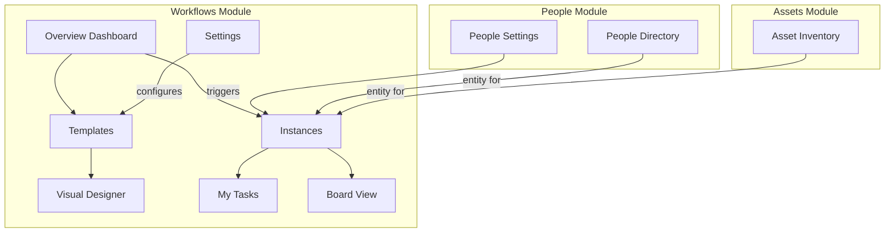

## Integration Architecture

### Automatic Workflow Triggering

The Workflows module integrates with other modules to automatically create workflow instances based on events like person status changes or asset assignments.

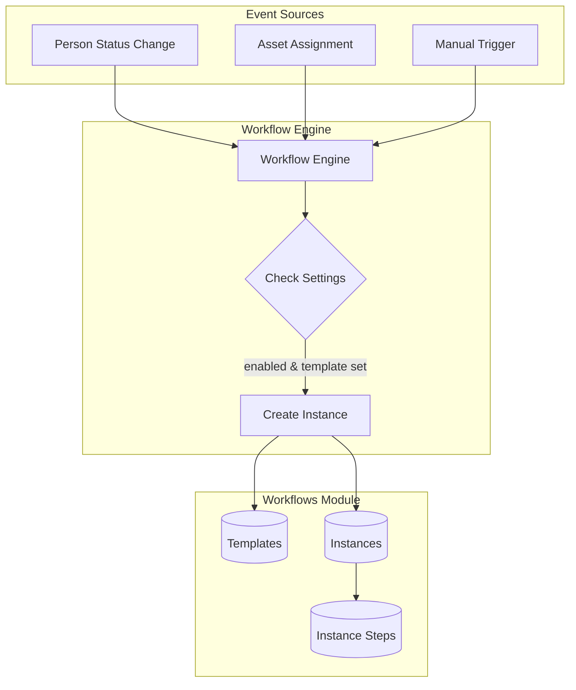

### People Module Integration

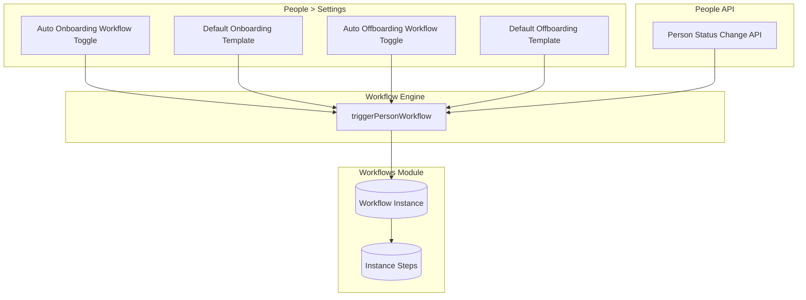

### Workflow Execution Flow

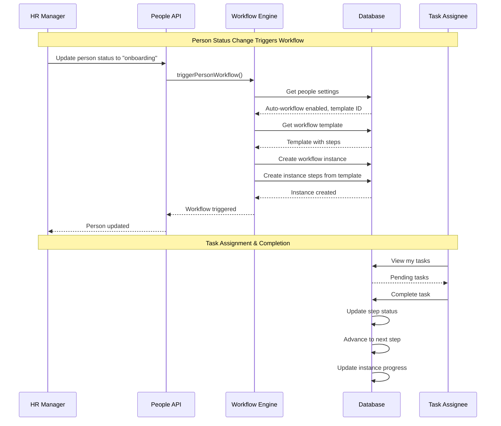

## Sub-Modules

### Overview Dashboard (`/workflows`)

High-level view of workflow metrics and quick access to sub-modules.

**Features:**
- Active workflows count
- Overdue tasks count
- Pending approvals
- Recent workflow activity
- Quick links to sub-modules
- Workflow templates summary

### Templates (`/workflows/templates`)

Define reusable workflow templates that can be instantiated manually or automatically.

**Features:**
- List all workflow templates
- Filter by status, module scope, trigger type
- Create template via drawer form
- Edit template details
- Delete template (with instance check)
- Duplicate template
- Set template status (draft, active, archived)
- Column visibility toggle

### Template Detail (`/workflows/templates/[id]`)

View and configure individual workflow template.

**Features:**
- Template overview card
- Step list with order and configuration
- Edge/connection list
- Open visual designer button
- Edit template properties
- Activate/deactivate template

### Visual Designer (`/workflows/templates/[id]/designer`)

Drag-and-drop workflow builder using React Flow.

**Features:**
- Canvas with zoom and pan
- Add steps from toolbar
- Connect steps with edges
- Configure step properties (assignee, due date offset)
- Configure edge conditions
- Save workflow layout
- Preview mode

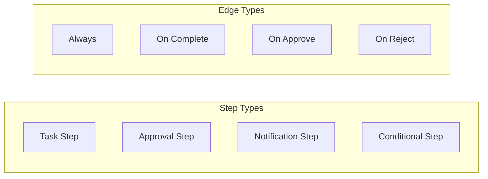

### Instances (`/workflows/instances`)

Track all running and completed workflow instances.

**Features:**
- List all workflow instances
- Filter by status, template, entity type
- Search by name
- View progress (steps completed / total)
- Create instance manually
- Cancel instance
- View instance details

### Instance Detail (`/workflows/instances/[id]`)

View individual workflow instance with step progress.

**Features:**
- Instance overview card
- Progress bar visualization
- Step list with status badges
- Complete/skip individual steps
- Add notes to steps
- View entity link (person, asset)
- Timeline of step completions

### My Tasks (`/workflows/tasks`)

Personal task view for assigned workflow steps.

**Features:**
- List tasks assigned to current user
- Filter by status, due date
- Sort by due date, priority
- Quick status update
- Complete task with notes
- View related workflow instance

### Board View (`/workflows/board`)

Kanban-style view of workflow step progress.

**Features:**
- Columns by step status (Pending, In Progress, Completed)
- Drag-and-drop status changes
- Filter by instance or all instances
- Visual progress indicators
- Step details on hover

### Settings (`/workflows/settings`)

Module-level workflow configuration.

**Features:**
- Default workflow settings
- Notification preferences
- Integration configuration

---

## Permissions

### Permission Matrix

| Sub-Module | Action | Owner | Admin | Manager | Member |
|------------|--------|-------|-------|---------|--------|
| Overview | View | Yes | Yes | Yes | Yes |
| Templates | View | Yes | Yes | Yes | Yes |
| Templates | Create | Yes | Yes | Yes | No |
| Templates | Edit | Yes | Yes | Yes | No |
| Templates | Delete | Yes | Yes | No | No |
| Designer | Edit | Yes | Yes | Yes | No |
| Instances | View | Yes | Yes | Yes | Own |
| Instances | Create | Yes | Yes | Yes | No |
| Instances | Cancel | Yes | Yes | Yes | No |
| Tasks | View | Yes | Yes | Yes | Own |
| Tasks | Complete | Yes | Yes | Yes | Own |
| Board | View | Yes | Yes | Yes | Own |
| Settings | View | Yes | Yes | No | No |
| Settings | Configure | Yes | Yes | No | No |

### Permission Diagram

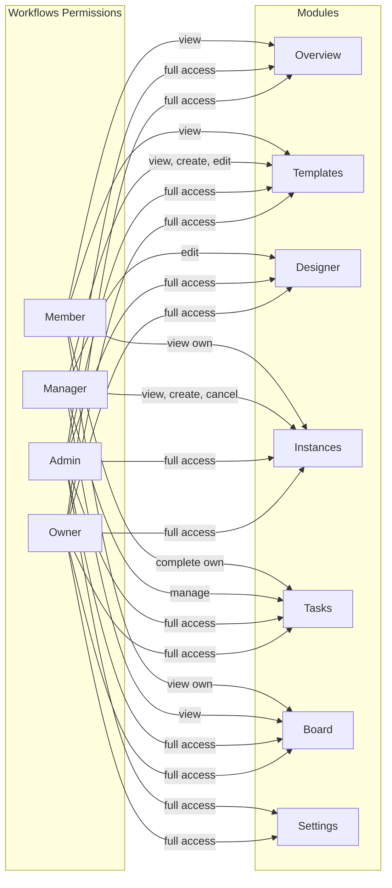

---

## User Flows

### Create Workflow Template Flow

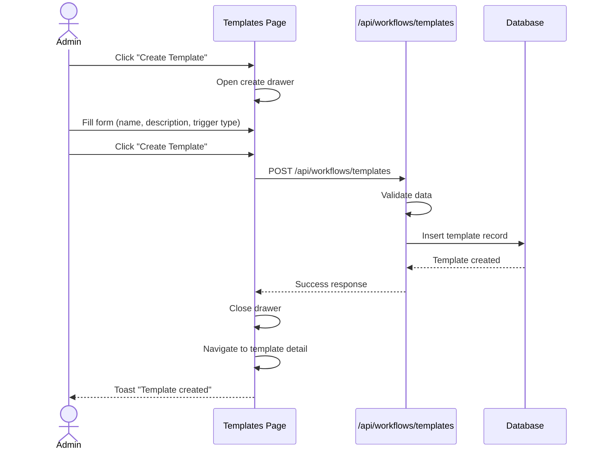

### Design Workflow Flow

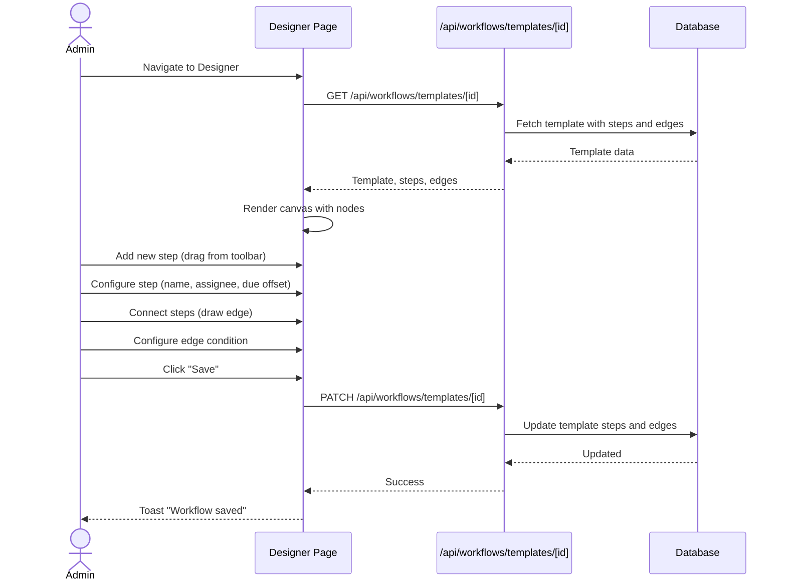

### Automatic Workflow Instance Creation Flow

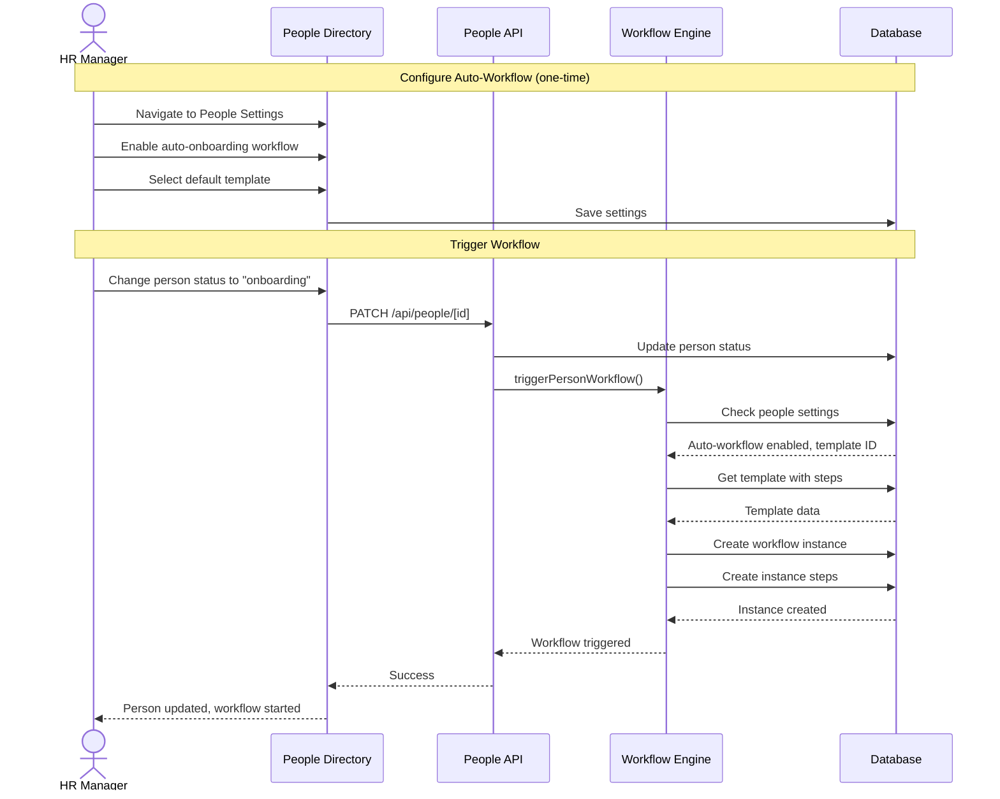

### Complete Workflow Task Flow

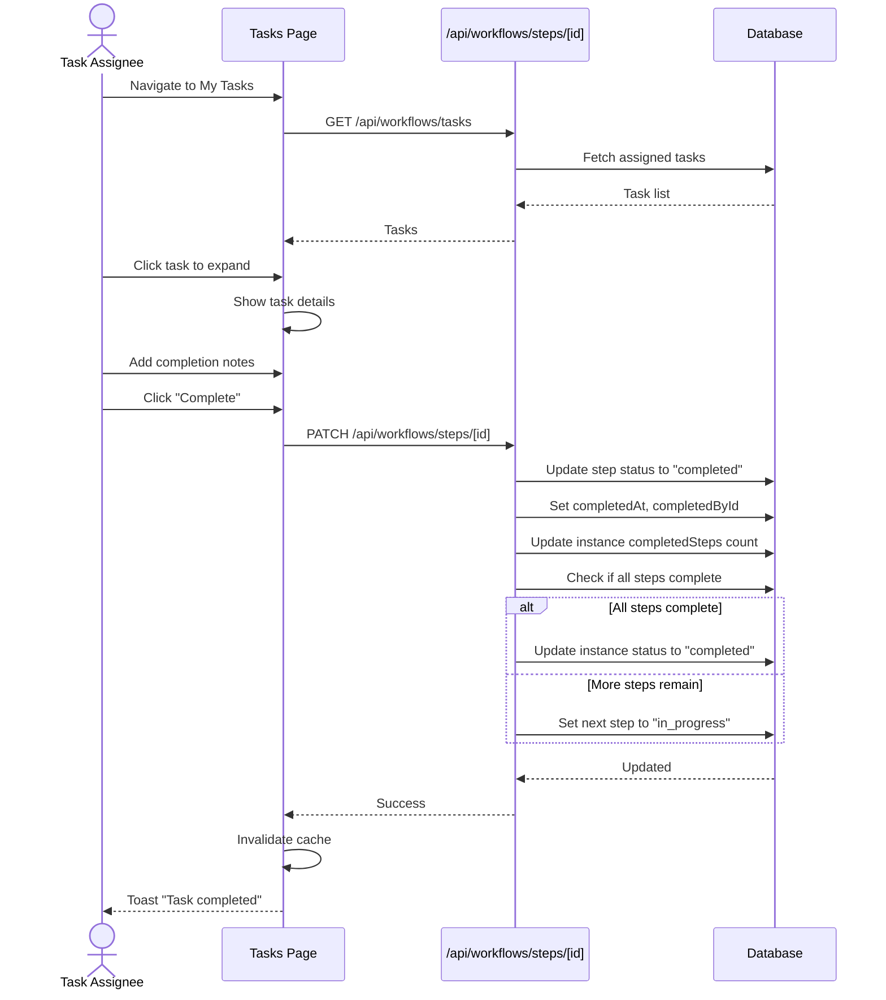

### Manual Workflow Instance Creation Flow

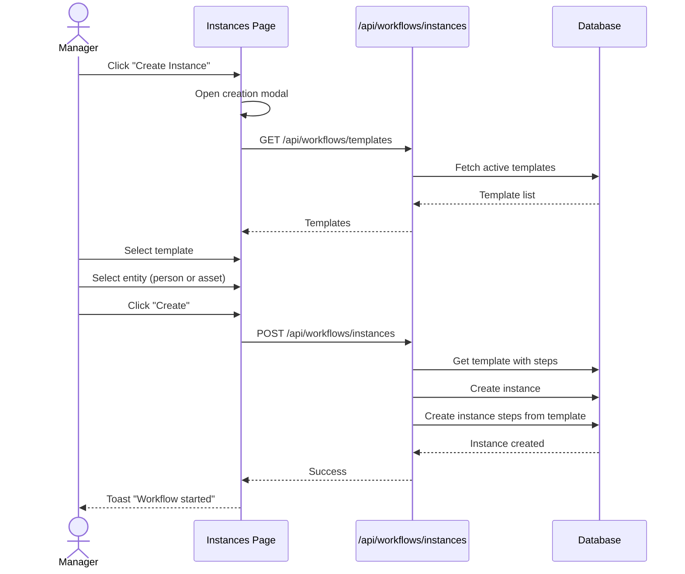

---

## API Endpoints

### Templates API

| Method | Path | Description |
|--------|------|-------------|
| GET | `/api/workflows/templates` | List all templates |
| POST | `/api/workflows/templates` | Create template |
| GET | `/api/workflows/templates/[id]` | Get template with steps & edges |
| PATCH | `/api/workflows/templates/[id]` | Update template |
| DELETE | `/api/workflows/templates/[id]` | Delete template |

### Instances API

| Method | Path | Description |
|--------|------|-------------|
| GET | `/api/workflows/instances` | List all instances |
| POST | `/api/workflows/instances` | Create instance |
| GET | `/api/workflows/instances/[id]` | Get instance with steps |
| PATCH | `/api/workflows/instances/[id]` | Update instance |
| DELETE | `/api/workflows/instances/[id]` | Delete instance |

### Steps API

| Method | Path | Description |
|--------|------|-------------|
| PATCH | `/api/workflows/steps/[id]` | Update step status |

### Request/Response Examples

**GET /api/workflows/templates**

```json
[
  {
    "id": "uuid",
    "name": "Employee Onboarding",
    "description": "Standard onboarding workflow for new employees",
    "moduleScope": "people",
    "triggerType": "person_onboarding",
    "status": "active",
    "isActive": true,
    "defaultDueDays": 14,
    "createdAt": "2024-01-15T09:00:00Z",
    "updatedAt": "2024-01-20T10:30:00Z"
  }
]
```

**POST /api/workflows/instances**

```json
{
  "templateId": "uuid",
  "entityType": "person",
  "entityId": "uuid",
  "name": "Onboarding - John Doe"
}
```

**PATCH /api/workflows/steps/[id]**

```json
{
  "status": "completed",
  "notes": "IT setup completed, laptop delivered"
}
```

---

## Database Schema

### Entity Relationships

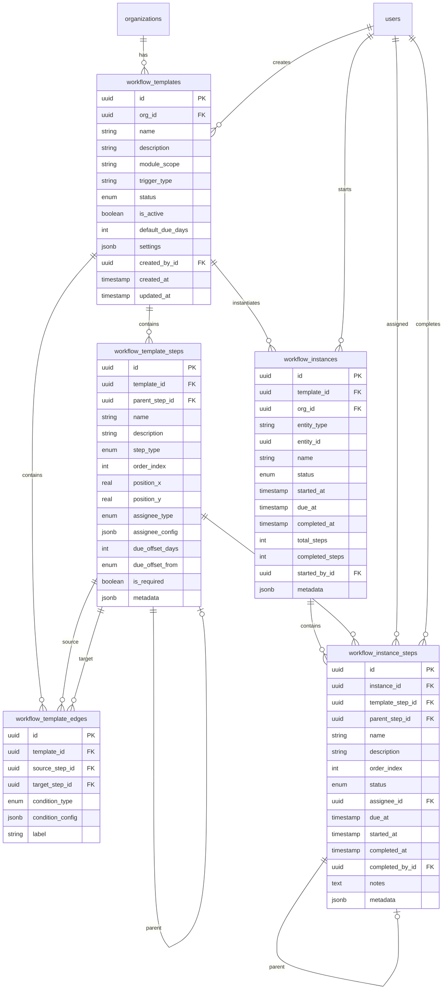

### Table Schemas

#### workflow_templates

| Column | Type | Description |
|--------|------|-------------|
| `id` | UUID | Primary key |
| `org_id` | UUID | Organization reference |
| `name` | TEXT | Template name |
| `description` | TEXT | Template description |
| `module_scope` | TEXT | Module this applies to (people, assets) |
| `trigger_type` | TEXT | Trigger type (manual, person_onboarding, etc.) |
| `status` | ENUM | draft, active, archived |
| `is_active` | BOOLEAN | Whether template is active |
| `default_due_days` | INTEGER | Default duration for workflow |
| `settings` | JSONB | Additional settings |
| `created_by_id` | UUID | User who created template |
| `created_at` | TIMESTAMPTZ | Creation timestamp |
| `updated_at` | TIMESTAMPTZ | Last update timestamp |

#### workflow_template_steps

| Column | Type | Description |
|--------|------|-------------|
| `id` | UUID | Primary key |
| `template_id` | UUID | Parent template reference |
| `parent_step_id` | UUID | Self-reference for sub-steps |
| `name` | TEXT | Step name |
| `description` | TEXT | Step description |
| `step_type` | ENUM | task, approval, notification, conditional |
| `order_index` | INTEGER | Step order in workflow |
| `position_x` | REAL | X position for designer |
| `position_y` | REAL | Y position for designer |
| `assignee_type` | ENUM | unassigned, initiator, manager, role, person |
| `assignee_config` | JSONB | Assignee configuration |
| `due_offset_days` | INTEGER | Days offset from start |
| `due_offset_from` | ENUM | workflow_start or previous_step_completion |
| `is_required` | BOOLEAN | Whether step is required |
| `metadata` | JSONB | Additional step data |

#### workflow_template_edges

| Column | Type | Description |
|--------|------|-------------|
| `id` | UUID | Primary key |
| `template_id` | UUID | Parent template reference |
| `source_step_id` | UUID | Source step reference |
| `target_step_id` | UUID | Target step reference |
| `condition_type` | ENUM | always, on_complete, on_approve, on_reject |
| `condition_config` | JSONB | Condition configuration |
| `label` | TEXT | Edge label for designer |

#### workflow_instances

| Column | Type | Description |
|--------|------|-------------|
| `id` | UUID | Primary key |
| `template_id` | UUID | Template reference |
| `org_id` | UUID | Organization reference |
| `entity_type` | TEXT | Entity type (person, asset) |
| `entity_id` | UUID | Entity this workflow is for |
| `name` | TEXT | Instance name |
| `status` | ENUM | pending, in_progress, completed, cancelled, failed |
| `started_at` | TIMESTAMPTZ | When workflow started |
| `due_at` | TIMESTAMPTZ | Workflow due date |
| `completed_at` | TIMESTAMPTZ | When workflow completed |
| `total_steps` | INTEGER | Total number of steps |
| `completed_steps` | INTEGER | Number of completed steps |
| `started_by_id` | UUID | User who started workflow |
| `metadata` | JSONB | Instance-specific data |

#### workflow_instance_steps

| Column | Type | Description |
|--------|------|-------------|
| `id` | UUID | Primary key |
| `instance_id` | UUID | Parent instance reference |
| `template_step_id` | UUID | Template step reference |
| `parent_step_id` | UUID | Self-reference for sub-steps |
| `name` | TEXT | Step name |
| `description` | TEXT | Step description |
| `order_index` | INTEGER | Step order |
| `status` | ENUM | pending, in_progress, completed, skipped, failed |
| `assignee_id` | UUID | User assigned to step |
| `due_at` | TIMESTAMPTZ | Step due date |
| `started_at` | TIMESTAMPTZ | When step was started |
| `completed_at` | TIMESTAMPTZ | When step was completed |
| `completed_by_id` | UUID | User who completed step |
| `notes` | TEXT | Completion notes |
| `metadata` | JSONB | Step-specific data |

---

## Status Definitions

### Template Status

| Status | Description | Badge Color |
|--------|-------------|-------------|
| `draft` | Template is being designed, not yet usable | Gray |
| `active` | Template is ready for use | Green |
| `archived` | Template is no longer used but preserved | Amber |

### Instance Status

| Status | Description | Badge Color |
|--------|-------------|-------------|
| `pending` | Workflow created but not started | Gray |
| `in_progress` | Workflow is actively being worked on | Blue |
| `completed` | All required steps completed | Green |
| `cancelled` | Workflow was cancelled | Amber |
| `failed` | Workflow encountered an error | Red |

### Step Status

| Status | Description | Badge Color |
|--------|-------------|-------------|
| `pending` | Step not yet started | Gray |
| `in_progress` | Step is currently being worked on | Blue |
| `completed` | Step has been completed | Green |
| `skipped` | Step was skipped (non-required) | Amber |
| `failed` | Step encountered an error | Red |

---

## Components

### Key React Components

- `PageShell` - Page layout with title and actions
- `DataTable` - Full-featured data table
- `FormDrawer` - Schema-driven form drawer
- `Protected` - RBAC visibility wrapper
- `WorkflowDesigner` - Visual node editor (uses @xyflow/react)
- `WorkflowKanban` - Kanban board view
- `WorkflowTaskList` - Task list component
- `StepNode` - Custom node for designer
- `StepStatusBadge` - Step status indicators
- `StatsCard` - Metric display cards

### React Query Hooks

Located in `lib/api/workflows.ts`:

- `useWorkflowTemplatesList()` - Fetch all templates
- `useWorkflowTemplateDetail(id)` - Fetch single template with steps/edges
- `useCreateWorkflowTemplate()` - Create mutation
- `useUpdateWorkflowTemplate()` - Update mutation
- `useDeleteWorkflowTemplate()` - Delete mutation
- `useWorkflowInstancesList()` - Fetch all instances
- `useWorkflowInstanceDetail(id)` - Fetch single instance with steps
- `useCreateWorkflowInstance()` - Create mutation
- `useUpdateWorkflowInstance()` - Update mutation
- `useDeleteWorkflowInstance()` - Delete mutation
- `useWorkflowInstanceSteps(instanceId)` - Fetch instance steps
- `useUpdateWorkflowInstanceStep()` - Update step status mutation
- `useWorkflowTasksList()` - Fetch assigned tasks

---

## Integration Points

### With People Module

- Workflows can be triggered on person status change (onboarding/offboarding)
- Configuration in People > Settings
- Person record linked as workflow entity
- Person detail page can show active workflows

**Trigger Configuration (in People Settings):**

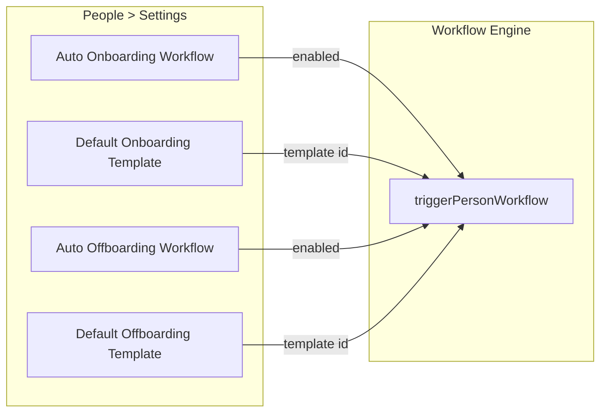

### With Assets Module (Future)

- Workflows can be triggered on asset assignment
- Device provisioning workflows
- Asset return workflows
- Asset as workflow entity

### With Settings Module

- User assignments for workflow steps
- Role-based task assignment
- Audit logging of workflow actions

---

## Next Steps

### Immediate Enhancements

1. **Run database migrations** - Generate and apply migrations for new workflow tables
2. **Test workflow creation** - Verify template and instance CRUD operations work correctly
3. **Test auto-triggering** - Verify workflow instances are created on person status change

### Short-term Improvements

4. **Add notifications** - Send email/in-app notifications when tasks are assigned
5. **Step due date warnings** - Highlight overdue steps in task list and board
6. **Workflow history** - Add detailed activity timeline to instance detail

### Medium-term Features

7. **Conditional branching** - Implement edge conditions for approval workflows
8. **Template versioning** - Track template changes and allow rollback
9. **Bulk operations** - Complete multiple tasks at once
10. **Workflow analytics** - Dashboard with completion rates, average duration

### Long-term Roadmap

11. **Asset module integration** - Trigger workflows on asset events
12. **Webhook triggers** - Start workflows from external systems
13. **Custom step types** - API call steps, script execution
14. **SLA tracking** - Monitor compliance with workflow deadlines
