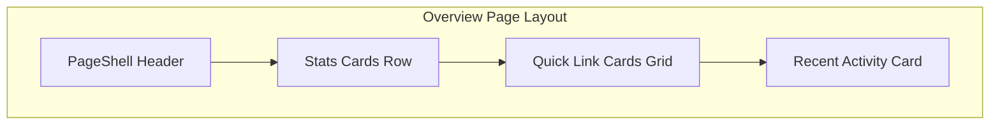
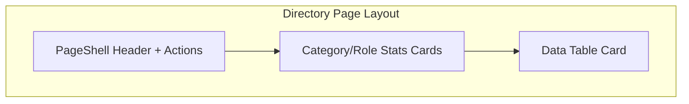

# Page Layout Patterns

> **Purpose**: Define consistent page structures for different page types across all modules.

## Page Types

### 1. Overview Page (`/module`)

Dashboard-style page with metrics and quick navigation.



```tsx
<PageShell 
  title="Module Name" 
  description="Module description."
  action={<PrimaryActionButton />}
>
  <div className="space-y-6">
    {/* Stats Row */}
    <div className="grid gap-4 sm:grid-cols-2 lg:grid-cols-4">
      <StatsCard ... />
    </div>

    {/* Quick Links */}
    <div className="grid gap-4 sm:grid-cols-2 lg:grid-cols-3">
      <QuickLinkCard ... />
    </div>

    {/* Activity Feed */}
    <Card>
      <CardHeader>
        <CardTitle>Recent Activity</CardTitle>
      </CardHeader>
      <CardContent>
        <ActivityList />
      </CardContent>
    </Card>
  </div>
</PageShell>
```

### 2. Directory/List Page (`/module/directory`)

Data table with filters and summary stats.



```tsx
<PageShell 
  title="Directory Name"
  description="Directory description."
  action={
    <div className="flex items-center gap-2">
      <SecondaryAction />
      <PrimaryAction />
    </div>
  }
>
  <div className="space-y-6">
    {/* Category Stats */}
    <div className="grid gap-4 md:grid-cols-3 lg:grid-cols-5">
      {categories.map((cat) => (
        <StatsCard key={cat.id} ... />
      ))}
    </div>

    {/* Data Table */}
    <Card>
      <CardHeader>
        <CardTitle>All Items</CardTitle>
        <CardDescription>Description of the data</CardDescription>
      </CardHeader>
      <CardContent>
        <DataTableAdvanced ... />
      </CardContent>
    </Card>
  </div>
</PageShell>
```

### 3. Detail Page (`/module/directory/[slug]`)

Individual record view with tabs for different aspects.

```tsx
<PageShell 
  title={item.name}
  description={item.subtitle}
  action={
    <div className="flex items-center gap-2">
      <EditButton />
      <DeleteButton />
    </div>
  }
>
  <div className="space-y-6">
    {/* Profile/Summary Card */}
    <Card>
      <CardContent className="pt-6">
        <ProfileHeader ... />
      </CardContent>
    </Card>

    {/* Tabbed Content */}
    <Tabs defaultValue="overview">
      <TabsList>
        <TabsTrigger value="overview">Overview</TabsTrigger>
        <TabsTrigger value="details">Details</TabsTrigger>
        <TabsTrigger value="activity">Activity</TabsTrigger>
      </TabsList>
      <TabsContent value="overview">...</TabsContent>
      <TabsContent value="details">...</TabsContent>
      <TabsContent value="activity">...</TabsContent>
    </Tabs>
  </div>
</PageShell>
```

### 4. Settings Page (`/module/settings`)

Form-based configuration page.

```tsx
<PageShell 
  title="Settings"
  description="Configure module settings."
>
  <div className="space-y-6">
    <Card>
      <CardHeader>
        <CardTitle>General Settings</CardTitle>
        <CardDescription>Basic configuration options</CardDescription>
      </CardHeader>
      <CardContent>
        <Form ... />
      </CardContent>
    </Card>

    <Card>
      <CardHeader>
        <CardTitle>Advanced Settings</CardTitle>
      </CardHeader>
      <CardContent>
        <Form ... />
      </CardContent>
    </Card>
  </div>
</PageShell>
```

## Header Action Patterns

### Single Primary Action

```tsx
action={
  <Protected module="module.name" action="create">
    <Button>
      <Plus className="mr-2 h-4 w-4" />
      Add Item
    </Button>
  </Protected>
}
```

### Multiple Actions

```tsx
action={
  <div className="flex items-center gap-2">
    {/* Secondary actions first (outline variant) */}
    <Protected module="module.name" action="edit">
      <Button variant="outline">
        <RefreshCw className="mr-2 h-4 w-4" />
        Sync
      </Button>
    </Protected>
    
    {/* Primary action last (default variant) */}
    <Protected module="module.name" action="create">
      <Button>
        <Plus className="mr-2 h-4 w-4" />
        Add Item
      </Button>
    </Protected>
  </div>
}
```

## Spacing Standards

- **Section spacing**: `space-y-6` (24px between major sections)
- **Card grid gap**: `gap-4` (16px between cards)
- **Content padding**: Handled by Card components
- **Inner spacing**: `space-y-4` for form fields, `space-y-3` for tight lists

## Responsive Behavior

### Stats Cards
```tsx
className="grid gap-4 sm:grid-cols-2 lg:grid-cols-4"
// 1 col → 2 cols (sm) → 4 cols (lg)
```

### Quick Link Cards
```tsx
className="grid gap-4 sm:grid-cols-2 lg:grid-cols-3"
// 1 col → 2 cols (sm) → 3 cols (lg)
```

### Role/Category Cards
```tsx
className="grid gap-4 md:grid-cols-3 lg:grid-cols-5"
// 1 col → 3 cols (md) → 5 cols (lg)
```

## Page State Handling

### Loading State

```tsx
if (isLoading) {
  return (
    <PageShell title="Page Title">
      <div className="space-y-6">
        <div className="grid gap-4 lg:grid-cols-4">
          {[1,2,3,4].map((i) => (
            <Skeleton key={i} className="h-32" />
          ))}
        </div>
        <Skeleton className="h-96" />
      </div>
    </PageShell>
  )
}
```

### Access Denied State

```tsx
if (!canAccess) {
  return (
    <PageShell title="Page Title">
      <AccessDenied 
        title="Access Denied" 
        description="You don't have permission to view this page." 
      />
    </PageShell>
  )
}
```

### Empty State

```tsx
<Card>
  <CardContent className="py-12">
    <div className="text-center">
      <Icon className="mx-auto h-8 w-8 mb-2 text-muted-foreground opacity-50" />
      <p className="text-muted-foreground mb-4">No items found</p>
      <Button>Add First Item</Button>
    </div>
  </CardContent>
</Card>
```
